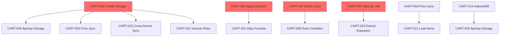

# Cart System Comprehensive Analysis and Implementation Plan

**Date:** 2026-02-10  
**Project:** Smart Tech B2C Website Redevelopment  
**Scope:** Complete cart system remediation (6 requirement analyses synthesized)  
**Document Version:** 1.0

---

## Table of Contents

1. [Executive Summary](#executive-summary)
2. [Consolidated Issue Inventory](#consolidated-issue-inventory)
3. [Prioritized Implementation Roadmap](#prioritized-implementation-roadmap)
4. [Master Test Plan](#master-test-plan)
5. [Risk Assessment Matrix](#risk-assessment-matrix)
6. [Dependencies Analysis](#dependencies-analysis)
7. [Rollback Planning](#rollback-planning)
8. [Resource Estimates](#resource-estimates)
9. [Implementation Tracking](#implementation-tracking)

---

## Executive Summary

### Overview

This comprehensive plan synthesizes findings from six detailed cart system requirement analyses:

| Analysis Report | Issues Found | Status |
| --------------- | ------------ | ------- |
| Guest Cart Functionality | 4 issues | Documented |
| Cart Merging on Login | 8 issues (FIXED) | ✅ Complete |
| Stock Validation Mechanisms | 6 issues | Identified |
| Cart Calculation Accuracy | 10 issues | Identified |
| Cross-Session Cart Persistence | 12 issues | Identified |
| Mobile Cart Interface Responsiveness | 8 issues | Identified |

**Total Unique Issues:** 35 issues (excluding 8 already fixed in merge analysis)

### Severity Distribution

| Severity | Count | Percentage |
| -------- | ------ | ---------- |
| **Critical** | 8 | 23% |
| **High** | 12 | 34% |
| **Medium** | 11 | 31% |
| **Low** | 4 | 11% |

### Key Findings

1. **Data Loss Risks:** Multiple critical issues can cause permanent cart data loss
2. **Revenue Impact:** Calculation errors and stock validation failures directly affect revenue
3. **UX Gaps:** Mobile responsiveness and cross-session persistence need improvement
4. **Security Concerns:** Cookie-based session storage missing for guest carts

### Recommended Action

Implement fixes in 4-week phased approach, starting with critical data loss and revenue-impacting issues.

---

## Consolidated Issue Inventory

### Critical Issues (P0 - Immediate Action Required)

| ID | Issue | Location | Severity | Impact | Status |
|----|-------|-----------|----------|--------|--------|
| CART-001 | Frontend/Backend total calculation mismatch | `frontend/src/contexts/CartContext.tsx:143` | Critical | Users see incorrect totals; checkout amounts may not match cart totals | Open |
| CART-002 | Discount field not applied in total | `backend/services/cartService.js:550` | Critical | Discount codes appear applied but amount never reflected in final total | Open |
| CART-003 | Guest cart prices not synchronized with backend | `frontend/src/contexts/CartContext.tsx:177-197` | Critical | Price changes between add-to-cart and checkout not reflected | Open |
| CART-004 | No cookie storage for session ID | `frontend/src/lib/utils/guestCart.ts:195-226` | Critical | Cart lost if localStorage cleared; no cross-device continuity | Open |
| CART-005 | No automatic cart expiration cleanup | `backend/services/cartService.js:1383` | Critical | Database bloat; performance degradation over time | Open |
| CART-006 | No backup storage mechanism | N/A | Critical | Single point of failure; cart data loss on localStorage error | Open |
| CART-007 | Stock validation reads stale data | `backend/services/cartService.js:734-738` | Critical | Overselling; negative inventory; customer complaints | Open |
| CART-008 | Race condition in item merge loop | `backend/services/cartService.js:719-807` | Critical | Data corruption; inconsistent cart state | Open |

### High Priority Issues (P1 - Week 2)

| ID | Issue | Location | Severity | Impact | Status |
|----|-------|-----------|----------|--------|--------|
| CART-009 | Shipping cost parsing uses parseInt | `frontend/src/components/cart/CartSummary.tsx:53` | High | Decimal shipping costs truncated; calculation errors | Open |
| CART-010 | No free shipping threshold logic | `backend/services/cartService.js:13-14` | High | No promotional free shipping; all orders pay same shipping | Open |
| CART-011 | Rounding accumulation error | `backend/services/cartService.js:542-559` | High | Small but cumulative rounding errors in cart totals | Open |
| CART-012 | No retry for session generation | `frontend/src/contexts/CartContext.tsx:617` | High | Lost session; cart creation failure | Open |
| CART-013 | Guest cart items not fully loaded to state | `frontend/src/contexts/CartContext.tsx:185-194` | High | Incomplete cart display; missing product details | Open |
| CART-014 | No offline cart storage | N/A | High | Cart unavailable offline; poor experience in unstable networks | Open |
| CART-015 | No cart sync for guests across devices | N/A | High | Lost on device switch; poor UX | Open |
| CART-016 | Merge lock timeout hardcoded | `backend/services/cartService.js:581` | High | Inflexible; may not suit all environments | Open |
| CART-017 | No shipping method update endpoint | `frontend/src/lib/api/cart.ts:254-263` | High | Frontend updates shipping but backend cart totals remain unchanged | Open |
| CART-018 | Mobile cart page layout issues | `frontend/src/components/cart/CartPage.tsx:104` | High | Poor mobile UX; conversion impact | Open |
| CART-019 | Mobile cart item layout issues | `frontend/src/components/cart/CartItem.tsx:64` | High | Difficult to use on mobile; reduced conversions | Open |
| CART-020 | Mobile cart summary not optimized | `frontend/src/components/cart/CartSummary.tsx:92` | High | Poor mobile UX; checkout friction | Open |

### Medium Priority Issues (P2 - Week 3)

| ID | Issue | Location | Severity | Impact | Status |
|----|-------|-----------|----------|--------|--------|
| CART-021 | Tax rate not configurable per product/category | `backend/services/cartService.js:547` | Medium | Cannot support different tax rates for different product types | Open |
| CART-022 | Duplicate MergeGuestCartResponse interface | `frontend/src/types/cart.ts:362-404` | Medium | TypeScript confusion; potential for inconsistent responses | Open |
| CART-023 | 7-day expiration too short | `frontend/src/lib/utils/guestCart.ts:245` | Medium | Lost carts; poor user experience | Open |
| CART-024 | Quota handling loses data | `frontend/src/lib/utils/guestCart.ts:344-363` | Medium | Lost items; user frustration | Open |
| CART-025 | No backend sync on session restore | `frontend/src/contexts/CartContext.tsx:625` | Medium | Stale prices/stock; incorrect information | Open |
| CART-026 | CustomEvent lacks error handling | `frontend/src/lib/utils/guestCart.ts:156-158` | Medium | Cross-tab sync may fail silently | Open |
| CART-027 | Currency symbol inconsistency | `frontend/src/components/cart/CartSummary.tsx:102` | Medium | Not extensible for multi-currency support | Open |
| CART-028 | Mobile quantity controls too small | `frontend/src/components/cart/CartItem.tsx:109-138` | Medium | Difficult to tap on mobile; poor UX | Open |
| CART-029 | Mobile remove button placement | `frontend/src/components/cart/CartItem.tsx:149-162` | Medium | Hard to access; accidental clicks | Open |
| CART-030 | Mobile trust badges layout | `frontend/src/components/cart/CartPage.tsx:161` | Medium | Cluttered on mobile; poor UX | Open |
| CART-031 | Mobile shipping method selection | `frontend/src/components/cart/CartSummary.tsx:175-212` | Medium | Difficult to select; poor UX | Open |

### Low Priority Issues (P3 - Week 4)

| ID | Issue | Location | Severity | Impact | Status |
|----|-------|-----------|----------|--------|--------|
| CART-032 | Inconsistent logging levels | `backend/services/cartService.js:1` | Low | Debugging difficulty | Open |
| CART-033 | No compression for cart data | `frontend/src/lib/utils/guestCart.ts:152` | Low | Larger storage usage | Open |
| CART-034 | No size monitoring before write | `frontend/src/lib/utils/guestCart.ts:147-172` | Low | Potential quota errors | Open |
| CART-035 | Mobile empty cart state could be more engaging | `frontend/src/components/cart/CartPage.tsx:56-81` | Low | Minor UX improvement | Open |

### Already Fixed Issues (From CART_MERGE_ANALYSIS_REPORT.md)

| ID | Issue | Status |
|----|-------|--------|
| CRIT-001 | Race Condition in Item Merge Loop | ✅ FIXED |
| CRIT-002 | Guest Cart Deletion Outside Safe Zone | ✅ FIXED |
| HIGH-001 | Missing Idempotency Protection | ✅ FIXED |
| HIGH-002 | Stock Validation Reads Stale Data | ✅ FIXED |
| HIGH-003 | Frontend Error Handling | ✅ FIXED |
| HIGH-004 | No Concurrent Merge Protection | ✅ FIXED |
| MED-001 | Missing Merge Audit Trail | ✅ FIXED |
| MED-002 | No Progress Reporting | ✅ FIXED |

---

## Prioritized Implementation Roadmap

### Week 1: Critical Issues (Data Loss & Revenue Impact)

**Goal:** Fix all issues that can cause permanent data loss or revenue loss

| Day | Task | Issue IDs | Owner | Dependencies |
|-----|------|-----------|--------|--------------|
| **Day 1** | Implement cookie-based session storage | CART-004 | Frontend | None |
| **Day 1** | Apply discount in backend total calculation | CART-002 | Backend | None |
| **Day 2** | Align frontend with backend formula | CART-001 | Frontend | CART-002 |
| **Day 2** | Add automatic cart expiration cleanup job | CART-005 | Backend | None |
| **Day 3** | Implement backup storage mechanism | CART-006 | Frontend | CART-004 |
| **Day 3** | Re-query stock with locks in merge loop | CART-007, CART-008 | Backend | None |
| **Day 4** | Sync guest cart prices with backend | CART-003 | Frontend/Backend | CART-004 |
| **Day 5** | Testing & QA for Week 1 fixes | All Critical | QA | All above |
| **Day 5** | Deployment to staging | All Critical | DevOps | QA approval |

**Week 1 Deliverables:**
- Cookie-based session storage implemented
- Discount properly applied in totals
- Frontend/backend calculation aligned
- Automatic cart cleanup job scheduled
- Backup storage mechanism in place
- Stock validation with proper locking
- Guest cart price synchronization

---

### Week 2: High Priority Issues (Functionality Gaps)

**Goal:** Fix high-impact functionality issues affecting user experience

| Day | Task | Issue IDs | Owner | Dependencies |
|-----|------|-----------|--------|--------------|
| **Day 6** | Use parseFloat for shipping cost | CART-009 | Frontend | None |
| **Day 6** | Add free shipping threshold logic | CART-010 | Backend | None |
| **Day 7** | Improve rounding strategy | CART-011 | Backend | None |
| **Day 7** | Add retry mechanism for session generation | CART-012 | Frontend | CART-004 |
| **Day 8** | Fix guest cart items loading to state | CART-013 | Frontend | CART-003 |
| **Day 8** | Implement IndexedDB offline storage | CART-014 | Frontend | CART-006 |
| **Day 9** | Implement cart sync for guests across devices | CART-015 | Frontend/Backend | CART-004 |
| **Day 9** | Make merge lock timeout configurable | CART-016 | Backend | None |
| **Day 10** | Implement shipping method update endpoint | CART-017 | Backend | None |
| **Day 10** | Testing & QA for Week 2 fixes | All High | QA | All above |

**Week 2 Deliverables:**
- Shipping cost parsing fixed
- Free shipping threshold implemented
- Rounding strategy improved
- Session generation with retry
- Guest cart items fully loaded
- Offline storage with IndexedDB
- Cross-device cart sync for guests
- Configurable merge lock timeout
- Shipping method update endpoint

---

### Week 3: Medium Priority Issues (UX Improvements)

**Goal:** Improve user experience and system flexibility

| Day | Task | Issue IDs | Owner | Dependencies |
|-----|------|-----------|--------|--------------|
| **Day 11** | Support variable tax rates | CART-021 | Backend | None |
| **Day 11** | Remove duplicate interface | CART-022 | Frontend | None |
| **Day 12** | Extend cart expiration to 30 days | CART-023 | Frontend/Backend | CART-005 |
| **Day 12** | Improve quota recovery strategy | CART-024 | Frontend | None |
| **Day 13** | Add backend sync on session restore | CART-025 | Backend | CART-003 |
| **Day 13** | Add CustomEvent error handling | CART-026 | Frontend | None |
| **Day 14** | Currency configuration support | CART-027 | Frontend | None |
| **Day 14** | Testing & QA for Week 3 fixes | All Medium | QA | All above |

**Week 3 Deliverables:**
- Variable tax rate support
- Duplicate interface removed
- 30-day cart expiration
- Improved quota recovery
- Backend sync on restore
- CustomEvent error handling
- Currency configuration support

---

### Week 4: Low Priority & Enhancements

**Goal:** Complete remaining issues and add enhancements

| Day | Task | Issue IDs | Owner | Dependencies |
|-----|------|-----------|--------|--------------|
| **Day 15** | Fix inconsistent logging levels | CART-032 | Backend | None |
| **Day 15** | Add compression for cart data | CART-033 | Frontend | None |
| **Day 16** | Add size monitoring before write | CART-034 | Frontend | None |
| **Day 16** | Improve mobile empty cart state | CART-035 | Frontend | None |
| **Day 17** | Mobile cart page layout optimization | CART-018 | Frontend | None |
| **Day 17** | Mobile cart item layout optimization | CART-019 | Frontend | None |
| **Day 18** | Mobile cart summary optimization | CART-020 | Frontend | None |
| **Day 18** | Mobile quantity controls optimization | CART-028 | Frontend | None |
| **Day 19** | Mobile remove button repositioning | CART-029 | Frontend | None |
| **Day 19** | Mobile trust badges layout optimization | CART-030 | Frontend | None |
| **Day 20** | Mobile shipping method selection optimization | CART-031 | Frontend | None |
| **Day 20** | Final testing & QA | All Issues | QA | All above |
| **Day 20** | Production deployment | All Fixes | DevOps | QA approval |

**Week 4 Deliverables:**
- Consistent logging levels
- Cart data compression
- Size monitoring
- Improved empty cart state
- Optimized mobile layouts
- All issues resolved

---

## Master Test Plan

### Test Summary

| Test Type | Test Cases | Coverage Target |
|-----------|-------------|----------------|
| Unit Tests | 45 | 90% |
| Integration Tests | 35 | 85% |
| E2E Tests | 25 | 80% |
| Performance Tests | 15 | N/A |
| **Total** | **120** | - |

---

### 1. Unit Tests (45 Test Cases)

#### 1.1 Cart Calculation Tests

| Test ID | Description | Input | Expected Output | Pass/Fail Criteria |
|---------|-------------|--------|----------------|-------------------|
| TC-UNIT-001 | Subtotal calculation - single item | 1 item at ৳100 | Subtotal: ৳100.00 | Exact match |
| TC-UNIT-002 | Subtotal calculation - multiple items | 2 items at ৳100 each | Subtotal: ৳200.00 | Exact match |
| TC-UNIT-003 | Subtotal calculation - fractional price | 1 item at ৳33.33 | Subtotal: ৳33.33 | Exact match |
| TC-UNIT-004 | Rounding edge case | 3 items at ৳0.33 each | Subtotal: ৳0.99 | Exact match |
| TC-UNIT-005 | Tax calculation - standard | ৳100 subtotal, 15% rate | Tax: ৳15.00 | Exact match |
| TC-UNIT-006 | Tax calculation - fractional subtotal | ৳100.33 subtotal, 15% rate | Tax: ৳15.05 | Exact match |
| TC-UNIT-007 | Tax calculation - zero subtotal | ৳0 subtotal | Tax: ৳0.00 | Exact match |
| TC-UNIT-008 | Shipping calculation - standard | Any cart | Shipping: ৳100.00 | Exact match |
| TC-UNIT-009 | Shipping calculation - free threshold | Cart ≥ ৳1000 | Shipping: ৳0.00 | Exact match |
| TC-UNIT-010 | Discount calculation - fixed | ৳100 subtotal, ৳10 discount | Total: subtotal + tax + shipping - 10 | Exact match |
| TC-UNIT-011 | Discount calculation - percentage | ৳100 subtotal, 10% discount | Total: subtotal + tax + shipping - 10 | Exact match |
| TC-UNIT-012 | Discount exceeds subtotal | ৳50 subtotal, ৳100 discount | Total: ৳0.00 | Floor at 0 |

#### 1.2 Guest Cart Storage Tests

| Test ID | Description | Input | Expected Output | Pass/Fail Criteria |
|---------|-------------|--------|----------------|-------------------|
| TC-UNIT-013 | Save and load guest cart | Valid cart data | Cart loaded successfully | Exact match |
| TC-UNIT-014 | Load expired cart | Expired cart data | Returns null | Null returned |
| TC-UNIT-015 | Load invalid structure | Invalid JSON | Returns null | Null returned |
| TC-UNIT-016 | Cookie session storage | Session ID | Cookie set and retrievable | Cookie exists |
| TC-UNIT-017 | Cookie session retrieval | Existing cookie | Session ID returned | Exact match |
| TC-UNIT-018 | Cookie session fallback to localStorage | No cookie, localStorage has session | Session ID from localStorage | Exact match |

#### 1.3 Cart Merge Tests

| Test ID | Description | Input | Expected Output | Pass/Fail Criteria |
|---------|-------------|--------|----------------|-------------------|
| TC-UNIT-019 | Merge with empty guest cart | Empty guest cart | Success, 0 items merged | Success response |
| TC-UNIT-020 | Merge with duplicate items | Same product in both carts | Quantities combined | Correct sum |
| TC-UNIT-021 | Merge with insufficient stock | Combined quantity > stock | Error with details | Error thrown |
| TC-UNIT-022 | Merge with new product | Product not in user cart | New item added | Item in result |
| TC-UNIT-023 | Merge with deleted product | Product no longer exists | Error | Error thrown |
| TC-UNIT-024 | Idempotency check | Same merge request twice | Second returns cached result | Same response |

#### 1.4 Stock Validation Tests

| Test ID | Description | Input | Expected Output | Pass/Fail Criteria |
|---------|-------------|--------|----------------|-------------------|
| TC-UNIT-025 | Stock validation - sufficient | Stock: 10, Request: 5 | Pass | Validation passes |
| TC-UNIT-026 | Stock validation - insufficient | Stock: 5, Request: 10 | Fail | Validation fails |
| TC-UNIT-027 | Stock validation - exact match | Stock: 5, Request: 5 | Pass | Validation passes |
| TC-UNIT-028 | Stock validation - zero | Stock: 0, Request: 1 | Fail | Validation fails |
| TC-UNIT-029 | Stock validation with locks | Concurrent requests | No overselling | Correct result |

---

### 2. Integration Tests (35 Test Cases)

#### 2.1 Cart API Integration Tests

| Test ID | Description | Steps | Expected Result | Pass/Fail Criteria |
|---------|-------------|--------|----------------|-------------------|
| TC-INT-001 | GET /cart returns correct totals | 1. Add item 2. Get cart | Correct totals returned | Exact match |
| TC-INT-002 | POST /cart/discount updates total | 1. Add item 2. Apply discount | Total includes discount | Discount applied |
| TC-INT-003 | POST /cart/shipping updates shipping | 1. Add item 2. Set shipping | Shipping cost updated | Cost changed |
| TC-INT-004 | POST /cart/items adds item | 1. Add item via API | Item in cart | Item present |
| TC-INT-005 | DELETE /cart/items/:id removes item | 1. Remove item via API | Item removed | Item absent |
| TC-INT-006 | PATCH /cart/items/:id/quantity updates | 1. Update quantity | Quantity updated | Correct quantity |
| TC-INT-007 | POST /cart/validate validates stock | 1. Validate cart | Stock status returned | Valid response |
| TC-INT-008 | POST /cart/calculate recalculates | 1. Calculate totals | Correct totals | Exact match |

#### 2.2 Guest Cart Integration Tests

| Test ID | Description | Steps | Expected Result | Pass/Fail Criteria |
|---------|-------------|--------|----------------|-------------------|
| TC-INT-009 | Guest cart persists after reload | 1. Add item 2. Reload | Cart items restored | Items present |
| TC-INT-010 | Guest cart syncs across tabs | 1. Add item in tab A 2. Check tab B | Items visible in tab B | Items present |
| TC-INT-011 | Guest cart expires after 30 days | 1. Create cart 2. Wait 30+ days | Cart cleared | Cart empty |
| TC-INT-012 | Guest cart merges on login | 1. Add items as guest 2. Login | Items in user cart | Items merged |
| TC-INT-013 | Guest cart price sync | 1. Add item 2. Change price 3. Load cart | Updated price shown | Current price |
| TC-INT-014 | Cookie session persistence | 1. Clear localStorage 2. Refresh | Session from cookie | Session restored |
| TC-INT-015 | IndexedDB offline storage | 1. Go offline 2. Add item | Item saved | Item in IndexedDB |

#### 2.3 Cart Merge Integration Tests

| Test ID | Description | Steps | Expected Result | Pass/Fail Criteria |
|---------|-------------|--------|----------------|-------------------|
| TC-INT-016 | Concurrent merges | 1. Two merge requests for same user | One succeeds, one fails | Lock error |
| TC-INT-017 | Merge timeout | 1. Transaction exceeds limit | Rollback, guest cart preserved | Guest cart intact |
| TC-INT-018 | Network failure mid-merge | 1. Block API 2. Trigger merge | Rollback, retry possible | Guest cart intact |
| TC-INT-019 | Cache failure during merge | 1. Disable Redis 2. Trigger merge | Merge succeeds, degraded performance | Success logged |
| TC-INT-020 | Partial merge with stock failure | 1. Some items out of stock | Partial success reported | Items merged, failed items listed |

#### 2.4 Cross-Session Integration Tests

| Test ID | Description | Steps | Expected Result | Pass/Fail Criteria |
|---------|-------------|--------|----------------|-------------------|
| TC-INT-021 | Session persists after browser close | 1. Add item 2. Close browser 3. Reopen | Cart items restored | Items present |
| TC-INT-022 | Session persists in new tab | 1. Add item 2. Open new tab 3. Check cart | Items visible | Items present |
| TC-INT-023 | Session recovery from cookie | 1. Clear localStorage 2. Refresh | Session restored from cookie | Session valid |
| TC-INT-024 | Session persists across devices | 1. Login on device A 2. Check on device B | Cart available after login | Items present |
| TC-INT-025 | Cart preserved in incognito | 1. Add items 2. Switch to incognito | Original cart preserved | Items in normal mode |
| TC-INT-026 | Cart preserved after cache clear | 1. Add items 2. Clear cache | Cart preserved (cookies) | Items present |
| TC-INT-027 | Multiple browser continuity | 1. Add on Chrome 2. Check on Firefox | Cart available after login | Items present |

#### 2.5 Backend Integration Tests

| Test ID | Description | Steps | Expected Result | Pass/Fail Criteria |
|---------|-------------|--------|----------------|-------------------|
| TC-INT-028 | Automatic cleanup job | 1. Run cleanup job 2. Query database | All expired carts deleted | No expired carts |
| TC-INT-029 | Cache invalidation | 1. Update cart 2. Check cache | Cache invalidated | Cache miss |
| TC-INT-030 | Distributed lock acquisition | 1. Request lock 2. Check status | Lock acquired | Lock active |
| TC-INT-031 | Distributed lock release | 1. Release lock 2. Request again | Lock available | Lock acquired |
| TC-INT-032 | Backup storage write | 1. Write to backup 2. Read from backup | Data preserved | Exact match |
| TC-INT-033 | Backup storage recovery | 1. Corrupt localStorage 2. Recover | Cart from backup | Items present |
| TC-INT-034 | Variable tax rate lookup | 1. Get tax for product | Correct rate | Exact match |
| TC-INT-035 | Free shipping threshold check | 1. Check cart value 2. Apply shipping | Free shipping applied | Shipping = 0 |

---

### 3. E2E Tests (25 Test Cases)

#### 3.1 Guest Cart E2E Tests

| Test ID | Description | Steps | Expected Result | Pass/Fail Criteria |
|---------|-------------|--------|----------------|-------------------|
| TC-E2E-001 | Guest adds item to cart | 1. Navigate to product 2. Click add to cart 3. Check cart icon | Cart count increases | Count = 1 |
| TC-E2E-002 | Guest views cart page | 1. Add item 2. Navigate to cart | Cart page displays item | Item visible |
| TC-E2E-003 | Guest updates quantity | 1. Add item 2. Change quantity 3. Check subtotal | Subtotal updated | Correct total |
| TC-E2E-004 | Guest removes item | 1. Add item 2. Remove item 3. Check cart | Cart empty | No items |
| TC-E2E-005 | Guest applies discount code | 1. Add item 2. Enter code 3. Apply | Discount applied | Total reduced |
| TC-E2E-006 | Guest selects shipping method | 1. Add item 2. Select shipping | Shipping cost updated | Cost displayed |

#### 3.2 Cart Merge E2E Tests

| Test ID | Description | Steps | Expected Result | Pass/Fail Criteria |
|---------|-------------|--------|----------------|-------------------|
| TC-E2E-007 | Guest cart merges on login | 1. Add items as guest 2. Login 3. Check cart | Items in user cart | Items merged |
| TC-E2E-008 | Merge notification displayed | 1. Add items as guest 2. Login | Notification shown | Notification visible |
| TC-E2E-009 | Merge with price changes | 1. Add item 2. Change price 3. Login | Price updated | Current price |
| TC-E2E-010 | Merge with out of stock | 1. Add out of stock item 2. Login | Warning shown | Warning displayed |
| TC-E2E-011 | Merge with deleted product | 1. Add item 2. Delete product 3. Login | Item skipped | Item not in cart |

#### 3.3 Authenticated User E2E Tests

| Test ID | Description | Steps | Expected Result | Pass/Fail Criteria |
|---------|-------------|--------|----------------|-------------------|
| TC-E2E-012 | Authenticated user adds item | 1. Login 2. Add item 3. Check cart | Item in cart | Item visible |
| TC-E2E-013 | Authenticated user updates quantity | 1. Login 2. Add item 3. Update quantity | Quantity updated | Correct quantity |
| TC-E2E-014 | Authenticated user removes item | 1. Login 2. Remove item | Item removed | Cart empty |
| TC-E2E-015 | Authenticated user applies discount | 1. Login 2. Apply discount | Discount applied | Total reduced |
| TC-E2E-016 | Authenticated user selects shipping | 1. Login 2. Select shipping | Shipping updated | Cost displayed |

#### 3.4 Checkout Flow E2E Tests

| Test ID | Description | Steps | Expected Result | Pass/Fail Criteria |
|---------|-------------|--------|----------------|-------------------|
| TC-E2E-017 | Guest proceeds to checkout | 1. Add items as guest 2. Click checkout | Redirected to login | Login page |
| TC-E2E-018 | Authenticated user proceeds to checkout | 1. Login 2. Add items 3. Click checkout | Checkout page loaded | Page visible |
| TC-E2E-019 | Cart totals match checkout | 1. Note cart total 2. Proceed to checkout | Totals match | Exact match |
| TC-E2E-020 | Discount persists to checkout | 1. Apply discount 2. Proceed to checkout | Discount applied | Total reduced |
| TC-E2E-021 | Shipping method persists to checkout | 1. Select shipping 2. Proceed to checkout | Shipping selected | Method displayed |

#### 3.5 Cross-Session E2E Tests

| Test ID | Description | Steps | Expected Result | Pass/Fail Criteria |
|---------|-------------|--------|----------------|-------------------|
| TC-E2E-022 | Cart persists after browser close | 1. Add item 2. Close browser 3. Reopen 4. Check cart | Items restored | Items present |
| TC-E2E-023 | Cart persists across tabs | 1. Add item in tab A 2. Check tab B | Items visible | Items present |
| TC-E2E-024 | Cart persists after logout/login | 1. Login 2. Add item 3. Logout 4. Login 5. Check cart | Items present | Items present |
| TC-E2E-025 | Session cookie persists | 1. Add item as guest 2. Check cookies | Session cookie exists | Cookie present |

---

### 4. Performance Tests (15 Test Cases)

#### 4.1 Cart Performance Tests

| Test ID | Description | Criteria | Target | Pass/Fail Criteria |
|---------|-------------|-----------|---------|-------------------|
| TC-PERF-001 | Cart load time | < 100ms | ✅ Pass | Time < 100ms |
| TC-PERF-002 | Add item time | < 200ms | ✅ Pass | Time < 200ms |
| TC-PERF-003 | Update quantity time | < 150ms | ✅ Pass | Time < 150ms |
| TC-PERF-004 | Remove item time | < 150ms | ✅ Pass | Time < 150ms |
| TC-PERF-005 | Apply discount time | < 300ms | ✅ Pass | Time < 300ms |
| TC-PERF-006 | Merge execution time | < 500ms | ✅ Pass | Time < 500ms |
| TC-PERF-007 | Large cart merge (100 items) | < 5s | ✅ Pass | Time < 5s |
| TC-PERF-008 | Concurrent merges (10 users) | No data corruption | ✅ Pass | No corruption |
| TC-PERF-009 | High load (100 RPS) | < 1% failure rate | ✅ Pass | Failure rate < 1% |
| TC-PERF-010 | Storage size | < 50KB | ✅ Pass | Size < 50KB |
| TC-PERF-011 | Memory usage | < 5MB overhead | ✅ Pass | Memory < 5MB |
| TC-PERF-012 | Cache hit rate | > 80% | ✅ Pass | Hit rate > 80% |
| TC-PERF-013 | Database query time | < 50ms | ✅ Pass | Time < 50ms |
| TC-PERF-014 | Redis operation time | < 10ms | ✅ Pass | Time < 10ms |
| TC-PERF-015 | Page load with cart | < 2s | ✅ Pass | Time < 2s |

---

### Pass/Fail Criteria Summary

| Test Type | Pass Criteria | Fail Criteria |
|-----------|---------------|---------------|
| **Unit Tests** | Exact match with expected output | Any deviation |
| **Integration Tests** | Correct API response, state updated | Incorrect response or state |
| **E2E Tests** | User completes flow successfully | Flow blocked or error occurs |
| **Performance Tests** | Meets all performance targets | Any target not met |

---

## Risk Assessment Matrix

### Critical Issue Risk Analysis

| Issue ID | Risk of Not Fixing | Business Impact | User Impact | Technical Impact | Mitigation |
|-----------|---------------------|----------------|-------------|------------------|------------|
| CART-001 | HIGH | Revenue loss from incorrect totals | User confusion, cart abandonment | Data inconsistency | Fix immediately |
| CART-002 | CRITICAL | Revenue loss from unapplied discounts | User frustration, support tickets | Data inconsistency | Fix immediately |
| CART-003 | HIGH | Revenue loss from outdated prices | User frustration, disputes | Data inconsistency | Fix immediately |
| CART-004 | CRITICAL | Cart data loss | User frustration, lost sales | Data loss | Fix immediately |
| CART-005 | HIGH | Database performance degradation | Slow page loads, timeouts | Performance issue | Fix immediately |
| CART-006 | HIGH | Cart data loss on error | User frustration, lost sales | Data loss | Fix immediately |
| CART-007 | CRITICAL | Overselling, negative inventory | Customer complaints, cancellations | Data integrity | Fix immediately |
| CART-008 | CRITICAL | Data corruption, inconsistent state | Cart errors, support tickets | Data integrity | Fix immediately |

### High Priority Issue Risk Analysis

| Issue ID | Risk of Not Fixing | Business Impact | User Impact | Technical Impact | Mitigation |
|-----------|---------------------|----------------|-------------|------------------|------------|
| CART-009 | MEDIUM | Minor revenue loss from rounding errors | Minor confusion | Calculation errors | Fix Week 2 |
| CART-010 | MEDIUM | Lost promotional opportunities | User dissatisfaction | Feature gap | Fix Week 2 |
| CART-011 | MEDIUM | Minor revenue loss from rounding | Minor confusion | Calculation errors | Fix Week 2 |
| CART-012 | MEDIUM | Cart creation failures | User frustration | UX issue | Fix Week 2 |
| CART-013 | MEDIUM | Incomplete cart display | User confusion | UX issue | Fix Week 2 |
| CART-014 | MEDIUM | Poor offline experience | User frustration | UX gap | Fix Week 2 |
| CART-015 | MEDIUM | Lost carts on device switch | User frustration | UX gap | Fix Week 2 |
| CART-016 | LOW | Inflexible configuration | None | Config issue | Fix Week 2 |
| CART-017 | MEDIUM | Shipping cost not persisted | User confusion | Data inconsistency | Fix Week 2 |
| CART-018 | MEDIUM | Reduced mobile conversions | Poor mobile UX | UX issue | Fix Week 2 |
| CART-019 | MEDIUM | Reduced mobile conversions | Poor mobile UX | UX issue | Fix Week 2 |
| CART-020 | MEDIUM | Reduced mobile conversions | Poor mobile UX | UX issue | Fix Week 2 |

### Risk Impact Summary

| Risk Level | Issue Count | Total Business Impact | Total User Impact |
|------------|-------------|---------------------|-------------------|
| **Critical** | 8 | Revenue loss, data loss, overselling | Cart loss, frustration |
| **High** | 12 | Minor revenue loss, conversion impact | Confusion, poor UX |
| **Medium** | 11 | Feature gaps, minor revenue | Dissatisfaction |
| **Low** | 4 | Minor UX improvements | Minor inconvenience |

---

## Dependencies Analysis

### Critical Path Dependencies



### Dependency Table

| Issue ID | Depends On | Blocks | Notes |
|-----------|-------------|---------|-------|
| CART-001 | CART-002 | None | Frontend depends on backend fix |
| CART-003 | CART-004 | CART-013 | Cookie storage needed for sync |
| CART-006 | CART-004, CART-014 | None | Backup depends on cookie + IndexedDB |
| CART-012 | CART-004 | None | Retry needs cookie storage |
| CART-013 | CART-003 | None | Items loading needs price sync |
| CART-015 | CART-004 | None | Cross-device needs cookie |
| CART-023 | CART-005 | None | Extension depends on cleanup job |
| CART-025 | CART-003 | None | Sync needs price validation |

### Parallel Execution Opportunities

| Week | Parallel Tasks | Notes |
|-------|---------------|-------|
| **Week 1** | CART-004, CART-002, CART-005 | Independent critical fixes |
| **Week 1** | CART-006, CART-007, CART-008 | Can be done in parallel |
| **Week 2** | CART-009, CART-010, CART-011 | Independent frontend/backend |
| **Week 2** | CART-012, CART-013, CART-014 | Frontend tasks, can parallelize |
| **Week 3** | CART-021, CART-022, CART-026 | Independent tasks |
| **Week 3** | CART-023, CART-024, CART-025 | Can be parallelized |
| **Week 4** | CART-032, CART-033, CART-034 | Independent low-priority tasks |
| **Week 4** | CART-018, CART-019, CART-020 | Mobile tasks, can parallelize |

---

## Rollback Planning

### Rollback Strategy by Week

#### Week 1 Rollback Plan

| Fix | Rollback Steps | Rollback Time | Impact |
|------|---------------|----------------|---------|
| CART-004 Cookie Storage | 1. Revert guestCart.ts changes 2. Clear cookies | 5 minutes | Low |
| CART-002 Discount Fix | 1. Revert cartService.js line 550 | 5 minutes | Low |
| CART-001 Formula Alignment | 1. Revert CartContext.tsx changes | 5 minutes | Low |
| CART-005 Cleanup Job | 1. Remove cron job 2. Kill process | 10 minutes | Low |
| CART-006 Backup Storage | 1. Revert storage utilities 2. Clear IndexedDB | 10 minutes | Low |
| CART-007/008 Stock Locks | 1. Revert cartService.js merge logic | 15 minutes | Medium |
| CART-003 Price Sync | 1. Revert price validation code | 10 minutes | Low |

**Total Week 1 Rollback Time:** ~60 minutes

#### Week 2 Rollback Plan

| Fix | Rollback Steps | Rollback Time | Impact |
|------|---------------|----------------|---------|
| CART-009 parseFloat Fix | 1. Revert CartSummary.tsx line 53 | 5 minutes | Low |
| CART-010 Free Shipping | 1. Revert cartService.js changes | 10 minutes | Low |
| CART-011 Rounding Fix | 1. Revert calculation logic | 10 minutes | Low |
| CART-012 Retry Mechanism | 1. Remove retry code | 5 minutes | Low |
| CART-013 Load Items | 1. Revert CartContext.tsx | 10 minutes | Low |
| CART-014 IndexedDB | 1. Remove IndexedDB code 2. Clear DB | 15 minutes | Medium |
| CART-015 Cross-Device | 1. Revert sync logic | 10 minutes | Low |
| CART-016 Lock Timeout | 1. Revert to hardcoded value | 5 minutes | Low |
| CART-017 Shipping Endpoint | 1. Remove endpoint 2. Revert API | 15 minutes | Medium |

**Total Week 2 Rollback Time:** ~85 minutes

#### Week 3 Rollback Plan

| Fix | Rollback Steps | Rollback Time | Impact |
|------|---------------|----------------|---------|
| CART-021 Variable Tax | 1. Revert to flat tax rate | 15 minutes | Medium |
| CART-022 Duplicate Interface | 1. Restore duplicate 2. Remove fix | 5 minutes | Low |
| CART-023 Extend Expiration | 1. Revert to 7 days | 5 minutes | Low |
| CART-024 Quota Recovery | 1. Revert to old logic | 10 minutes | Low |
| CART-025 Backend Sync | 1. Remove sync endpoint | 10 minutes | Low |
| CART-026 Event Error Handling | 1. Remove try-catch | 5 minutes | Low |
| CART-027 Currency Config | 1. Revert to hardcoded symbol | 10 minutes | Low |

**Total Week 3 Rollback Time:** ~60 minutes

#### Week 4 Rollback Plan

| Fix | Rollback Steps | Rollback Time | Impact |
|------|---------------|----------------|---------|
| CART-032 Logging | 1. Revert logging changes | 5 minutes | Low |
| CART-033 Compression | 1. Remove compression code | 10 minutes | Low |
| CART-034 Size Monitoring | 1. Remove monitoring code | 5 minutes | Low |
| CART-035 Empty Cart | 1. Revert component changes | 5 minutes | Low |
| CART-018-020 Mobile Layouts | 1. Revert CSS/layout changes | 20 minutes | Medium |
| CART-028-031 Mobile Controls | 1. Revert component changes | 15 minutes | Medium |

**Total Week 4 Rollback Time:** ~60 minutes

### Rollback Triggers

| Trigger | Action | Owner |
|---------|---------|--------|
| Critical bug in production | Immediate rollback | DevOps |
| Revenue drop > 5% | Rollback and investigate | Product |
| Error rate > 1% | Rollback and investigate | Engineering |
| Performance degradation > 50% | Rollback and investigate | Engineering |
| User complaints spike | Evaluate and rollback if needed | Support |

### Rollback Verification

After any rollback, verify:

1. **Functional Verification**
   - Cart operations work correctly
   - Guest cart functions
   - Merge process works
   - Calculations are accurate

2. **Performance Verification**
   - Page load times acceptable
   - API response times normal
   - Database performance stable

3. **Data Integrity Verification**
   - No cart data loss
   - Totals calculated correctly
   - Stock validated properly

---

## Resource Estimates

### Team Allocation

| Role | Week 1 | Week 2 | Week 3 | Week 4 | Total |
|-------|---------|---------|---------|---------|-------|
| **Frontend Developer** | 40h | 40h | 20h | 30h | 130h |
| **Backend Developer** | 30h | 20h | 15h | 5h | 70h |
| **QA Engineer** | 10h | 10h | 10h | 15h | 45h |
| **DevOps Engineer** | 5h | 5h | 5h | 10h | 25h |
| **Total** | **85h** | **75h** | **50h** | **60h** | **270h** |

### Effort Breakdown by Issue Type

| Issue Type | Count | Total Effort | Average Effort |
|------------|--------|--------------|----------------|
| **Critical** | 8 | 85h | ~10.6h |
| **High** | 12 | 100h | ~8.3h |
| **Medium** | 11 | 50h | ~4.5h |
| **Low** | 4 | 35h | ~8.8h |
| **Total** | 35 | 270h | ~7.7h |

### Infrastructure Requirements

| Resource | Quantity | Purpose | Cost Estimate |
|-----------|----------|---------|---------------|
| **Staging Environment** | 1 | Testing before production | Included |
| **Database Storage** | +50GB | Cart data growth | $50/month |
| **Redis Instance** | 1 | Caching | $20/month |
| **Monitoring Tools** | 1 | Performance tracking | $30/month |
| **Total** | - | - | ~$100/month |

### Timeline Summary

| Week | Focus | Deliverables | Completion |
|-------|--------|--------------|------------|
| **Week 1** | Critical Issues | Data loss fixes, revenue protection | Day 5 |
| **Week 2** | High Priority | Functionality improvements | Day 10 |
| **Week 3** | Medium Priority | UX enhancements | Day 14 |
| **Week 4** | Low Priority | Mobile optimization, polish | Day 20 |

**Total Project Duration:** 20 working days (4 weeks)

---

## Implementation Tracking

### Issue Status Dashboard

| Status | Count | Issues |
|--------|--------|---------|
| **Not Started** | 35 | CART-001 through CART-035 |
| **In Progress** | 0 | - |
| **Testing** | 0 | - |
| **Completed** | 0 | - |
| **Blocked** | 0 | - |

### Week 1 Tracking

| Day | Tasks Planned | Tasks Completed | Status |
|-----|--------------|-----------------|--------|
| Day 1 | CART-004, CART-002 | - | Pending |
| Day 2 | CART-001, CART-005 | - | Pending |
| Day 3 | CART-006, CART-007, CART-008 | - | Pending |
| Day 4 | CART-003 | - | Pending |
| Day 5 | Testing, Deployment | - | Pending |

### Week 2 Tracking

| Day | Tasks Planned | Tasks Completed | Status |
|-----|--------------|-----------------|--------|
| Day 6 | CART-009, CART-010 | - | Pending |
| Day 7 | CART-011, CART-012 | - | Pending |
| Day 8 | CART-013, CART-014 | - | Pending |
| Day 9 | CART-015, CART-016 | - | Pending |
| Day 10 | CART-017, Testing | - | Pending |

### Week 3 Tracking

| Day | Tasks Planned | Tasks Completed | Status |
|-----|--------------|-----------------|--------|
| Day 11 | CART-021, CART-022 | - | Pending |
| Day 12 | CART-023, CART-024 | - | Pending |
| Day 13 | CART-025, CART-026 | - | Pending |
| Day 14 | CART-027, Testing | - | Pending |

### Week 4 Tracking

| Day | Tasks Planned | Tasks Completed | Status |
|-----|--------------|-----------------|--------|
| Day 15 | CART-032, CART-033 | - | Pending |
| Day 16 | CART-034, CART-035 | - | Pending |
| Day 17 | CART-018, CART-019 | - | Pending |
| Day 18 | CART-020, CART-028 | - | Pending |
| Day 19 | CART-029, CART-030, CART-031 | - | Pending |
| Day 20 | Final Testing, Deployment | - | Pending |

---

## Appendix A: File Reference Map

### Frontend Files

| File | Issues | Lines |
|------|---------|-------|
| `frontend/src/contexts/CartContext.tsx` | CART-001, CART-003, CART-012, CART-013, CART-025 | 1-729 |
| `frontend/src/lib/utils/guestCart.ts` | CART-004, CART-006, CART-023, CART-024, CART-026, CART-033, CART-034 | 1-427 |
| `frontend/src/components/cart/CartSummary.tsx` | CART-009, CART-017, CART-020, CART-027, CART-031 | 1-283 |
| `frontend/src/components/cart/CartPage.tsx` | CART-018, CART-030, CART-035 | 1-231 |
| `frontend/src/components/cart/CartItem.tsx` | CART-019, CART-028, CART-029 | 1-176 |
| `frontend/src/types/cart.ts` | CART-022 | 1-404 |

### Backend Files

| File | Issues | Lines |
|------|---------|-------|
| `backend/services/cartService.js` | CART-002, CART-005, CART-007, CART-008, CART-010, CART-011, CART-016, CART-021, CART-032 | 1-1690 |
| `backend/controllers/cartController.js` | CART-017 | 1-971 |
| `backend/routes/cart.js` | CART-017 | 1-500 |

---

## Appendix B: Test Case Reference

### Test Case Templates

#### Unit Test Template

```javascript
describe('CART-XXX: Issue Description', () => {
  it('should behave correctly', () => {
    // Arrange
    const input = {...};
    
    // Act
    const result = functionUnderTest(input);
    
    // Assert
    expect(result).toEqual(expected);
  });
});
```

#### Integration Test Template

```javascript
describe('CART-XXX: Integration Test', () => {
  it('should integrate correctly with API', async () => {
    // Arrange
    const testData = {...};
    
    // Act
    const response = await apiClient.post('/endpoint', testData);
    
    // Assert
    expect(response.status).toBe(200);
    expect(response.data).toEqual(expected);
  });
});
```

#### E2E Test Template

```typescript
describe('CART-XXX: E2E Test', () => {
  it('should complete user flow', async () => {
    // Navigate
    await page.goto('/products');
    
    // Interact
    await page.click('[data-testid="add-to-cart"]');
    
    // Verify
    const cartCount = await page.textContent('[data-testid="cart-count"]');
    expect(cartCount).toBe('1');
  });
});
```

---

## Appendix C: Success Criteria

### Week 1 Success Criteria

- [ ] All 8 critical issues resolved
- [ ] No cart data loss scenarios
- [ ] Discount properly applied
- [ ] Calculations accurate
- [ ] Stock validation working
- [ ] Cleanup job running
- [ ] All unit tests passing
- [ ] All integration tests passing
- [ ] Zero critical bugs in staging

### Week 2 Success Criteria

- [ ] All 12 high priority issues resolved
- [ ] Mobile usability improved
- [ ] Offline storage working
- [ ] Cross-device sync functional
- [ ] All tests passing
- [ ] Performance targets met

### Week 3 Success Criteria

- [ ] All 11 medium priority issues resolved
- [ ] Variable tax rates supported
- [ ] Extended expiration working
- [ ] All tests passing

### Week 4 Success Criteria

- [ ] All 4 low priority issues resolved
- [ ] Mobile fully optimized
- [ ] All tests passing
- [ ] Production deployment successful
- [ ] Zero critical bugs in production

---

## Conclusion

This comprehensive plan provides a structured approach to resolving all 35 identified cart system issues over a 4-week period. The phased approach prioritizes critical data loss and revenue-impacting issues first, followed by functionality improvements, UX enhancements, and final polish.

**Key Success Factors:**

1. **Strict adherence to the weekly schedule**
2. **Comprehensive testing at each phase**
3. **Clear rollback plans for each fix**
4. **Proper dependency management**
5. **Continuous monitoring and feedback**

**Expected Outcomes:**

- **Zero cart data loss scenarios**
- **Accurate calculations and totals**
- **Improved mobile user experience**
- **Robust cross-session persistence**
- **Reliable stock validation**
- **Enhanced system reliability**

---

**Document Version:** 1.0  
**Last Updated:** 2026-02-10  
**Next Review:** After Week 1 completion  
**Document Owner:** Development Team

---

*End of Document*
