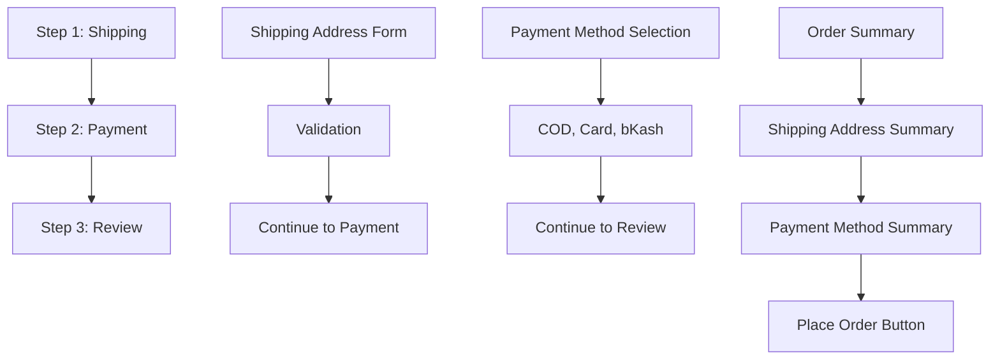
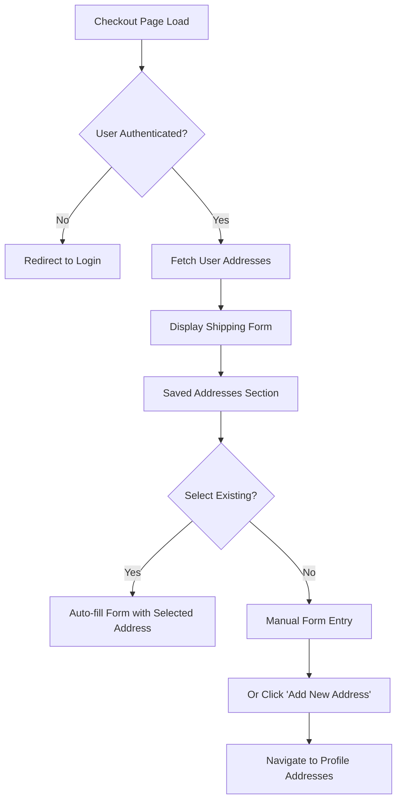

# Checkout and Address Management Implementation Analysis

**Date:** February 12, 2026  
**Project:** Smart Tech B2C Website Redevelopment  
**Base Directory:** `e:/Drive_D_Backup/Smart_Tech_B2C_Website_Redevelopment`

---

## Executive Summary

This report provides a comprehensive analysis of the current checkout page implementation and existing address management functionality in the Smart Tech B2C e-commerce platform. The analysis identifies key integration points for implementing a "Saved Addresses" feature that will allow users to utilize previously saved shipping and billing addresses during checkout.

**Key Findings:**
- The checkout page has a 3-step flow: Shipping → Payment → Review
- Address management is already implemented in the user profile section
- The system uses a hybrid state management approach with Zustand for cart and React Context for authentication
- Bangladesh-specific address hierarchy is well-established (Division → District → Upazila)
- The Address API is already functional with full CRUD operations

---

## 1. File Structure

### 1.1 Checkout-Related Files

| File Path | Purpose |
|-----------|---------|
| [`frontend/src/app/checkout/page.tsx`](frontend/src/app/checkout/page.tsx) | Main checkout page component with 3-step flow |
| [`frontend/src/contexts/CartContext.tsx`](frontend/src/contexts/CartContext.tsx) | Cart state management using Zustand |
| [`frontend/src/components/cart/CartPage.tsx`](frontend/src/components/cart/CartPage.tsx) | Cart page before checkout |
| [`frontend/src/components/cart/CartSummary.tsx`](frontend/src/components/cart/CartSummary.tsx) | Order summary component |

### 1.2 Address Management Files

| File Path | Purpose |
|-----------|---------|
| [`frontend/src/components/profile/AddressesTab.tsx`](frontend/src/components/profile/AddressesTab.tsx) | Displays list of saved addresses |
| [`frontend/src/components/profile/AddressForm.tsx`](frontend/src/components/profile/AddressForm.tsx) | Create/edit address form |
| [`frontend/src/components/profile/AddressCard.tsx`](frontend/src/components/profile/AddressCard.tsx) | Individual address display card |
| [`frontend/src/components/ui/BangladeshAddress.tsx`](frontend/src/components/ui/BangladeshAddress.tsx) | Bangladesh-specific address selection |
| [`frontend/src/data/bangladesh-data.ts`](frontend/src/data/bangladesh-data.ts) | Reference data for divisions, districts, upazilas |

### 1.3 API and Authentication Files

| File Path | Purpose |
|-----------|---------|
| [`frontend/src/lib/api/profile.ts`](frontend/src/lib/api/profile.ts) | Profile and Address API endpoints |
| [`frontend/src/lib/api/client.ts`](frontend/src/lib/api/client.ts) | Base API client with authentication |
| [`frontend/src/contexts/AuthContext.tsx`](frontend/src/contexts/AuthContext.tsx) | Authentication state management |

### 1.4 Type Definition Files

| File Path | Purpose |
|-----------|---------|
| [`frontend/src/types/auth.ts`](frontend/src/types/auth.ts) | User and authentication types |
| [`frontend/src/types/cart.ts`](frontend/src/types/cart.ts) | Cart-related types |

---

## 2. Current Checkout Implementation

### 2.1 Checkout Page Structure

The checkout page at [`frontend/src/app/checkout/page.tsx`](frontend/src/app/checkout/page.tsx) implements a 3-step checkout flow:



### 2.2 Shipping Address Form Fields

The current shipping address interface in [`frontend/src/app/checkout/page.tsx`](frontend/src/app/checkout/page.tsx:14-22) includes:

```typescript
interface ShippingAddress {
  fullName: string;      // Full name of recipient
  phone: string;         // Phone number (validated: 01[3-9]XXXXXXXX)
  addressLine1: string;  // Primary address
  addressLine2: string;  // Optional secondary address
  city: string;          // City name
  district: string;      // District (dropdown from predefined list)
  postalCode: string;    // Postal/ZIP code
}
```

### 2.3 Checkout Form Validation

The checkout page implements client-side validation with the following rules:

| Field | Validation Rule | Error Message |
|-------|-----------------|---------------|
| fullName | Required, non-empty | "Full name is required" |
| phone | Required, regex: `^01[3-9]\d{8}$` | "Invalid phone number format" |
| addressLine1 | Required, non-empty | "Address is required" |
| city | Required, non-empty | "City is required" |
| district | Required, non-empty | "District is required" |
| postalCode | Required, non-empty | "Postal code is required" |

### 2.4 Supported Districts

The checkout page includes a predefined list of 20 districts:

```typescript
const districts = [
  'Dhaka', 'Chittagong', 'Sylhet', 'Rajshahi', 'Rangpur', 'Khulna', 'Barisal',
  'Mymensingh', 'Gazipur', 'Narayanganj', 'Comilla', 'Gopalganj', 'Madaripur',
  'Munshiganj', 'Narayanganj', 'Tangail', 'Jamalpur', 'Sherpur', 'Kishoreganj', 'Manikganj'
];
```

**Note:** The profile address form uses a more comprehensive district list from [`frontend/src/data/bangladesh-data.ts`](frontend/src/data/bangladesh-data.ts) which includes all 64 districts of Bangladesh.

### 2.5 Payment Methods

The checkout supports three payment methods:

| ID | Name | Name (Bengali) |
|----|------|----------------|
| cod | Cash on Delivery | নগদ প্রদান |
| card | Credit/Debit Card | ক্রেডিট/ডেবিট কার্ড |
| bkash | bKash | বিকাশ |

---

## 3. Existing Address Management Implementation

### 3.1 Address Data Model

The [`Address`](frontend/src/lib/api/profile.ts:162-177) interface defines the structure of saved addresses:

```typescript
export interface Address {
  id: string;              // Unique identifier
  userId: string;          // Reference to user
  type: 'SHIPPING' | 'BILLING';  // Address type
  firstName: string;       // First name
  lastName: string;        // Last name
  phone?: string;          // Optional phone
  address: string;         // Primary address line
  addressLine2?: string;   // Optional secondary line
  city: string;            // City name
  district: string;        // District ID (e.g., "301")
  division: string;        // Division ID (e.g., "3")
  upazila?: string;        // Upazila ID (e.g., "30101")
  postalCode?: string;    // Postal code
  isDefault: boolean;     // Whether this is the default address
}
```

### 3.2 Address Hierarchy

The system uses Bangladesh's administrative hierarchy:

```
Division (বিভাগ)
    ↓
District (জেলা) / District ID
    ↓
Upazila (উপজেলা) / Upazila ID
    ↓
City / Postal Code
```

### 3.3 Address API Operations

The [`AddressAPI`](frontend/src/lib/api/profile.ts:196-284) class provides the following methods:

| Method | Endpoint | Description |
|--------|----------|-------------|
| `getAddresses(userId)` | `GET /users/{userId}/addresses` | Fetch all user addresses |
| `createAddress(userId, data)` | `POST /users/{userId}/addresses` | Create new address |
| `updateAddress(userId, addressId, data)` | `PUT /users/{userId}/addresses/{addressId}` | Update existing address |
| `deleteAddress(userId, addressId)` | `DELETE /users/{userId}/addresses/{addressId}` | Delete address |
| `setDefaultAddress(userId, addressId)` | `PUT /users/{userId}/addresses/{addressId}/default` | Set as default |

### 3.4 Address Form Features

The [`AddressForm`](frontend/src/components/profile/AddressForm.tsx) component includes:

- **Bilingual Support:** Full English and Bengali translations
- **Bangladesh Address Selector:** Cascading dropdowns for Division → District → Upazila
- **Phone Validation:** Pattern `^(\+880|01)(1[3-9]\d{8}|\d{9})$`
- **Form Validation:** Required field validation with error messages
- **Edit Mode:** Pre-populated form when editing existing address
- **Default Address:** Option to set as default address

### 3.5 Address Card Display

The [`AddressCard`](frontend/src/components/profile/AddressCard.tsx) component displays:

- Address type badge (SHIPPING/BILLING)
- Default address indicator
- Full name and phone
- Full address with hierarchical location
- Action buttons: Set Default, Edit, Delete

---

## 4. State Management Approach

### 4.1 Authentication State (AuthContext)

The [`AuthContext`](frontend/src/contexts/AuthContext.tsx) uses React's `useReducer` pattern:

```typescript
// State shape
interface AuthState {
  user: User | null;
  isLoading: boolean;
  error: LoginErrorPayload | string | null;
  sessionTimeout: number | null;
}

// Actions
type AuthAction =
  | { type: 'LOGIN_START' }
  | { type: 'LOGIN_SUCCESS'; payload: User }
  | { type: 'LOGIN_FAILURE'; payload: LoginErrorPayload }
  | { type: 'LOGOUT' }
  | { type: 'UPDATE_USER'; payload: User }
  // ... more actions
```

**Key Features:**
- NextAuth.js integration for session management
- Token refresh mechanism
- Session timeout tracking
- Bilingual error messages

### 4.2 Cart State (Zustand)

The [`CartContext`](frontend/src/contexts/CartContext.tsx) uses Zustand for state management:

```typescript
// CartStore interface
interface CartStore extends CartContextState {
  cart: Cart | null;
  isMerging: boolean;
  
  // Actions
  setCart: (cart: Cart | null) => void;
  setShippingMethod: (method: string, cost: number) => void;
  addItem: (product: Product, quantity: number, variantId?: string) => Promise<void>;
  removeItem: (itemId: string) => Promise<void>;
  updateQuantity: (itemId: string, quantity: number) => Promise<void>;
  clearCart: () => Promise<void>;
  applyDiscount: (code: string) => Promise<void>;
  loadCart: () => Promise<void>;
  mergeGuestCart: (sessionId: string) => Promise<void>;
  initializeCart: (user: any) => Promise<void>;
}
```

**Key Features:**
- Hybrid cart system (guest + authenticated)
- LocalStorage persistence for guest carts
- Cart merging on login
- Cross-tab synchronization
- Stock validation for guest carts

### 4.3 Form State in Checkout

The checkout page manages address form state locally:

```typescript
const [shippingAddress, setShippingAddress] = useState<ShippingAddress>({
  fullName: user ? `${user.firstName} ${user.lastName}` : '',
  phone: user?.phone || '',
  addressLine1: '',
  addressLine2: '',
  city: '',
  district: 'Dhaka',
  postalCode: '',
});

const [errors, setErrors] = useState<Partial<ShippingAddress>>({});
```

---

## 5. API Structure and Authentication

### 5.1 API Client Configuration

The base API client is defined in [`frontend/src/lib/api/client.ts`](frontend/src/lib/api/client.ts):

```typescript
// Environment-aware base URL
const API_BASE_URL = isServer
  ? process.env.BACKEND_API_URL || process.env.NEXT_PUBLIC_BACKEND_API_URL || 'http://localhost:3001/api/v1'
  : process.env.NEXT_PUBLIC_API_URL || 'http://localhost:3001/api/v1';
```

### 5.2 Authentication Headers

The API client automatically includes authentication tokens:

```typescript
const addAuthHeader = (headers: Record<string, string> = {}): Record<string, string> => {
  if (typeof window !== 'undefined') {
    const token = getToken();
    if (token) {
      return {
        ...headers,
        Authorization: `Bearer ${token}`,
      };
    }
  }
  return headers;
};
```

### 5.3 Token Management

- **Storage:** `localStorage` with key `'auth_token'`
- **Refresh:** Automatic token refresh on 401 responses
- **Remember Me:** Extended session token (`'remember_token'`)
- **Logout:** Clears all tokens from storage

### 5.4 Request/Response Handling

```typescript
// Automatic response unwrapping
if (shouldUnwrap && data?.success && typeof data.data !== 'undefined') {
  return data.data;
}

return data;
```

### 5.5 Error Handling

```typescript
class ApiError extends Error {
  constructor(
    message: string,
    public status?: number,
    public data?: any
  ) {
    super(message);
    this.name = 'ApiError';
  }
}
```

---

## 6. Integration Points for Saved Addresses Feature

### 6.1 Where to Integrate Saved Addresses

The saved addresses feature should be integrated at the **Shipping Address Form** step (Step 1) of the checkout:

```
Location: frontend/src/app/checkout/page.tsx
Component: <form onSubmit={handleShippingSubmit}>
File: Lines 261-413
```

### 6.2 Required Integration Points

| Integration Point | Description |
|-------------------|-------------|
| **Import AddressAPI** | Import from `frontend/src/lib/api/profile.ts` |
| **Add Saved Addresses State** | Create state for storing fetched addresses |
| **Fetch Addresses on Mount** | Load user addresses when checkout page loads |
| **Add Address Selector UI** | Create a dropdown/list to select saved addresses |
| **Auto-fill Form** | When a saved address is selected, populate the form fields |
| **Address Type Filtering** | Optionally filter by SHIPPING addresses only |
| **"Add New Address" Link** | Quick link to profile address management |

### 6.3 Data Mapping Required

The checkout [`ShippingAddress`](frontend/src/app/checkout/page.tsx:14-22) interface differs from the saved [`Address`](frontend/src/lib/api/profile.ts:162-177) interface:

| Checkout Field | Saved Address Field | Mapping Required |
|----------------|-------------------|------------------|
| fullName | firstName + lastName | ✓ Concatenate |
| phone | phone | ✓ Direct |
| addressLine1 | address | ✓ Direct |
| addressLine2 | addressLine2 | ✓ Direct |
| city | city | ✓ Direct |
| district | district | ✓ Direct (both IDs) |
| postalCode | postalCode | ✓ Direct |

### 6.4 UI Component Suggestions

A new `SavedAddressesSelector` component should be created at:
```
frontend/src/components/checkout/SavedAddressesSelector.tsx
```

**Props Interface:**
```typescript
interface SavedAddressesSelectorProps {
  addresses: Address[];
  selectedAddressId: string | null;
  onSelect: (address: Address) => void;
  onAddNew: () => void;
  language: 'en' | 'bn';
}
```

### 6.5 Flow Diagram



---

## 7. Technical Constraints and Limitations

### 7.1 Address Field Differences

**Constraint:** The checkout form and saved address form use different address field names.

**Details:**
- Checkout uses: `fullName`, `addressLine1`, `addressLine2`
- Saved addresses use: `firstName`, `lastName`, `address`, `addressLine2`

**Solution:** Create a mapping function to convert between formats.

### 7.2 District Data Inconsistency

**Constraint:** Checkout page has a limited district list (20) while the full system has 64 districts.

**Details:**
- Checkout: [`frontend/src/app/checkout/page.tsx:56-77`](frontend/src/app/checkout/page.tsx:56-77)
- Profile Address Form: [`frontend/src/data/bangladesh-data.ts`](frontend/src/data/bangladesh-data.ts)

**Solution:** Use the comprehensive district list from `bangladesh-data.ts` in checkout or add validation that allows any district ID.

### 7.3 No Billing Address in Checkout

**Constraint:** The current checkout only has a shipping address form, not a billing address form.

**Details:**
- Only `ShippingAddress` interface exists in checkout
- Payment method is selected but billing address is not collected

**Consideration:** If billing addresses are needed for saved address selection, the checkout may need to be enhanced.

### 7.4 Authentication Requirement

**Constraint:** Checkout requires authentication (redirects to login if not authenticated).

**Details:**
- From [`frontend/src/app/checkout/page.tsx:101-107`](frontend/src/app/checkout/page.tsx:101-107)

**Implication:** Saved addresses feature can assume user is authenticated.

### 7.5 No Cross-Component State Sharing

**Constraint:** Checkout page manages address state locally, not in a global context.

**Implication:** Address state will need to be managed locally or a new checkout context should be created.

### 7.6 API Response Handling

**Constraint:** The `getAddresses` API returns data in different formats depending on the endpoint.

**Details:**
- `AddressAPI.getAddresses()` returns `Address[]`
- Profile API returns `{ addresses: Address[] }`

**Solution:** Use the `AddressAPI` methods directly for consistency.

---

## 8. Recommendations

### 8.1 Immediate Implementation Steps

1. **Create Address Context** - Consider creating a `CheckoutAddressContext` for managing address state during checkout flow
2. **Implement Address Selector Component** - Create `SavedAddressesSelector` component with:
   - List of saved addresses
   - Selection indicator
   - "Add New Address" button
   - Proper error handling
3. **Add Address Fetching** - Fetch addresses when checkout page loads for authenticated users
4. **Implement Auto-fill Logic** - Map saved address fields to checkout form fields
5. **Add Unit Tests** - Test address mapping and form population logic

### 8.2 Future Enhancements

1. **Billing Address Support** - Add separate billing address form with "Same as shipping" option
2. **Address Validation** - Integrate with address validation service
3. **Address Suggestions** - Add Google Places-style address autocomplete
4. **Multiple Address Types** - Support for SHIPPING and BILLING address types in checkout

### 8.3 Code Organization

```
Suggested structure for new components:
frontend/src/
├── components/
│   └── checkout/
│       ├── SavedAddressesSelector.tsx  [NEW]
│       ├── ShippingAddressForm.tsx      [REFACTOR]
│       ├── BillingAddressForm.tsx       [FUTURE]
│       └── CheckoutAddressContext.tsx   [NEW - optional]
└── contexts/
    └── CheckoutContext.tsx              [NEW - optional]
```

---

## 9. Conclusion

The Smart Tech B2C e-commerce platform has a solid foundation for implementing saved addresses in checkout:

1. **Existing Infrastructure:** The address management system is fully implemented in the user profile
2. **API Ready:** All necessary API endpoints exist and are functional
3. **State Management:** Zustand and Context API provide flexible state management options
4. **Authentication:** User authentication is already integrated

The primary work required is to:
- Integrate the existing `AddressAPI` into the checkout page
- Create a UI component for selecting saved addresses
- Implement the field mapping between saved addresses and checkout form
- Handle edge cases (no saved addresses, different address formats)

The implementation should be straightforward given the existing infrastructure and clear API patterns established in the codebase.
