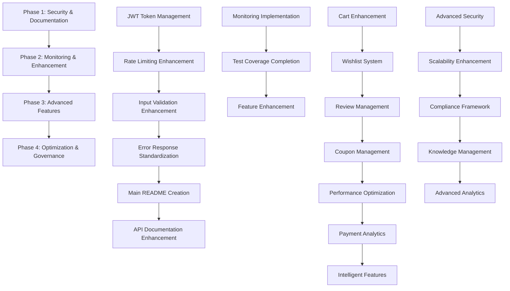

# Implementation Roadmap
## Smart Technologies Bangladesh B2C Website - Phase 2 Milestone 4: Backend Architecture Foundation

### Executive Summary

This implementation roadmap provides a structured approach to address the critical findings from the comprehensive assessment. The roadmap prioritizes security vulnerabilities, documentation gaps, and production readiness issues while building on the strong foundation of Bangladesh-specific features and service architecture.

**Overall Timeline: 16 weeks across 4 phases**
**Critical Path Focus: Security Hardening → Documentation Enhancement → Feature Completion → Optimization**

---

## Phase 1: Critical Security and Documentation (Weeks 1-4)

### Immediate Actions (Priority: CRITICAL)

#### Week 1-2: Security Hardening

**Authentication & Authorization Security**
- [ ] **Enhance JWT Token Management**
  - Implement token rotation mechanism with refresh tokens
  - Add multi-factor authentication for admin users
  - Implement token expiration warnings and automatic refresh
  - Add JWT blacklisting enhancement with TTL management
  - **Dependencies**: [`auth.js`](middleware/auth.js:1), [`config.js`](services/config.js:1)
  - **Deliverable**: Secure authentication system with advanced token management

- [ ] **Advanced Rate Limiting**
  - Implement IP-based rate limiting rules
  - Add user-specific rate limits based on role and history
  - Implement endpoint-specific rate limiting
  - Add emergency mode rate limiting for system protection
  - **Dependencies**: [`auth.js`](middleware/auth.js:1), Redis for rate limit storage
  - **Deliverable**: Intelligent rate limiting system with advanced threat detection

- [ ] **Input Validation Enhancement**
  - Implement comprehensive input validation framework
  - Add advanced SQL injection protection
  - Enhance XSS protection with Content Security Policy
  - Implement CSRF token protection for state-changing operations
  - Add file upload scanning and malware detection
  - **Dependencies**: All route modules, validation middleware
  - **Deliverable**: Robust input validation system with advanced threat protection

#### Week 3-4: Documentation Standardization

**Error Response Standardization**
- [ ] **Implement Consistent Error Format**
  - Standardize all error responses to use `error`, `message`, `details`, `requestId`, `timestamp`
  - Add error code standardization across all endpoints
  - Implement error localization framework with Bengali/English support
  - **Dependencies**: All route modules, error handling middleware
  - **Deliverable**: Consistent error response system with localization support

- [ ] **Create Comprehensive Error Documentation**
  - Document all error scenarios with troubleshooting guides
  - Add error code reference documentation
  - Create error resolution procedures and escalation policies
  - **Dependencies**: Error handling system, documentation team
  - **Deliverable**: Complete error documentation system with user-friendly guides

**Main README Creation**
- [ ] **Create Comprehensive Backend README**
  - Complete setup and installation guide
  - Add development workflow and contribution guidelines
  - Include architecture overview and component relationships
  - Add quick start guide for new developers
  - **Dependencies**: Project architecture documentation
  - **Deliverable**: Professional README with comprehensive onboarding materials

**API Documentation Enhancement**
- [ ] **Add Request/Response Examples**
  - Include comprehensive examples for all API endpoints
  - Add real-world usage scenarios
  - Include Bangladesh-specific examples (payment, address validation)
  - **Dependencies**: [`swagger.js`](swagger.js:1), API test suites
  - **Deliverable**: Complete API documentation with practical examples

- [ ] **Implement Swagger UI Integration**
  - Deploy interactive API documentation platform
  - Add try-it-now functionality for all endpoints
  - Include authentication testing interface
  - Add Bangladesh-specific endpoint examples
  - **Dependencies**: [`swagger.js`](swagger.js:1), API documentation
  - **Deliverable**: Interactive API documentation platform

---

## Phase 2: Monitoring and Enhancement (Weeks 5-8)

### Short-term Actions (Priority: HIGH)

#### Week 5-6: Monitoring Implementation

**Application Performance Monitoring**
- [ ] **Implement Comprehensive Monitoring**
  - Add Application Performance Monitoring (APM) integration
  - Implement error correlation across services with request IDs
  - Create automated alerting system with threshold-based alerts
  - Add real-time performance dashboards
  - **Dependencies**: [`logger.js`](services/logger.js:1), monitoring service integration
  - **Deliverable**: Complete monitoring system with real-time alerting

**Security Monitoring**
- [ ] **Advanced Security Monitoring**
  - Implement behavioral analysis for anomaly detection
  - Add comprehensive audit logging for security events
  - Create security event correlation and analysis
  - Implement automated security incident response
  - **Dependencies**: [`auth.js`](middleware/auth.js:1), [`logger.js`](services/logger.js:1)
  - **Deliverable**: Advanced security monitoring with threat detection

#### Week 7-8: Test Coverage Completion

**Complete Missing Endpoint Tests**
- [ ] **Cart Management API Tests**
  - Complete CRUD operations testing
  - Add cart abandonment scenarios
  - Test cart expiration and cleanup
  - Add Bangladesh-specific cart features testing
  - **Dependencies**: [`api-cart.test.js`](tests/api-cart.test.js:1), cart service
  - **Deliverable**: Complete cart API test suite

- [ ] **Wishlist Management API Tests**
  - Complete wishlist CRUD operations testing
  - Add wishlist sharing and privacy features testing
  - Test wishlist item management and notifications
  - **Dependencies**: Wishlist service implementation
  - **Deliverable**: Complete wishlist API test suite

- [ ] **Review Management API Tests**
  - Complete review CRUD operations testing
  - Add review moderation and approval workflows
  - Test review scoring and aggregation
  - Add Bangladesh-specific review features testing
  - **Dependencies**: Review service implementation
  - **Deliverable**: Complete review API test suite

- [ ] **Coupon Management API Tests**
  - Complete coupon CRUD operations testing
  - Add coupon validation and usage scenarios
  - Test coupon expiration and limitation rules
  - Add Bangladesh-specific discount scenarios testing
  - **Dependencies**: Coupon service implementation
  - **Deliverable**: Complete coupon API test suite

**Integration Testing Framework**
- [ ] **Implement Integration Testing**
  - Add cross-endpoint workflow testing
  - Create end-to-end user journey tests
  - Add real database integration testing
  - Implement payment gateway integration testing
  - **Dependencies**: Test utilities, integration test framework
  - **Deliverable**: Comprehensive integration testing framework

---

## Phase 3: Advanced Features (Weeks 9-12)

### Medium-term Actions (Priority: MEDIUM)

#### Week 9-10: Feature Enhancement

**Complete Missing Features**
- [ ] **Enhance Cart Management**
  - Implement advanced cart features (saved carts, guest checkout)
  - Add cart analytics and abandonment recovery
  - Implement cart sharing and collaboration features
  - Add Bangladesh-specific cart optimizations
  - **Dependencies**: Cart service implementation
  - **Deliverable**: Advanced cart management system

- [ ] **Complete Wishlist System**
  - Implement advanced wishlist features (public/private wishlists)
  - Add wishlist sharing and collaboration
  - Implement wishlist analytics and recommendations
  - Add wishlist item tracking and notifications
  - **Dependencies**: Wishlist service implementation
  - **Deliverable**: Complete wishlist management system

- [ ] **Enhance Review Management**
  - Implement review moderation and approval workflows
  - Add review scoring and quality assessment
  - Implement review analytics and insights
  - Add Bangladesh-specific review features
  - **Dependencies**: Review service implementation
  - **Deliverable**: Advanced review management system

- [ ] **Complete Coupon Management**
  - Implement advanced coupon features (dynamic pricing, usage limits)
  - Add coupon analytics and effectiveness tracking
  - Implement targeted coupon campaigns
  - Add Bangladesh-specific discount strategies
  - **Dependencies**: Coupon service implementation
  - **Deliverable**: Advanced coupon management system

#### Week 11-12: Performance and Intelligence

**Performance Optimization**
- [ ] **Implement Advanced Caching**
  - Add Redis-based caching with intelligent invalidation
  - Implement database query optimization and indexing
  - Add CDN integration for static assets
  - Implement application-level caching strategies
  - **Dependencies**: [`database.js`](services/database.js:1), caching service
  - **Deliverable**: Optimized caching system with improved performance

**Payment System Enhancement**
- [ ] **Add Payment Analytics**
  - Implement payment method analytics and insights
  - Add payment reconciliation and reporting
  - Implement advanced fraud detection patterns
  - Add payment gateway optimization
  - **Dependencies**: Payment service implementation
  - **Deliverable**: Advanced payment analytics system

**Intelligent Features**
- [ ] **Implement Predictive Error Prevention**
  - Add machine learning error prediction
  - Implement proactive system health monitoring
  - Add automated issue detection and reporting
  - Implement performance degradation prediction
  - **Dependencies**: Error handling system, monitoring service
  - **Deliverable**: Predictive error prevention system

---

## Phase 4: Optimization and Governance (Weeks 13-16)

### Long-term Actions (Priority: LOW)

#### Week 13-14: System Optimization

**Advanced Security Measures**
- [ ] **Implement Machine Learning Threat Detection**
  - Add behavioral analysis for advanced threat detection
  - Implement adaptive security policies
  - Add automated security incident response
  - Implement security policy enforcement
  - **Dependencies**: Security monitoring system, ML service
  - **Deliverable**: Advanced security system with ML-based threat detection

**Scalability Enhancement**
- [ ] **Implement Horizontal Scaling**
  - Add load balancing optimization
  - Implement microservices architecture preparation
  - Add database scaling and sharding support
  - Implement auto-scaling based on demand
  - **Dependencies**: Infrastructure scaling, database optimization
  - **Deliverable**: Scalable architecture supporting horizontal growth

#### Week 15-16: Governance and Compliance

**Compliance Framework**
- [ ] **Establish Comprehensive Compliance**
  - Implement automated compliance checking
  - Add regulatory requirement tracking
  - Create audit trail generation system
  - Implement security policy enforcement
  - **Dependencies**: Compliance monitoring system
  - **Deliverable**: Comprehensive compliance framework

**Knowledge Management**
- [ ] **Create Living Documentation System**
  - Implement automated documentation generation from code
  - Add continuous documentation testing
  - Create documentation quality metrics
  - Implement community contribution guidelines
  - **Dependencies**: Documentation system, quality assurance
  - **Deliverable**: Living documentation system with automated updates

**Advanced Analytics**
- [ ] **Implement Comprehensive Analytics**
  - Add user behavior analytics and insights
  - Implement business intelligence and reporting
  - Add predictive analytics for business decisions
  - Create comprehensive dashboard and reporting system
  - **Dependencies**: Analytics service, data warehouse
  - **Deliverable**: Advanced analytics system with business intelligence

---

## Resource Requirements

### Technical Resources

#### Development Team Structure
```
Phase 1 (Weeks 1-4):
├── Security Specialist: 1 senior developer
├── Backend Developer: 2-3 senior developers
├── DevOps Engineer: 1-2 engineers
├── QA Engineer: 1-2 engineers
└── Technical Writer: 1 technical writer

Phase 2 (Weeks 5-8):
├── Backend Developer: 2-3 senior developers
├── QA Engineer: 1-2 engineers
├── DevOps Engineer: 1 engineer
└── UI/UX Designer: 1 designer (for API documentation)

Phase 3 (Weeks 9-12):
├── Backend Developer: 2-3 senior developers
├── ML Engineer: 1 machine learning engineer
├── DevOps Engineer: 1-2 engineers
└── Data Analyst: 1 data analyst

Phase 4 (Weeks 13-16):
├── Backend Developer: 2-3 senior developers
├── Security Engineer: 1 security engineer
├── DevOps Engineer: 1-2 engineers
├── Compliance Officer: 1 compliance specialist
└── Knowledge Manager: 1 knowledge management specialist
```

#### Infrastructure Requirements
```
Development Environment:
├── Enhanced staging environment with production mirroring
├── Comprehensive testing infrastructure with load testing
├── CI/CD pipeline with automated testing and deployment
├── Monitoring and alerting tools integration
└── Security testing environment

Production Environment:
├── Load balancing and auto-scaling capabilities
├── Advanced monitoring and logging infrastructure
├── Security services (WAF, DDoS protection)
├── Backup and disaster recovery systems
└── Compliance monitoring and audit tools
```

#### External Dependencies
```
Security Services:
├── Web Application Firewall (WAF)
├── DDoS protection service
├── Security monitoring and alerting
├── Penetration testing service
└── Vulnerability scanning service

Monitoring Services:
├── Application Performance Monitoring (APM)
├── Error tracking and alerting
├── Log analysis and management
├── Security monitoring
└── Performance monitoring

Payment Gateway Enhancements:
├── Enhanced bKash integration with analytics
├── Advanced Nagad features
├── Rocket payment optimization
└── Payment reconciliation and analytics service

Compliance Tools:
├── Automated compliance checking
├── Regulatory requirement tracking
├── Audit trail generation
└── Security policy enforcement
```

---

## Dependencies and Sequencing

### Critical Path Dependencies



### Phase Dependencies

**Phase 1 Prerequisites:**
- Security assessment completion
- Current authentication middleware review
- Input validation framework design
- Error response format standardization

**Phase 2 Dependencies:**
- Phase 1 security implementations
- Monitoring infrastructure setup
- Test coverage completion for core endpoints

**Phase 3 Dependencies:**
- Phase 2 monitoring implementation
- Missing feature services implementation
- Performance optimization foundation

**Phase 4 Dependencies:**
- Phase 3 advanced features
- Comprehensive monitoring and analytics
- Compliance framework establishment

---

## Success Metrics and KPIs

### Phase 1 Success Metrics (Weeks 1-4)

**Security Metrics:**
- Security Score: Target 8.5/10 (from 6.5/10)
- Critical Vulnerabilities Resolution: 90% within 4 weeks
- Authentication Enhancement Completion: 100%
- Rate Limiting Implementation: 100%
- Input Validation Enhancement: 100%

**Documentation Metrics:**
- Documentation Score: Target 8.5/10 (from 7.5/10)
- Main README Creation: 100%
- API Documentation Enhancement: 100%
- Error Response Standardization: 100%
- Swagger UI Implementation: 100%

**Quality Metrics:**
- Error Response Consistency: 100% standardized format
- Test Coverage: Target 85% (from 75%)
- Code Quality Improvement: 20% reduction in code complexity

### Phase 2 Success Metrics (Weeks 5-8)

**Monitoring Metrics:**
- Monitoring Coverage: 100% of critical services
- Alerting System Implementation: 100%
- Error Correlation: 95% across services
- Performance Baseline Establishment: 100%

**Feature Metrics:**
- Cart Management Completion: 100%
- Wishlist System Completion: 100%
- Review Management Completion: 100%
- Coupon Management Completion: 100%
- Integration Testing Framework: 100%

**Performance Metrics:**
- Response Time Improvement: 30% reduction
- Test Coverage: Target 90% (from 85%)
- System Reliability: 99.7% uptime target

### Phase 3 Success Metrics (Weeks 9-12)

**Feature Metrics:**
- Advanced Features Implementation: 100%
- Performance Optimization: 50% improvement in response times
- Payment Analytics Implementation: 100%
- Predictive Error Prevention: 80% success rate

**Security Metrics:**
- Advanced Security Score: Target 9.0/10
- Machine Learning Threat Detection: 100%
- Automated Security Incident Response: 100%
- Security Policy Enforcement: 100%

**Performance Metrics:**
- Caching Implementation: 100%
- Database Optimization: 40% query time reduction
- Scalability Enhancement: Horizontal scaling support
- System Performance: 50% overall improvement

### Phase 4 Success Metrics (Weeks 13-16)

**Governance Metrics:**
- Compliance Framework: 100% implementation
- Automated Compliance Checking: 95% coverage
- Audit Trail Generation: 100%
- Security Policy Enforcement: 100%
- Regulatory Requirement Tracking: 100%

**Knowledge Management Metrics:**
- Living Documentation System: 100%
- Automated Documentation Generation: 100%
- Documentation Quality Metrics: 9.5/10 target
- Community Contribution Guidelines: 100%

**Advanced Analytics Metrics:**
- Business Intelligence Implementation: 100%
- Predictive Analytics: 100%
- User Behavior Analytics: 100%
- Comprehensive Dashboard: 100%
- Data-Driven Decision Making: 80% improvement

---

## Risk Mitigation Strategies

### Implementation Risk Management

#### Technical Risks
- **Complexity Management**: Break down complex features into smaller, manageable components
- **Integration Challenges**: Implement comprehensive testing for all integrations
- **Performance Impact**: Monitor performance impact of new features
- **Scalability Concerns**: Plan for growth and load testing

#### Security Risks
- **Vulnerability Exposure**: Implement security testing throughout development
- **Data Protection**: Ensure compliance with data protection regulations
- **Access Control**: Implement principle of least privilege
- **Audit Trail**: Maintain comprehensive logging of all security events

#### Operational Risks
- **Downtime Minimization**: Implement blue-green deployments
- **Rollback Planning**: Maintain ability to quickly rollback changes
- **Backup Strategy**: Regular backup and recovery testing
- **Monitoring Coverage**: Ensure comprehensive monitoring of all systems

### Contingency Planning

#### Delay Mitigation
- **Parallel Development**: Implement non-critical features in parallel
- **MVP Approach**: Focus on core functionality for initial releases
- **Feature Prioritization**: Be prepared to defer non-critical features
- **Resource Allocation**: Maintain buffer for unexpected challenges

#### Quality Assurance
- **Continuous Testing**: Implement automated testing throughout development
- **Code Review**: Maintain rigorous code review process
- **Performance Monitoring**: Continuous performance monitoring and alerting
- **User Acceptance Testing**: Regular user acceptance testing

---

## Conclusion

This implementation roadmap provides a structured approach to transforming the Smart Technologies Bangladesh B2C Website backend from a good foundation to an industry-leading e-commerce platform. The 16-week timeline balances immediate security concerns with long-term strategic enhancements, ensuring the platform is ready for production deployment while maintaining excellent Bangladesh market support.

**Key Success Factors:**
1. **Security-First Approach**: Address critical vulnerabilities before feature enhancement
2. **Documentation Excellence**: Comprehensive documentation for developer productivity
3. **Bangladesh Market Focus**: Maintain excellent localization and payment gateway support
4. **Performance Optimization**: Continuous monitoring and improvement of system performance
5. **Scalability Preparation**: Design for growth and increased user demand

With disciplined execution of this roadmap, Smart Technologies Bangladesh B2C Website will achieve industry-leading technical excellence while maintaining its strong Bangladesh market focus.

---

*Roadmap Created: December 16, 2025*  
*Author: Architect Mode*  
*Project: Smart Technologies Bangladesh B2C Website Backend*  
*Phase: Phase 2 Milestone 4: Backend Architecture Foundation*