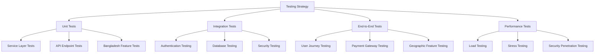
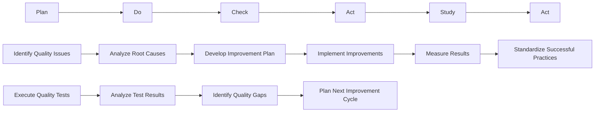

# Quality Assurance Framework
## Smart Technologies Bangladesh B2C Website - Phase 2 Milestone 4: Backend Architecture Foundation

### Executive Summary

This quality assurance framework establishes a comprehensive approach to maintaining and enhancing the quality of the Smart Technologies Bangladesh B2C Website backend. The framework focuses on continuous improvement, automated monitoring, and systematic quality measurement across all aspects of the system.

**Quality Philosophy:**
- **Continuous Improvement**: Ongoing enhancement rather than one-time fixes
- **Measurement-Driven**: Data-driven decision making for quality improvements
- **Bangladesh Market Focus**: Maintain excellent localization while improving overall quality
- **Security-First Approach**: Prioritize security and reliability in all quality initiatives
- **Developer Experience**: Focus on code maintainability and documentation excellence

---

## Code Quality Assurance

### Code Review Process

**Review Cadence:**
- **Daily Code Reviews**: Peer reviews for all code changes
- **Weekly Architecture Reviews**: Design and architecture decision reviews
- **Monthly Quality Assessments**: Comprehensive code quality evaluations
- **Quarterly Security Reviews**: Focused security vulnerability assessments

**Code Quality Standards:**
```javascript
// Code Quality Criteria
const codeQualityStandards = {
  maintainability: {
    score: 8.5,
    criteria: [
      "Clear and readable code structure",
      "Consistent naming conventions",
      "Proper documentation and comments",
      "Logical code organization",
      "Appropriate design patterns"
    ]
  },
  security: {
    score: 9.0,
    criteria: [
      "Secure coding practices",
      "Input validation and sanitization",
      "Proper authentication and authorization",
      "Data protection and encryption",
      "Error handling without information disclosure"
    ]
  },
  performance: {
    score: 8.0,
    criteria: [
      "Efficient algorithms and data structures",
      "Proper resource management",
      "Optimized database queries",
      "Memory and CPU usage optimization",
      "Response time optimization"
    ]
  },
  testability: {
    score: 8.5,
    criteria: [
      "Comprehensive unit test coverage",
      "Integration test coverage",
      "Test-driven development practices",
      "Mock and stub usage",
      "Automated test execution"
    ]
  },
  documentation: {
    score: 8.0,
    criteria: [
      "Comprehensive JSDoc comments",
      "Clear API documentation",
      "Architecture decision records",
      "Code examples and usage guides",
      "Setup and installation instructions"
    ]
  }
};
```

### Automated Code Quality Tools

**Static Analysis:**
- **ESLint Configuration**: Comprehensive linting rules for code quality
- **Code Complexity Analysis**: Cyclomatic complexity measurement and monitoring
- **Security Scanning**: Automated vulnerability scanning in CI/CD pipeline
- **Dependency Analysis**: Automated dependency vulnerability scanning
- **Code Coverage**: Automated test coverage reporting with quality gates

**Quality Gates:**
- **Code Coverage Gate**: Minimum 80% coverage for new features
- **Security Scan Gate**: Zero high-severity vulnerabilities
- **Performance Gate**: No performance regression in new features
- **Documentation Gate**: All new APIs documented with examples

### Code Quality Metrics

**Target Metrics:**
```
Code Quality Metrics:
- Maintainability Score: Target 8.5/10
- Security Score: Target 9.0/10
- Performance Score: Target 8.0/10
- Testability Score: Target 8.5/10
- Documentation Score: Target 8.0/10

Technical Debt Metrics:
- Code Complexity: Target < 10 cyclomatic complexity per function
- Test Coverage: Target 90% for new features
- Security Vulnerabilities: Target 0 critical vulnerabilities
- Documentation Coverage: Target 90% of APIs documented
```

**Monitoring Dashboard:**
```javascript
// Quality Metrics Dashboard
const qualityMetrics = {
  codeQuality: {
    maintainability: "Current score and trend",
    security: "Security scan results and trends",
    performance: "Code performance metrics",
    testability: "Test coverage and quality metrics",
    documentation: "Documentation completeness and quality"
  },
  technicalDebt: {
    complexity: "Code complexity trends",
    duplicates: "Code duplication metrics",
    outdated: "Outdated dependencies and patterns",
    violations: "Code standard violations count"
  },
  developmentVelocity: {
    commits: "Commits per week",
    features: "Features completed per sprint",
    bugs: "Bug fix rate and time to resolution",
    codeChurn: "Code change rate and stability"
  }
};
```

---

## Testing Quality Assurance

### Testing Strategy

**Testing Pyramid:**


### Test Coverage Standards

**Coverage Targets:**
```
Test Coverage Requirements:
Unit Tests: 90% minimum for new features
Integration Tests: 85% minimum for API endpoints
End-to-End Tests: 80% minimum for critical user journeys
Security Tests: 100% for authentication and authorization
Performance Tests: 70% for load and stress scenarios
Bangladesh Feature Tests: 95% for localization features
```

### Automated Testing Framework

**Continuous Integration:**
```javascript
// CI/CD Testing Pipeline
const testingPipeline = {
  triggers: [
    "On every commit to main branch",
    "On pull request creation/update",
    "Nightly build with full test suite",
    "Weekly security scan execution"
  ],
  stages: [
    {
      name: "Build",
      actions: ["Compile", "Lint", "Security Scan"],
      qualityGates: ["No compilation errors", "No linting violations", "No security vulnerabilities"]
    },
    {
      name: "Unit Tests",
      actions: ["Run unit test suite", "Generate coverage report"],
      qualityGates: ["80% minimum coverage", "No test failures"]
    },
    {
      name: "Integration Tests",
      actions: ["Run integration test suite", "Test API contracts"],
      qualityGates: ["85% minimum coverage", "No integration failures"]
    },
    {
      name: "Security Tests",
      actions: ["Run security test suite", "Vulnerability scanning"],
      qualityGates: ["No critical vulnerabilities", "All security tests pass"]
    },
    {
      name: "Deploy to Staging",
      actions: ["Deploy to staging environment", "Run smoke tests"],
      qualityGates: ["All smoke tests pass", "No deployment failures"]
    }
  ]
};
```

### Bangladesh-Specific Testing

**Localization Testing:**
```javascript
// Bangladesh Feature Testing Framework
const bangladeshTesting = {
  paymentGateways: {
    bKash: {
      "sandboxTesting": "Test all bKash scenarios in sandbox",
      "productionTesting": "Validate bKash integration in production",
      "errorScenarios": "Test payment failures, timeouts, and error handling",
      "currencyHandling": "Test BDT currency conversion and formatting"
    },
    nagad: {
      "sandboxTesting": "Complete Nagad sandbox testing",
      "productionTesting": "Validate Nagad production integration",
      "errorHandling": "Test Nagad-specific error scenarios",
      "fallbackTesting": "Test Nagad fallback mechanisms"
    },
    rocket: {
      "sandboxTesting": "Complete Rocket payment testing",
      "productionTesting": "Validate Rocket production integration",
      "errorHandling": "Test Rocket-specific error scenarios",
      "fallbackTesting": "Test Rocket fallback mechanisms"
    }
  },
  geographicFeatures: {
    addressValidation: {
      "divisionTesting": "Test all 8 Bangladesh divisions",
      "districtTesting": "Test major district validation",
      "postalCodeTesting": "Validate postal code formats",
      "addressStructure": "Test division/district/upazila hierarchy"
    },
    languageSupport: {
      "bengaliScript": "Test Bengali Unicode handling",
      "bilingualContent": "Test English/Bengali content switching",
      "rtlSupport": "Test right-to-left text rendering",
      "fontSupport": "Test Bengali font rendering"
    },
    culturalAdaptation: {
      "businessHours": "Test local business hour considerations",
      "holidays": "Test Bangladesh holiday calendar integration",
      "localCustoms": "Test regional customization features"
    }
  }
};
```

### Test Quality Metrics

**Testing KPIs:**
```
Testing Quality Metrics:
Test Coverage: Target 90% overall (from current 75%)
Test Execution Time: Target < 30 minutes for full suite
Test Reliability: Target 95% pass rate
Test Automation: Target 80% of tests automated
Bangladesh Feature Coverage: Target 95% for localization features
Security Test Coverage: Target 100% for authentication and authorization
Performance Test Baseline: Establish response time benchmarks
```

---

## Security Quality Assurance

### Security Assessment Framework

**Security Review Process:**
```javascript
// Security Review Framework
const securityReview = {
  frequency: {
    "codeReviews": "Weekly security-focused code reviews",
    "architectureReviews": "Monthly security architecture reviews",
    "penetrationTests": "Quarterly penetration testing",
    "vulnerabilityScanning": "Weekly automated vulnerability scanning",
    "dependencyAudits": "Monthly dependency vulnerability audits"
  },
  scope: {
    "authentication": "JWT token management, session security, MFA",
    "inputValidation": "SQL injection, XSS, CSRF protection",
    "apiSecurity": "Rate limiting, CORS, security headers",
    "dataProtection": "Encryption, access controls, data masking",
    "infrastructure": "Network security, server hardening, monitoring"
  },
  tools: [
    "OWASP ZAP",
    "Snyk",
    "SonarQube",
    "Burp Suite",
    "Custom security scanning tools"
  ]
};
```

### Security Quality Standards

**Security Score Calculation:**
```javascript
// Security Quality Metrics
const securityQuality = {
  authentication: {
    weight: 0.25,
    criteria: [
      "JWT token management and rotation",
      "Multi-factor authentication",
      "Session security and fixation protection",
      "Password policies and complexity"
    ]
  },
  inputValidation: {
    weight: 0.20,
    criteria: [
      "SQL injection protection",
      "XSS prevention",
      "CSRF protection",
      "Input sanitization and validation",
      "File upload security"
    ]
  },
  apiSecurity: {
    weight: 0.20,
    criteria: [
      "Rate limiting effectiveness",
      "CORS configuration",
      "Security headers implementation",
      "API versioning and deprecation"
    ]
  },
  dataProtection: {
    weight: 0.15,
    criteria: [
      "Data encryption at rest and in transit",
      "Access control and permissions",
      "Data masking and anonymization",
      "Privacy compliance"
    ]
  },
  infrastructure: {
    weight: 0.10,
    criteria: [
      "Server hardening",
      "Network security configuration",
      "Monitoring and alerting",
      "Backup and disaster recovery"
    ]
  },
  compliance: {
    weight: 0.10,
    criteria: [
      "OWASP compliance",
      "PCI DSS compliance",
      "Data protection regulations",
      "Audit trail and logging"
    ]
  }
};
```

### Security Monitoring

**Security Monitoring Framework:**
```javascript
// Security Monitoring System
const securityMonitoring = {
  realTimeMonitoring: {
    "authenticationEvents": "Login attempts, token usage, MFA challenges",
    "suspiciousActivity": "Brute force attacks, unusual patterns",
    "securityEvents": "Permission changes, admin actions, configuration changes",
    "vulnerabilityScanning": "Automated security scan results",
    "apiAbuse": "Rate limit exceeded, unusual API usage patterns"
  },
  alertingSystem: {
    "immediateAlerts": "Security incidents, critical vulnerabilities",
    "thresholdAlerts": "Rate limit exceeded, performance degradation",
    "escalationPolicies": "Automatic escalation for critical security events",
    "notificationChannels": ["Email", "SMS", "Slack", "Dashboard alerts"]
  },
  incidentResponse: {
    "containment": "Immediate isolation of affected systems",
    "investigation": "Security incident analysis and forensics",
    "recovery": "System restoration and security hardening",
    "postMortem": "Security incident analysis and prevention planning"
  }
};
```

---

## Documentation Quality Assurance

### Documentation Standards

**Documentation Requirements:**
```
Documentation Quality Standards:
API Documentation: 9.0/10
- Complete API endpoint documentation with examples
- Request/response examples for all endpoints
- Bangladesh-specific feature documentation
- Interactive documentation with Swagger UI
- Error code reference and troubleshooting guides

Code Documentation: 8.5/10
- Comprehensive JSDoc comments for all public methods
- Architecture decision records (ADRs)
- Code examples and usage guides
- Development setup and contribution guidelines

README Documentation: 8.5/10
- Comprehensive project setup guide
- Development environment requirements
- Architecture overview and component relationships
- Quick start guide for new developers
- Troubleshooting guide with common issues
```

### Documentation Review Process

**Review Cadence:**
- **Pre-Release Documentation Review**: Comprehensive review before each release
- **Monthly Documentation Quality Assessment**: Score documentation against standards
- **Quarterly Documentation Gap Analysis**: Identify missing or outdated documentation
- **Continuous Documentation Testing**: Validate code examples and setup instructions

**Documentation Quality Metrics:**
```
Documentation Quality Metrics:
Completeness: Target 90% of required documentation documented
Accuracy: Target 95% accuracy between documentation and implementation
Usability: Target 4.5/5 user satisfaction rating
Accessibility: Target WCAG 2.1 AA compliance for documentation
Timeliness: Documentation updated within 7 days of code changes
Maintenance: Regular documentation reviews and updates scheduled
```

---

## Performance Quality Assurance

### Performance Monitoring Framework

**Performance Metrics Collection:**
```javascript
// Performance Monitoring System
const performanceMonitoring = {
  applicationMetrics: {
    "responseTime": "Average and P95 response times",
    "throughput": "Requests per second and concurrent users",
    "errorRate": "Percentage of requests resulting in errors",
    "availability": "System uptime and downtime",
    "resourceUtilization": "CPU, memory, disk, network usage"
  },
  databaseMetrics: {
    "queryTime": "Average and slow query identification",
    "connectionPool": "Active connections and pool efficiency",
    "indexPerformance": "Query optimization and indexing effectiveness",
    "transactionThroughput": "Transactions per second"
  },
  businessMetrics: {
    "userSatisfaction": "User experience and satisfaction scores",
    "conversionRates": "Bangladesh payment method success rates",
    "revenueMetrics": "Revenue and transaction analytics",
    "featureUsage": "Feature adoption and utilization rates"
  },
  infrastructureMetrics: {
    "serverPerformance": "CPU, memory, and I/O metrics",
    "networkLatency": "Response times and bandwidth utilization",
    "scalability": "Load testing results and capacity planning"
  }
};
```

### Performance Standards

**Performance Targets:**
```
Performance Standards:
Response Time: Target < 300ms average for API endpoints
Throughput: Target 1000+ requests per second
Availability: Target 99.9% uptime with graceful degradation
Error Rate: Target < 1% of requests result in errors
Resource Utilization: Target < 80% CPU, < 70% memory usage
Database Performance: Target < 100ms average query time
Bangladesh Features: < 200ms response time for local features
```

### Performance Optimization

**Optimization Strategies:**
```javascript
// Performance Optimization Framework
const performanceOptimization = {
  database: {
    "queryOptimization": "Improve query efficiency and indexing",
    "connectionPooling": "Optimize connection pool management",
    "caching": "Implement intelligent caching strategies",
    "monitoring": "Database performance monitoring and alerting"
  },
  application: {
    "codeOptimization": "Profile and optimize hot paths",
    "memoryManagement": "Implement efficient memory usage patterns",
    "concurrency": "Optimize concurrent request handling",
    "asyncOperations": "Implement non-blocking operations"
  },
  infrastructure: {
    "loadBalancing": "Implement intelligent load distribution",
    "cdnIntegration": "Content delivery network optimization",
    "compression": "Enable response compression",
    "monitoring": "Comprehensive infrastructure monitoring"
  },
  bangladeshFeatures: {
    "paymentGatewayOptimization": "Optimize local payment method performance",
    "geographicDataOptimization": "Optimize Bangladesh geographic queries",
    "contentOptimization": "Optimize localized content delivery"
    "culturalOptimization": "Optimize for Bangladesh user preferences"
  }
};
```

---

## Bangladesh Market Quality Assurance

### Localization Quality Framework

**Localization Standards:**
```javascript
// Localization Quality Framework
const localizationQuality = {
  languageSupport: {
    bengali: {
      "scriptSupport": "Complete Bengali Unicode support",
      "fontRendering": "Bengali font optimization",
      "inputMethods": "Bengali keyboard input support",
      "textDirection": "Right-to-left text rendering support"
    },
    english: {
      "defaultLanguage": "English as primary language",
      "fallbackMechanism": "Graceful fallback for missing translations"
    }
  },
  culturalAdaptation: {
    businessPractices: "Bangladesh business hour considerations",
    holidays: "Bangladesh holiday calendar integration",
    localCustoms: "Regional customization and preferences",
    paymentPreferences: "Bangladesh payment method optimization"
  },
  geographicFeatures: {
    addressStructure: "Bangladesh-specific address format validation",
    divisions: "All 8 administrative divisions supported",
    districts: "64+ districts with proper validation",
    postalCodes: "Local postal code format support"
    timezone: "Asia/Dhaka timezone configuration"
  },
  paymentSystems: {
    localMethods: {
      "bKash": "Complete bKash integration with error handling",
      "nagad": "Full Nagad support with fallback mechanisms",
      "rocket": "Rocket payment system with optimization",
      "traditional": "Cash on delivery and bank transfer options"
    },
    currency: {
      "primary": "BDT with proper formatting (৳ symbol)",
      "conversion": "Real-time currency conversion rates",
      "display": "Localized currency formatting"
    }
  }
};
```

### Localization Testing

**Localization Test Coverage:**
```
Localization Testing Requirements:
Language Support: 100% Bengali and English content tested
Geographic Coverage: 100% of Bangladesh divisions and districts tested
Payment Methods: 100% of Bangladesh payment methods tested
Cultural Features: 90% of Bangladesh-specific features tested
User Experience: 95% of localization workflows tested
Error Handling: 100% of error localization tested
```

### Localization Quality Metrics

**Localization KPIs:**
```
Localization Quality Metrics:
Translation Coverage: Target 95% of content translated
Translation Accuracy: Target 98% translation accuracy
User Satisfaction: Target 4.5/5 for localization experience
Cultural Adaptation: Target 90% of Bangladesh market features adapted
Geographic Accuracy: Target 99% of geographic data correct
Payment Method Success: Target 95% of Bangladesh payment transactions successful
Documentation Quality: Target 9.0/10 for localization documentation
```

---

## Continuous Improvement Process

### Quality Improvement Cycle

**PDCA Cycle:**


### Quality Improvement Initiatives

**Continuous Improvement Categories:**
```javascript
// Quality Improvement Framework
const qualityImprovement = {
  technical: {
    "codeQuality": "Regular code reviews and refactoring",
    "architecture": "Architecture decision records and reviews",
    "performance": "Performance optimization and monitoring",
    "security": "Security assessments and enhancements",
    "testing": "Test coverage expansion and automation"
  },
  process: {
    "documentation": "Documentation quality improvements",
    "codeReview": "Structured code review process",
    "deployment": "Deployment quality and reliability",
    "monitoring": "Comprehensive monitoring and alerting"
  },
  product: {
    "userExperience": "User feedback collection and analysis",
    "featureQuality": "Feature usage analytics and optimization",
    "bangladeshMarket": "Bangladesh-specific feature enhancement"
  },
  learning: {
    "teamTraining": "Technical skill development and training",
    "knowledgeSharing": "Best practices documentation and sharing",
    "tooling": "Development tool and process improvements"
  }
};
```

### Quality Metrics Dashboard

**Quality Dashboard Components:**
```javascript
// Quality Metrics Dashboard
const qualityDashboard = {
  overview: {
    "overallScore": "Composite quality score with trend analysis",
    "keyMetrics": "Critical KPIs with current status and targets",
    "trendAnalysis": "Historical quality trends and predictions",
    "improvementStatus": "Active improvement initiatives and progress"
  },
  technical: {
    "codeQuality": "Code quality metrics and trends",
    "securityScore": "Security assessment results and improvements",
    "performanceMetrics": "System performance indicators",
    "testCoverage": "Test coverage statistics and quality"
  },
  product: {
    "userSatisfaction": "User feedback and satisfaction scores",
    "featureUsage": "Feature adoption and utilization metrics",
    "bangladeshFeatures": "Bangladesh-specific feature quality and usage"
  },
  operational: {
    "deploymentQuality": "Deployment success rates and rollback frequency",
    "incidentResponse": "Incident resolution time and effectiveness",
    "systemReliability": "Uptime, availability, and degradation metrics"
  }
};
```

---

## Quality Assurance Governance

### Quality Council

**Quality Council Structure:**
- **Technical Lead**: Senior developer responsible for technical quality standards
- **Security Champion**: Security specialist leading security initiatives
- **Testing Lead**: QA engineer responsible for testing strategy and execution
- **Documentation Owner**: Technical writer responsible for documentation quality
- **Bangladesh Market Expert**: Specialist for Bangladesh market adaptation and localization
- **Product Manager**: Overall product quality and user experience

**Quality Council Responsibilities:**
```javascript
// Quality Council Responsibilities
const qualityCouncil = {
  standards: {
    "defineQualityStandards": "Establish and maintain quality standards",
    "reviewQualityMetrics": "Regular review of quality KPIs and trends",
    "approveQualityImprovements": "Review and approve quality improvement initiatives"
  },
  monitoring: {
    "qualityMetricsReview": "Monthly review of quality metrics and dashboards",
    "trendAnalysis": "Analyze quality trends and identify improvement areas",
    "reporting": "Quarterly quality reports to stakeholders"
  },
  improvement: {
    "prioritizeInitiatives": "Prioritize quality improvement based on impact",
    "resourceAllocation": "Allocate resources for quality improvement projects",
    "successMeasurement": "Measure effectiveness of quality improvement initiatives"
  }
};
```

### Quality Assurance Training

**Training Programs:**
```
Quality Assurance Training:
Code Quality Training:
- Secure coding practices and vulnerability prevention
- Code review techniques and quality standards
- Performance optimization and profiling
- Testing best practices and automation

Security Training:
- OWASP security guidelines and compliance
- Bangladesh-specific security considerations
- Incident response and handling procedures
- Security tool usage and analysis

Documentation Training:
- Technical writing best practices
- API documentation standards and tools
- Bangladesh market documentation requirements
- User experience and accessibility considerations

Bangladesh Market Training:
- Bangladesh e-commerce market dynamics and regulations
- Cultural considerations and user preferences
- Local payment method integration and support
- Geographic and demographic considerations
```

---

## Conclusion

This quality assurance framework provides a comprehensive approach to maintaining and enhancing the quality of the Smart Technologies Bangladesh B2C Website backend. The framework emphasizes continuous improvement, measurement-driven decision making, and Bangladesh market focus while ensuring technical excellence and security.

**Key Success Factors:**
1. **Comprehensive Quality Coverage**: Code, security, testing, documentation, and performance
2. **Bangladesh Market Excellence**: Maintaining excellent localization while improving overall quality
3. **Security-First Approach**: Prioritizing security and reliability in all quality initiatives
4. **Continuous Improvement**: Ongoing enhancement rather than one-time fixes
5. **Measurement-Driven Decisions**: Data-driven quality improvement with clear KPIs

With disciplined execution of this quality assurance framework, Smart Technologies Bangladesh B2C Website will achieve industry-leading quality standards while maintaining its strong Bangladesh market focus and user experience excellence.

---

*Quality Assurance Framework Created: December 16, 2025*  
*Author: Architect Mode*  
*Project: Smart Technologies Bangladesh B2C Website Backend*  
*Phase: Phase 2 Milestone 4: Backend Architecture Foundation*