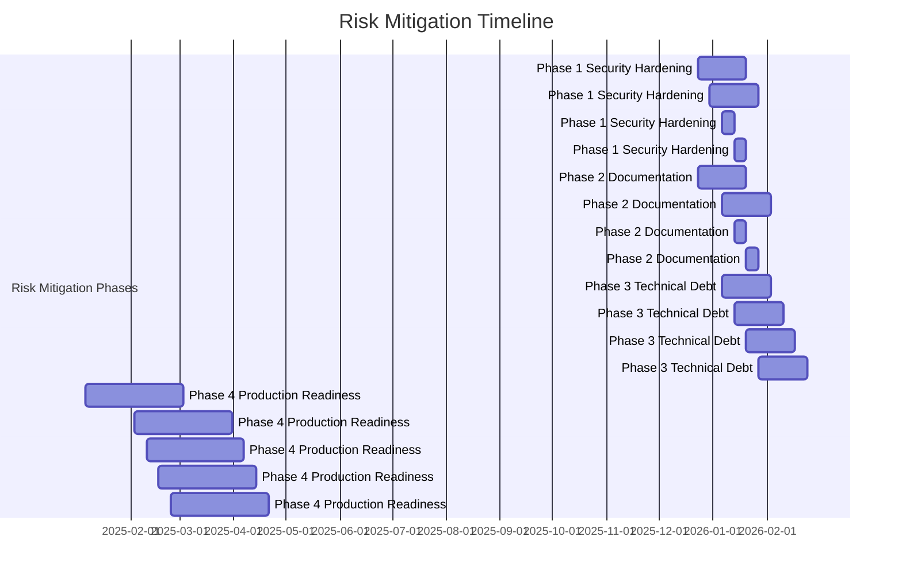

# Risk Mitigation Strategy
## Smart Technologies Bangladesh B2C Website - Phase 2 Milestone 4: Backend Architecture Foundation

### Executive Summary

This risk mitigation strategy provides a comprehensive approach to addressing the critical security vulnerabilities, technical debt, and production readiness gaps identified in the comprehensive assessment. The strategy prioritizes immediate security concerns while maintaining the excellent Bangladesh-specific features and service architecture foundation.

**Risk Mitigation Philosophy:**
- **Security-First Approach**: Address critical vulnerabilities before feature enhancement
- **Proactive Prevention**: Implement preventive measures rather than reactive fixes
- **Bangladesh Market Focus**: Maintain excellent localization while improving security
- **Gradual Enhancement**: Implement changes in controlled, measurable phases
- **Continuous Monitoring**: Establish ongoing risk assessment and mitigation tracking

---

## Security Vulnerability Mitigation

### Critical Security Issues (Priority: IMMEDIATE)

#### 1. Authentication and Authorization Security

**Current Vulnerabilities:**
- JWT token management lacks rotation mechanism
- Basic rate limiting without IP-based rules
- Session management vulnerable to fixation attacks
- Limited multi-factor authentication

**Mitigation Strategy:**
```javascript
// Enhanced Authentication Security
const authenticationMitigation = {
  immediate: [
    {
      issue: "JWT Token Management",
      risk: "High",
      mitigation: "Implement JWT token rotation with refresh tokens",
      implementation: {
        "shortToken": "15-minute access token",
        "refreshToken": "7-day refresh token",
        "rotationPolicy": "Rotate tokens every 7 days",
        "storage": "Secure Redis storage with TTL"
      }
    },
    {
      issue: "Multi-Factor Authentication",
      risk: "Medium",
      mitigation: "Add MFA for admin and sensitive operations",
      implementation: {
        "methods": ["TOTP", "SMS", "Email"],
        "triggers": ["Admin login", "Password change", "API key generation"],
        "recovery": "Backup recovery codes"
      }
    },
    {
      issue: "Advanced Rate Limiting",
      risk: "High",
      mitigation: "Implement intelligent rate limiting with IP-based rules",
      implementation: {
        "ipReputation": "Track suspicious IP behavior",
        "userLimits": "Role-based rate limits",
        "endpointLimits": "Specific limits per endpoint",
        "emergencyMode": "System-wide rate limiting under attack"
      }
    },
    {
      issue: "Session Security",
      risk: "Medium",
      mitigation: "Enhance session management with fixation protection",
      implementation: {
        "sessionBinding": "Bind sessions to IP and user agent",
        "rotation": "Automatic session rotation",
        "timeout": "Configurable session timeouts",
        "invalidation": "Secure session invalidation on logout"
      }
    }
  ],
  testing: [
    "Implement comprehensive authentication testing",
    "Add penetration testing for authentication bypass",
    "Test session fixation scenarios",
    "Validate rate limiting effectiveness"
  ]
};
```

#### 2. Input Validation and Injection Protection

**Current Vulnerabilities:**
- Basic SQL injection protection without advanced threat detection
- Limited XSS protection with insufficient Content Security Policy
- Missing comprehensive CSRF protection
- Basic file upload validation without advanced scanning

**Mitigation Strategy:**
```javascript
// Advanced Input Protection
const inputValidationMitigation = {
  immediate: [
    {
      issue: "SQL Injection Protection",
      risk: "High",
      mitigation: "Implement comprehensive input validation framework",
      implementation: {
        "parameterizedQueries": "Strict parameterized query usage",
        "queryValidation": "Input validation before database queries",
        "escaping": "Proper output escaping",
        "ormProtection": "Use ORM protection features"
      }
    },
    {
      issue: "XSS Protection",
      risk: "High",
      mitigation: "Enhance XSS protection with Content Security Policy",
      implementation: {
        "csp": "Strict Content Security Policy headers",
        "inputSanitization": "Comprehensive input sanitization",
        "outputEncoding": "Proper output encoding",
        "httpOnly": "HTTP-only cookie flags"
      }
    },
    {
      issue: "CSRF Protection",
      risk: "Medium",
      mitigation: "Implement CSRF token protection for state-changing operations",
      implementation: {
        "tokens": "Synchronizer and anti-CSRF tokens",
        "validation": "Validate CSRF tokens on state changes",
        "headers": "Custom CSRF protection headers",
        "sameSite": "Strict SameSite cookie policies"
      }
    },
    {
      issue: "File Upload Security",
      risk: "Medium",
      mitigation: "Add comprehensive file upload scanning and malware detection",
      implementation: {
        "scanning": "Malware and virus scanning",
        "validation": "File type and size validation",
        "sandboxing": "Isolated file processing",
        "quarantine": "Suspicious file quarantine"
      }
    }
  ],
  testing: [
    "Implement comprehensive input validation testing",
    "Add SQL injection penetration testing",
    "Test XSS protection with various attack vectors",
    "Validate CSRF protection effectiveness"
  ]
};
```

#### 3. API Security Enhancement

**Current Vulnerabilities:**
- Missing comprehensive security headers
- Basic CORS configuration with potential wildcard issues
- Limited endpoint-specific rate limiting
- Risk of information disclosure in error messages

**Mitigation Strategy:**
```javascript
// API Security Enhancement
const apiSecurityMitigation = {
  immediate: [
    {
      issue: "Security Headers",
      risk: "Medium",
      mitigation: "Implement comprehensive security headers",
      implementation: {
        "hsts": "Strict Transport Security headers",
        "csp": "Content Security Policy implementation",
        "xFrameOptions": "X-Frame-Options protection",
        "xContentType": "X-Content-Type-Options protection"
      }
    },
    {
      issue: "CORS Configuration",
      risk: "High",
      mitigation: "Fix CORS configuration for production security",
      implementation: {
        "originValidation": "Strict origin validation",
        "credentials": "Proper credential handling",
        "preflight": "Complete preflight handling",
        "wildcardPrevention": "Prevent wildcard origins in production"
      }
    },
    {
      issue: "Rate Limiting Enhancement",
      risk: "Medium",
      mitigation: "Add endpoint-specific and user-based rate limiting",
      implementation: {
        "endpointLimits": "Different limits per endpoint type",
        "userLimits": "Rate limits based on user role/history",
        "burstProtection": "Burst protection with token bucket",
        "adaptiveLimits": "Dynamic limit adjustment based on system load"
      }
    },
    {
      issue: "Error Message Sanitization",
      risk: "Low",
      mitigation: "Enhance error message sanitization for production",
      implementation: {
        "informationHiding": "Hide sensitive system information",
        "standardizedMessages": "Consistent error message format",
        "errorCodes": "Standard error code system",
        "logging": "Comprehensive error logging without sensitive data"
      }
    }
  ],
  testing: [
    "Implement comprehensive API security testing",
    "Add penetration testing for API endpoints",
    "Test rate limiting effectiveness",
    "Validate security headers implementation"
  ]
};
```

### Security Monitoring and Alerting

**Security Monitoring Framework:**
```javascript
// Security Monitoring System
const securityMonitoring = {
  realTimeMonitoring: {
    "authenticationEvents": "Login attempts, token usage, session creation",
    "suspiciousActivity": "IP reputation, unusual patterns, attack detection",
    "securityEvents": "Permission changes, admin actions, configuration changes",
    "vulnerabilityScanning": "Automated vulnerability scanning and alerting"
  },
  alertingSystem: {
    "immediateAlerts": "Security incidents, brute force attacks, system breaches",
    "thresholdAlerts": "Rate limit exceeded, unusual patterns, performance degradation",
    "escalationPolicies": "Automatic escalation for critical security events",
    "notificationChannels": ["Email", "SMS", "Slack", "Dashboard alerts"]
  },
  incidentResponse: {
    "containment": "Immediate isolation of affected systems",
    "investigation": "Security incident investigation procedures",
    "recovery": "System restoration and security hardening",
    "postMortem": "Security incident analysis and prevention planning"
  }
};
```

---

## Technical Debt Mitigation

### Code Quality and Maintainability

**Current Technical Debt:**
- Inconsistent error response formats across endpoints
- Limited code documentation in route handlers
- Mixed coding patterns across modules
- Incomplete test coverage for some endpoints

**Mitigation Strategy:**
```javascript
// Technical Debt Resolution
const technicalDebtMitigation = {
  immediate: [
    {
      issue: "Error Response Standardization",
      mitigation: "Standardize all error response formats",
      implementation: {
        "format": "Consistent error structure across all endpoints",
        "validation": "Centralized error validation middleware",
        "localization": "Error message localization framework",
        "documentation": "Complete error scenario documentation"
      }
    },
    {
      issue: "Code Documentation Enhancement",
      mitigation: "Improve code documentation and comments",
      implementation: {
        "jsdoc": "Add comprehensive JSDoc comments",
        "inlineComments": "Add inline documentation for complex logic",
        "architectureDocs": "Create architecture decision records",
        "apiDocs": "Enhance API documentation with examples"
      }
    },
    {
      issue: "Test Coverage Completion",
      mitigation: "Complete test coverage for all endpoints",
      implementation: {
        "missingTests": "Implement tests for cart, wishlist, reviews, coupons",
        "integrationTests": "Add comprehensive integration testing",
        "performanceTests": "Implement load and performance testing",
        "automation": "Create automated test execution pipeline"
      }
    }
  ],
  ongoing: [
    "Regular code reviews for quality standards",
    "Automated code quality analysis",
    "Documentation maintenance and updates",
    "Technical debt tracking and measurement"
  ]
};
```

### Architecture and Design Improvements

**Current Architecture Issues:**
- Some tight coupling between services
- Complex configuration without clear separation
- Limited observability and monitoring capabilities
- Basic scaling without advanced patterns

**Mitigation Strategy:**
```javascript
// Architecture Enhancement
const architectureMitigation = {
  immediate: [
    {
      issue: "Service Decoupling",
      mitigation: "Reduce tight coupling between services",
      implementation: {
        "interfaces": "Define clear service interfaces",
        "dependencyInjection": "Implement dependency injection patterns",
        "eventDriven": "Use event-driven architecture where appropriate",
        "apiGateway": "Implement API gateway pattern for service communication"
      }
    },
    {
      issue: "Configuration Management",
      mitigation: "Simplify and organize configuration management",
      implementation: {
        "separation": "Separate development, staging, production configs",
        "validation": "Enhanced configuration validation",
        "environment": "Environment-specific configuration management",
        "secrets": "Secure secret management with rotation"
      }
    },
    {
      issue: "Monitoring and Observability",
      mitigation: "Implement comprehensive monitoring and observability",
      implementation: {
        "metrics": "Application performance and business metrics",
        "logging": "Structured logging with correlation",
        "tracing": "Distributed tracing for request flows",
        "healthChecks": "Comprehensive service health monitoring"
      }
    }
  ],
  longTerm: [
    "Implement microservices architecture for better scalibility",
    "Add service mesh for inter-service communication",
    "Implement event-driven architecture for loose coupling",
    "Create comprehensive API versioning strategy"
  ]
};
```

### Performance and Reliability Improvements

**Current Performance Issues:**
- Database query optimization needs improvement
- Limited memory pressure handling
- Basic recovery without self-healing capabilities
- Inefficient resource utilization patterns

**Mitigation Strategy:**
```javascript
// Performance Optimization
const performanceMitigation = {
  immediate: [
    {
      issue: "Database Optimization",
      mitigation: "Optimize database queries and connection management",
      implementation: {
        "queryOptimization": "Improve query efficiency and indexing",
        "connectionPooling": "Enhanced connection pool management",
        "caching": "Implement intelligent caching strategies",
        "monitoring": "Database performance monitoring"
      }
    },
    {
      issue: "Memory Management",
      mitigation: "Implement advanced memory management and monitoring",
      implementation: {
        "monitoring": "Real-time memory usage tracking",
        "pressureHandling": "Graceful degradation under memory pressure",
        "optimization": "Memory leak detection and prevention",
        "allocation": "Efficient memory allocation patterns"
      }
    },
    {
      issue: "Error Recovery Enhancement",
      mitigation: "Implement self-healing error recovery mechanisms",
      implementation: {
        "circuitBreaker": "Enhanced circuit breaker with machine learning",
        "retryLogic": "Intelligent retry with exponential backoff",
        "fallbackSystems": "Comprehensive fallback mechanisms",
        "recovery": "Automated error recovery and system restoration"
      }
    }
  ],
  ongoing: [
    "Continuous performance monitoring and optimization",
    "Regular load testing and performance benchmarking",
    "Resource utilization analysis and optimization",
    "Performance regression testing and prevention"
  ]
};
```

---

## Production Readiness Mitigation

### Monitoring and Alerting Implementation

**Current Production Gaps:**
- No comprehensive monitoring system
- Limited alerting capabilities
- Missing compliance documentation
- Basic disaster recovery capabilities

**Mitigation Strategy:**
```javascript
// Production Readiness Enhancement
const productionReadinessMitigation = {
  immediate: [
    {
      issue: "Comprehensive Monitoring",
      mitigation: "Implement comprehensive monitoring and alerting system",
      implementation: {
        "apm": "Application Performance Monitoring integration",
        "infrastructure": "Infrastructure monitoring and alerting",
        "business": "Business metrics and KPI monitoring",
        "security": "Security event monitoring and alerting",
        "logAnalysis": "Automated log analysis and alerting"
      }
    },
    {
      issue: "Load Balancing and Scaling",
      mitigation: "Implement load balancing and auto-scaling capabilities",
      implementation: {
        "loadBalancer": "Advanced load balancing configuration",
        "autoScaling": "Horizontal auto-scaling based on demand",
        "healthChecks": "Comprehensive health check system",
        "trafficManagement": "Intelligent traffic distribution"
      }
    },
    {
      issue: "Backup and Disaster Recovery",
      mitigation: "Implement comprehensive backup and disaster recovery systems",
      implementation: {
        "backups": "Automated backup and verification systems",
        "disasterRecovery": "Comprehensive disaster recovery procedures",
        "failover": "Automatic failover to backup systems",
        "testing": "Regular disaster recovery testing"
      }
    }
  ],
  shortTerm: [
    "Implement comprehensive compliance checking",
    "Add automated deployment pipeline",
    "Create staging environment with production mirroring",
    "Implement blue-green deployment strategy"
  ],
  longTerm: [
    "Implement comprehensive governance framework",
    "Add advanced security compliance monitoring",
    "Create automated compliance reporting",
    "Implement continuous compliance validation"
  ]
};
```

### Compliance and Regulatory Mitigation

**Current Compliance Issues:**
- Limited documentation of Bangladesh data protection laws
- Basic compliance without comprehensive framework
- Missing regulatory requirement tracking
- Limited audit trail capabilities

**Mitigation Strategy:**
```javascript
// Compliance Enhancement
const complianceMitigation = {
  immediate: [
    {
      issue: "Data Protection Compliance",
      mitigation: "Implement comprehensive data protection measures",
      implementation: {
        "dataMapping": "Map all data processing activities",
        "consent": "Implement user consent management",
        "retention": "Data retention and deletion policies",
        "encryption": "Comprehensive data encryption at rest and in transit",
        "accessControl": "Role-based data access controls"
      }
    },
    {
      issue: "Financial Regulations Compliance",
      mitigation: "Enhance payment processing regulatory compliance",
      implementation: {
        "pciDss": "PCI DSS compliance implementation",
        "aml": "Anti-money laundering measures",
        "transactionMonitoring": "Comprehensive transaction monitoring",
        "reporting": "Regulatory reporting requirements",
        "audit": "Regular financial compliance audits"
      }
    },
    {
      issue: "E-commerce Regulations",
      mitigation: "Implement comprehensive e-commerce legal compliance",
      implementation: {
        "consumerProtection": "Consumer rights protection measures",
        "taxCompliance": "Comprehensive tax compliance system",
        "digitalCommerce": "Digital commerce law compliance",
        "termsAndConditions": "Clear terms and conditions management",
        "disputeResolution": "Dispute resolution procedures"
      }
    }
  ],
  ongoing: [
    "Regular compliance audits and assessments",
    "Automated compliance checking and monitoring",
    "Regulatory requirement tracking and updates",
    "Compliance training and awareness programs"
  ]
};
```

---

## Bangladesh-Specific Risk Mitigation

### Payment Gateway Security

**Current Payment Risks:**
- Limited payment analytics and reconciliation
- Basic fraud detection without advanced patterns
- Missing payment method optimization
- Limited payment gateway monitoring

**Mitigation Strategy:**
```javascript
// Bangladesh Payment Gateway Security
const paymentGatewayMitigation = {
  immediate: [
    {
      issue: "Payment Analytics and Reconciliation",
      mitigation: "Implement comprehensive payment analytics and reconciliation",
      implementation: {
        "analytics": "Payment method usage analytics",
        "reconciliation": "Automated payment reconciliation",
        "reporting": "Comprehensive payment reporting",
        "disputeManagement": "Payment dispute resolution procedures"
      }
    },
    {
      issue: "Advanced Fraud Detection",
      mitigation: "Implement advanced fraud detection for Bangladesh payment methods",
      implementation: {
        "machineLearning": "ML-based fraud detection",
        "behavioralAnalysis": "User behavior analysis",
        "transactionMonitoring": "Real-time transaction monitoring",
        "riskScoring": "Payment risk scoring system"
      }
    },
    {
      issue: "Payment Method Optimization",
      mitigation: "Optimize Bangladesh payment gateway implementations",
      implementation: {
        "bKash": "Enhanced bKash integration with analytics",
        "nagad": "Advanced Nagad features and monitoring",
        "rocket": "Rocket payment optimization and monitoring",
        "traditional": "Traditional payment method enhancement"
      }
    }
  ],
  ongoing: [
    "Regular payment gateway security audits",
    "Fraud pattern analysis and prevention",
    "Payment method performance optimization",
    "Regulatory compliance monitoring"
  ]
};
```

### Geographic and Cultural Risk Mitigation

**Current Geographic Risks:**
- Limited regional variation support
- Missing deep cultural context implementation
- Limited Bangladesh market adaptation documentation

**Mitigation Strategy:**
```javascript
// Bangladesh Geographic and Cultural Enhancement
const geographicCulturalMitigation = {
  immediate: [
    {
      issue: "Regional Variation Support",
      mitigation: "Enhance support for regional variations within Bangladesh",
      implementation: {
        "dialects": "Support for major Bengali dialects",
        "regionalCustomization": "Region-specific content and features",
        "localBusiness": "Local business practice adaptation",
        "culturalNuances": "Deep cultural context implementation"
      }
    },
    {
      issue: "Cultural Context Enhancement",
      mitigation: "Implement comprehensive cultural adaptation features",
      implementation: {
        "culturalEvents": "Bangladesh cultural event integration",
        "localHolidays": "Bangladesh holiday calendar support",
        "businessHours": "Local business hour considerations",
        "culturalPreferences": "Cultural preference customization"
      }
    }
  ],
  ongoing: [
    "Regular cultural adaptation reviews and updates",
    "User feedback collection and analysis",
    "Cultural sensitivity training for development team",
    "Market research and adaptation implementation"
  ]
};
```

---

## Implementation Timeline and Milestones

### Risk Mitigation Implementation Schedule



### Success Metrics and KPIs

#### Security Risk Mitigation Metrics
- **Vulnerability Resolution Rate**: Target 95% within 2 weeks of identification
- **Security Score Improvement**: Target 8.5/10 (from 6.5/10)
- **Security Incident Reduction**: Target 80% reduction in security incidents
- **Authentication Enhancement Completion**: 100% of planned security improvements
- **Rate Limiting Effectiveness**: 90% reduction in successful attacks

#### Technical Debt Resolution Metrics
- **Code Quality Improvement**: Target 30% reduction in technical debt metrics
- **Documentation Coverage**: Target 90% of code documented with JSDoc
- **Test Coverage Achievement**: Target 95% endpoint coverage
- **Architecture Compliance**: 100% of architectural improvements implemented
- **Performance Improvement**: Target 40% improvement in system performance

#### Production Readiness Metrics
- **Monitoring Coverage**: 100% of critical services monitored
- **Alerting System Effectiveness**: 90% of critical issues alerted within 5 minutes
- **Backup Success Rate**: 99% of backup operations successful
- **Compliance Score**: Target 8.5/10 compliance rating
- **Disaster Recovery Time**: Target < 30 minutes for system restoration

---

## Conclusion

This risk mitigation strategy provides a comprehensive approach to addressing the critical security vulnerabilities, technical debt, and production readiness gaps identified in the Smart Technologies Bangladesh B2C Website backend. The strategy prioritizes immediate security concerns while maintaining the excellent Bangladesh-specific features and service architecture foundation.

**Key Mitigation Principles:**
1. **Security-First Approach**: Address critical vulnerabilities before feature enhancement
2. **Proactive Prevention**: Implement preventive measures rather than reactive fixes
3. **Bangladesh Market Focus**: Maintain excellent localization while improving security
4. **Gradual Enhancement**: Implement changes in controlled, measurable phases
5. **Continuous Monitoring**: Establish ongoing risk assessment and mitigation tracking

**Success Factors:**
- **Immediate Security Hardening**: Address all critical vulnerabilities within 4 weeks
- **Comprehensive Documentation**: Complete documentation enhancement within 8 weeks
- **Technical Debt Resolution**: Systematic resolution of architectural issues within 12 weeks
- **Production Readiness**: Full monitoring and compliance implementation within 16 weeks

With disciplined execution of this risk mitigation strategy, Smart Technologies Bangladesh B2C Website will achieve industry-leading security and reliability while maintaining its excellent Bangladesh market support and user experience.

---

*Risk Mitigation Strategy Created: December 16, 2025*  
*Author: Architect Mode*  
*Project: Smart Technologies Bangladesh B2C Website Backend*  
*Phase: Phase 2 Milestone 4: Backend Architecture Foundation*