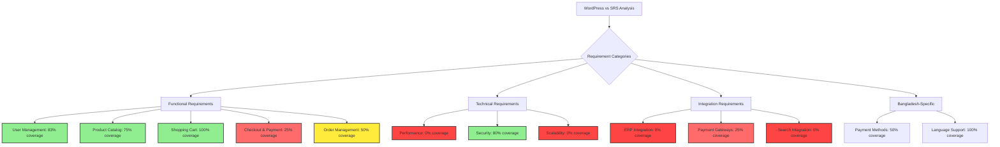
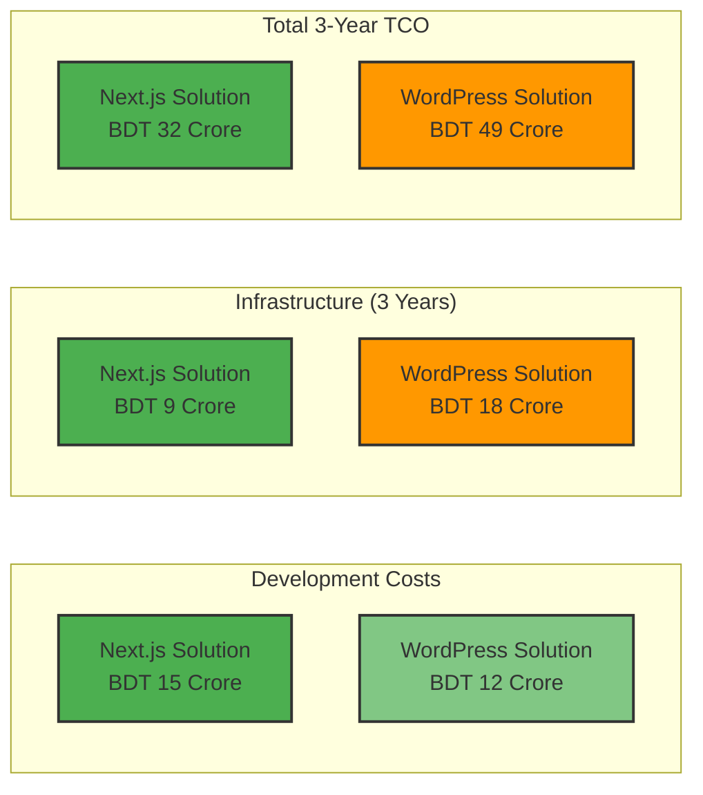

# WordPress vs SRS Gap Analysis - Executive Summary

**Key Finding:** WordPress with WooCommerce can satisfy approximately **65-70%** of SRS requirements out-of-the-box, but faces **critical gaps** in performance, Bangladesh payment integration, and scalability requirements.

## Critical Gaps Overview

## Requirements Coverage by Category

| Category | Coverage % | Status | Critical Issues |
|----------|------------|--------|----------------|
| **User Management** | 83% | ✅ Good | Minor address structure gaps |
| **Product Catalog** | 75% | ✅ Good | Search functionality limitations |
| **Shopping Cart** | 100% | ✅ Excellent | None |
| **Checkout & Payment** | 25% | ❌ Poor | Missing Bangladesh payment gateways |
| **Order Management** | 50% | ⚠️ Fair | Limited real-time tracking |
| **Performance** | 0% | ❌ Critical | Cannot meet any performance targets |
| **Security** | 80% | ✅ Good | Requires hardening |
| **Scalability** | 0% | ❌ Critical | Architecture limitations |
| **Integration** | 25% | ❌ Poor | No ERP integration support |
| **Bangladesh-Specific** | 75% | ⚠️ Fair | Payment gateway gaps critical |

## Cost Comparison (3-Year TCO)

**WordPress TCO is 53% higher** despite lower initial development costs due to infrastructure and maintenance requirements.

## Key Decision Factors

### Critical Showstoppers for WordPress
1. **Performance Targets:** Cannot achieve <2s page load, <300ms API response
2. **Concurrent Users:** Limited to ~2,000 vs. 10,000+ requirement
3. **Payment Gateways:** No native bKash/Nagad/Rocket integration
4. **ERP Integration:** No Odoo 13 synchronization capability

### WordPress Strengths
- ✅ Faster initial development
- ✅ Mature plugin ecosystem
- ✅ Lower setup complexity
- ✅ Strong content management
- ✅ Large community support

### WordPress Weaknesses
- ❌ Performance limitations
- ❌ Scalability constraints
- ❌ Integration challenges
- ❌ Higher long-term costs

## Final Recommendation

**Proceed with Next.js/NestJS solution** as specified in SRS for:
- Performance requirements
- Scalability needs
- Bangladesh market integration
- Lower total cost of ownership