# Phase 1 Development Roadmap
## Project Foundation & Environment Setup

**Date:** November 29, 2024  
**Document Version:** 1.0  
**Status:** Ready for Implementation  
**Duration:** 10 Working Days (2 weeks)  
**Priority:** P0 - Critical

---

## Executive Summary

Phase 1 establishes the foundational development environment, infrastructure, and processes required for successful execution of the Smart Technologies B2C e-commerce platform redevelopment. This phase focuses on creating a complete, scalable development setup that supports the entire 12-month development lifecycle while ensuring team productivity and code quality from day one.

### Key Objectives
- Establish complete local development environment for all team members
- Set up core infrastructure services (database, caching, search)
- Create structured monorepo with frontend and backend applications
- Implement code quality standards and CI/CD pipeline foundation
- Ensure all team members can begin productive development work

### Success Metrics
- 100% completion of all environment setup tasks
- All team members with fully functional development environments
- Operational local infrastructure services
- Complete documentation for all setup processes

---

## Project Context

### Strategic Alignment
This Phase 1 roadmap directly supports the broader Smart Technologies B2C Website Redevelopment initiative by:
- Establishing technical foundations for the 12-phase development plan
- Enabling team productivity for subsequent development phases
- Implementing best practices for code quality and deployment processes
- Creating scalable infrastructure to support future growth

### Technology Stack Overview
- **Frontend:** Next.js 14 with TypeScript and Tailwind CSS
- **Backend:** NestJS with TypeScript
- **Database:** PostgreSQL 15+ with Redis for caching
- **Search:** Elasticsearch for product search functionality
- **Containerization:** Docker and Docker Compose
- **Package Management:** pnpm
- **Version Control:** Git with GitHub
- **Development Environment:** Linux OS with VS Code IDE

---

## Detailed Implementation Plan

### Milestone 1: Development Environment Foundation
**Duration:** Day 1-2  
**Primary Objective:** Establish core development environment with Node.js and package management

#### Constituent Tasks
1. **Operating System Preparation**
   - Install and configure Ubuntu 22.04 LTS or Windows 11 with WSL2
   - Verify terminal access and internet connectivity
   - Ensure system meets minimum hardware requirements (8GB RAM, 50GB storage)

2. **Node.js Environment Setup**
   - Install Node.js 20 LTS using NVM
   - Configure NVM for version management
   - Verify Node.js and npm installation

3. **Package Manager Installation**
   - Install pnpm globally for efficient package management
   - Configure pnpm for optimal performance
   - Verify package manager functionality

#### Key Deliverables
- Working OS environment with terminal access
- Node.js 20 LTS installed with NVM
- pnpm package manager installed and configured
- Environment validation script

#### Dependencies
- **External:** Hardware meeting minimum specifications
- **Internal:** None (first milestone)

#### Acceptance Criteria
- [ ] OS boots successfully with terminal access
- [ ] `node --version` returns v20.x.x
- [ ] `nvm --version` executes successfully
- [ ] `pnpm --version` returns 8.x.x or later
- [ ] All team members can execute basic Node.js commands

---

### Milestone 2: Database Infrastructure Setup
**Duration:** Day 3-4  
**Primary Objective:** Set up and configure local database services for development

#### Constituent Tasks
1. **PostgreSQL Installation**
   - Install PostgreSQL 15+ on local machine
   - Configure PostgreSQL service to start automatically
   - Set up initial database configuration

2. **PostgreSQL Database Creation**
   - Create smart_ecommerce_dev database
   - Create smart_dev user with appropriate permissions
   - Configure connection settings and security

3. **Redis Installation**
   - Install Redis 7+ server
   - Configure Redis service for automatic startup
   - Verify basic Redis functionality

4. **Redis Configuration**
   - Configure Redis with password authentication
   - Set up basic Redis configuration parameters
   - Test Redis connectivity and operations

#### Key Deliverables
- PostgreSQL server running locally with database and user
- Redis server running with security configuration
- Database connection documentation
- Database initialization scripts

#### Dependencies
- **Internal:** Milestone 1 (Development Environment Foundation)
- **External:** Database installation packages

#### Acceptance Criteria
- [ ] PostgreSQL service starts without errors
- [ ] Can connect to PostgreSQL via psql with smart_dev user
- [ ] smart_ecommerce_dev database accessible
- [ ] `redis-cli ping` returns PONG
- [ ] Redis accepts configured password
- [ ] Basic database operations work correctly

---

### Milestone 3: Container and Search Setup
**Duration:** Day 5-6  
**Primary Objective:** Implement containerization and search infrastructure

#### Constituent Tasks
1. **Docker Installation**
   - Install Docker Desktop or Docker Engine
   - Install Docker Compose for multi-container applications
   - Configure Docker for optimal performance
   - Verify Docker installation and permissions

2. **Elasticsearch Setup**
   - Deploy Elasticsearch using Docker
   - Configure Elasticsearch for development environment
   - Set up basic Elasticsearch indices and mappings
   - Verify Elasticsearch connectivity and functionality

#### Key Deliverables
- Docker and Docker Compose installed and configured
- Elasticsearch container running with basic configuration
- Docker compose files for development environment
- Container configuration documentation

#### Dependencies
- **Internal:** Milestone 1 (Development Environment Foundation)
- **External:** Docker Hub access, Elasticsearch Docker image

#### Acceptance Criteria
- [ ] `docker --version` returns valid version information
- [ ] `docker-compose --version` executes successfully
- [ ] Docker can run basic containers without permission errors
- [ ] Elasticsearch container starts successfully
- [ ] `curl http://localhost:9200` returns cluster information
- [ ] Basic Elasticsearch operations work correctly

---

### Milestone 4: Project Structure Foundation
**Duration:** Day 7-8  
**Primary Objective:** Create complete monorepo structure and documentation framework

#### Constituent Tasks
1. **Repository Creation**
   - Create project root directory
   - Initialize Git repository
   - Set up basic repository configuration

2. **Directory Structure Creation**
   - Create monorepo directory structure
   - Set up frontend, backend, and shared directories
   - Create documentation and configuration directories
   - Establish proper folder hierarchy

3. **Docker Configuration Files**
   - Create Docker compose files for development
   - Write Dockerfiles for frontend and backend
   - Configure container networking and volumes
   - Set up development environment containers

4. **Documentation Structure Setup**
   - Create documentation directories
   - Set up README files for each major component
   - Establish documentation templates and guidelines
   - Create API documentation structure

#### Key Deliverables
- Complete monorepo directory structure
- Git repository initialized with proper configuration
- Docker compose files and Dockerfiles
- Documentation framework with templates

#### Dependencies
- **Internal:** Milestone 1 (Development Environment Foundation), Milestone 3 (Container and Search Setup)
- **External:** None

#### Acceptance Criteria
- [ ] `.git` directory exists and `git status` works
- [ ] All required directories created with proper structure
- [ ] Docker files exist with valid syntax
- [ ] Documentation directories created with template files
- [ ] README files exist for major components
- [ ] Directory structure matches project specifications

---

### Milestone 5: Application Initialization
**Duration:** Day 9-10  
**Primary Objective:** Initialize working frontend and backend applications

#### Constituent Tasks
1. **Frontend Project Initialization**
   - Initialize Next.js project with TypeScript
   - Configure Tailwind CSS for styling
   - Set up basic project structure and routing
   - Create initial pages and components

2. **Backend Project Initialization**
   - Initialize NestJS project with TypeScript
   - Set up basic project structure and modules
   - Configure main application file and startup
   - Create basic controllers and services

#### Key Deliverables
- Working Next.js frontend application
- Working NestJS backend application
- Basic application structure and configuration
- Initial application endpoints and pages

#### Dependencies
- **Internal:** Milestone 1 (Development Environment Foundation), Milestone 4 (Project Structure Foundation)
- **External:** Next.js and NestJS CLIs

#### Acceptance Criteria
- [ ] `pnpm dev` starts frontend without errors
- [ ] Frontend basic page loads in browser
- [ ] `pnpm start:dev` starts backend without errors
- [ ] Backend basic endpoint responds correctly
- [ ] TypeScript compilation works for both applications
- [ ] Basic routing and navigation function properly

---

## Timeline and Resource Allocation

### Overall Timeline (10 Working Days)

```mermaid
gantt
    title Phase 1 Development Timeline
    dateFormat X
    axisFormat %d
    
    section Milestone 1
    Dev Environment Foundation :active, m1, 1, 2
    
    section Milestone 2
    Database Infrastructure :active, m2, 3, 4
    
    section Milestone 3
    Container and Search Setup :active, m3, 5, 6
    
    section Milestone 4
    Project Structure Foundation :active, m4, 7, 8
    
    section Milestone 5
    Application Initialization :active, m5, 9, 10
```

### Resource Allocation Matrix

| Role | Allocation | Key Responsibilities | Primary Milestones |
|------|------------|---------------------|-------------------|
| Technical Lead | 25% | Architecture oversight, version control, documentation | M1, M4 |
| Backend Developer | 35% | API development, database setup, backend configuration | M1, M2, M5 |
| Frontend Developer | 25% | UI setup, frontend configuration, styling | M1, M5 |
| DevOps Engineer | 15% | Infrastructure, containers, search setup | M3, M4 |

---

## Risk Assessment and Mitigation Strategies

### High-Risk Items

| Risk | Impact | Probability | Mitigation Strategy |
|------|--------|-------------|-------------------|
| Environment Compatibility Issues | High | Medium | Provide OS-specific guides, use Docker containers for services |
| Database Connection Problems | High | Low | Clear connection documentation, troubleshooting guide, connection validation scripts |
| Version Conflicts | Medium | Low | Lock dependencies with package-lock files, use .nvmrc for Node version |

### Medium-Risk Items

| Risk | Impact | Probability | Mitigation Strategy |
|------|--------|-------------|-------------------|
| Team Unfamiliarity with Tools | Medium | Medium | Conduct training sessions, provide comprehensive documentation, pair programming |
| Container Setup Issues | Medium | Medium | Provide Docker compose files, detailed setup instructions, troubleshooting guide |

---

## Success Metrics and Validation Checkpoints

### Technical Validation Metrics

1. **Environment Replication**
   - Metric: 100% success rate across team machines
   - Validation: Environment validation script results
   - Checkpoint: End of Milestone 1

2. **Service Availability**
   - Metric: All services (PostgreSQL, Redis, Elasticsearch) running
   - Validation: Service health checks and connectivity tests
   - Checkpoint: End of Milestone 3

3. **Application Functionality**
   - Metric: Frontend and backend applications start without errors
   - Validation: Application startup tests
   - Checkpoint: End of Milestone 5

---

## Phase Transition Planning

### Phase 1 Completion Criteria

- [ ] All 5 milestones completed
- [ ] All acceptance criteria met
- [ ] Team development environments fully functional
- [ ] All infrastructure services operational
- [ ] Documentation complete and accessible
- [ ] Knowledge transfer completed

### Phase 2 Readiness Assessment

1. **Technical Readiness**
   - Development environment supports Phase 2 requirements
   - All tools and frameworks properly configured
   - Infrastructure can handle Phase 2 workload
   - Database schema design tools ready

2. **Team Readiness**
   - All members skilled in required technologies
   - Development workflow established and tested
   - Collaboration processes working effectively

---

## Conclusion

This Phase 1 Development Roadmap provides a comprehensive foundation for the Smart Technologies B2C e-commerce platform development. The systematic approach ensures all team members have the necessary tools, infrastructure, and processes to begin productive development work in Phase 2.

### Key Success Factors

1. **Systematic Approach:** Clear task breakdown with logical dependencies
2. **Quality Focus:** Code quality tools and standards implemented from start
3. **Team Alignment:** Shared understanding of processes and requirements
4. **Risk Mitigation:** Proactive identification and mitigation of potential issues

### Expected Outcomes

- Fully functional development environment for all team members
- Robust infrastructure supporting subsequent development phases
- Established development processes and quality standards
- Complete documentation enabling knowledge transfer and onboarding

---

**Document Status:** Ready for Implementation  
**Next Steps:**
1. Review and approve this roadmap with all stakeholders
2. Assign team members to specific milestones and tasks
3. Begin Milestone 1 execution
4. Establish daily tracking and reporting mechanisms
5. Prepare Phase 2 initiation based on Phase 1 outcomes

**Prepared By:** Enterprise Solutions Team  
**For:** Smart Technologies (Bangladesh) Ltd.  
**Contact:** project-team@smarttechnologies.bd