# Phase 2 Development Roadmap
## Core Architecture & Database Design

**Date:** November 29, 2024  
**Document Version:** 1.0  
**Status:** Ready for Implementation  
**Duration:** 10 Working Days (2 weeks)  
**Priority:** P0 - Critical

---

## Executive Summary

Phase 2 establishes the core technical architecture and database foundation for the Smart Technologies B2C e-commerce platform. This phase builds upon the development environment established in Phase 1 to create the scalable, type-safe data layer and application architecture that will support all subsequent development phases.

### Key Objectives
- Design complete database schema aligned with SRS requirements
- Implement Prisma ORM with TypeScript for type-safe database access
- Establish scalable backend architecture patterns with NestJS
- Setup data models and relationships for e-commerce functionality
- Create database migrations and seed data for development

### Success Metrics
- Complete database schema covering all SRS requirements
- All tables and relationships created correctly
- Database migrations executed without errors
- Seed data populated successfully
- Backend server starts without errors

---

## Project Context

### Strategic Alignment
This Phase 2 roadmap supports the Smart Technologies B2C Website Redevelopment by:
- Creating the data foundation for all e-commerce operations
- Establishing scalable architecture patterns for future growth
- Implementing type-safe database access to prevent runtime errors
- Setting up development tools for database management

### Technology Stack Focus
- **Database:** PostgreSQL 15+ with advanced features (JSONB, full-text search)
- **ORM:** Prisma 5.7+ for type-safe database operations
- **Backend:** NestJS 10+ with modular architecture
- **Development:** Database migrations, Prisma Studio, schema validation

---

## Detailed Implementation Plan

### Milestone 1: Database Schema Design
**Duration:** Day 1-3  
**Primary Objective:** Design complete database schema aligned with SRS requirements

#### Constituent Tasks
1. **Core Entity Design**
   - Design User management entities (User, Address, Session, Account)
   - Design Product catalog entities (Product, Category, Brand, ProductImage, ProductSpecification)
   - Design Order management entities (Order, OrderItem, Transaction)
   - Design Shopping entities (Cart, CartItem, Wishlist, WishlistItem)

2. **Relationship Modeling**
   - Define one-to-many relationships (User to Orders, Category to Products)
   - Define many-to-many relationships (Products to Orders, Users to Reviews)
   - Define self-referencing relationships (Category hierarchy)
   - Define foreign key constraints and cascade behaviors

3. **Schema Validation**
   - Validate schema against SRS functional requirements
   - Ensure all e-commerce workflows supported
   - Check for normalization and performance considerations
   - Validate Bangladesh-specific requirements (address structure, payment methods)

#### Key Deliverables
- Complete entity-relationship diagram
- Database schema documentation
- Schema validation report
- Performance optimization recommendations

#### Dependencies
- **Internal:** Phase 1 (Development Environment Foundation)
- **External:** SRS and URD documents for requirements

#### Acceptance Criteria
- [ ] All SRS functional requirements covered in schema
- [ ] Entity relationships properly defined
- [ ] Bangladesh-specific requirements addressed
- [ ] Schema normalized to 3NF where appropriate
- [ ] Performance considerations documented
- [ ] Schema approved by technical lead

---

### Milestone 2: Prisma ORM Implementation
**Duration:** Day 4-6  
**Primary Objective:** Implement Prisma ORM with TypeScript for type-safe database access

#### Constituent Tasks
1. **Prisma Setup**
   - Initialize Prisma in backend project
   - Configure Prisma with PostgreSQL connection
   - Set up Prisma schema file with all entities
   - Configure Prisma client generation

2. **Schema Implementation**
   - Implement User management models (User, Address, Session, Account)
   - Implement Product catalog models (Product, Category, Brand, ProductImage, ProductSpecification, ProductVariant)
   - Implement Order management models (Order, OrderItem, Transaction, Coupon)
   - Implement Shopping models (Cart, CartItem, Wishlist, WishlistItem, Review)

3. **TypeScript Integration**
   - Generate TypeScript types from Prisma schema
   - Configure Prisma Client for dependency injection
   - Set up type-safe database access patterns
   - Create custom Prisma methods for complex queries

#### Key Deliverables
- Complete Prisma schema file
- Generated TypeScript types
- Prisma service configuration
- Type-safe database access patterns

#### Dependencies
- **Internal:** Milestone 1 (Database Schema Design)
- **External:** Prisma documentation and best practices

#### Acceptance Criteria
- [ ] Prisma schema compiles without errors
- [ ] TypeScript types generated successfully
- [ ] All entities implemented with correct relationships
- [ ] Prisma client connects to database
- [ ] Type-safe queries working correctly
- [ ] Database operations follow TypeScript best practices

---

### Milestone 3: Database Migration System
**Duration:** Day 7-8  
**Primary Objective:** Create and execute database migration system

#### Constituent Tasks
1. **Migration Setup**
   - Configure Prisma migration system
   - Set up migration naming conventions
   - Create migration development workflow
   - Set up migration rollback procedures

2. **Initial Migration**
   - Create initial migration from schema
   - Generate SQL migration files
   - Test migration on development database
   - Validate migration results

3. **Migration Management**
   - Create migration scripts for different environments
   - Set up migration testing procedures
   - Document migration rollback process
   - Create database seeding scripts

#### Key Deliverables
- Database migration files
- Migration execution scripts
- Database seeding scripts
- Migration documentation

#### Dependencies
- **Internal:** Milestone 2 (Prisma ORM Implementation)
- **External:** PostgreSQL migration best practices

#### Acceptance Criteria
- [ ] Migration files generated correctly
- [ ] Initial migration executes without errors
- [ ] Database schema created from migration
- [ ] Seed data loads successfully
- [ ] Rollback procedures tested and working
- [ ] Migration workflow documented

---

### Milestone 4: Backend Architecture Foundation
**Duration:** Day 9-10  
**Primary Objective:** Establish scalable backend architecture patterns

#### Constituent Tasks
1. **NestJS Module Structure**
   - Create modular directory structure (auth, users, products, orders, etc.)
   - Set up feature-based module organization
   - Configure module dependencies and imports
   - Establish shared module patterns

2. **Core Services Setup**
   - Create Prisma service for database access
   - Set up configuration management with environment variables
   - Implement logging service with Winston
   - Create error handling and exception filters

3. **API Architecture**
   - Set up API versioning and routing
   - Configure request/response validation pipes
   - Implement authentication guards and interceptors
   - Set up API documentation with Swagger

#### Key Deliverables
- Modular NestJS application structure
- Core services (database, configuration, logging)
- API architecture foundation
- Swagger API documentation setup

#### Dependencies
- **Internal:** Milestone 3 (Database Migration System)
- **External:** NestJS architecture best practices

#### Acceptance Criteria
- [ ] Backend application starts without errors
- [ ] All modules load correctly
- [ ] Database connection established
- [ ] API endpoints respond correctly
- [ ] Swagger documentation accessible
- [ ] Error handling and logging working

---

## Database Schema Overview

### Core Tables Structure

```prisma
// User Management
model User {
  id            String      @id @default(uuid())
  email         String      @unique
  emailVerified DateTime?
  phone         String?     @unique
  phoneVerified DateTime?
  password      String?
  firstName     String
  lastName      String
  dateOfBirth   DateTime?
  gender        String?
  role          UserRole    @default(CUSTOMER)
  status        UserStatus  @default(ACTIVE)
  image         String?
  
  createdAt     DateTime    @default(now())
  updatedAt     DateTime    @updatedAt
  lastLoginAt   DateTime?
  
  addresses     Address[]
  orders        Order[]
  reviews       Review[]
  cart          Cart?
  wishlist      Wishlist?
  
  @@map("users")
}

// Product Catalog
model Product {
  id            String        @id @default(uuid())
  sku           String        @unique
  name          String
  nameEn        String
  nameBn        String?
  slug          String        @unique
  shortDescription String?
  description   String?
  categoryId    String
  brandId       String
  
  regularPrice  Decimal       @db.Decimal(12, 2)
  salePrice     Decimal?      @db.Decimal(12, 2)
  costPrice     Decimal       @db.Decimal(12, 2)
  taxRate       Decimal       @default(0) @db.Decimal(5, 2)
  
  stockQuantity Int           @default(0)
  lowStockThreshold Int       @default(10)
  status        ProductStatus @default(ACTIVE)
  
  metaTitle     String?
  metaDescription String?
  metaKeywords  String?
  
  isFeatured    Boolean       @default(false)
  isNewArrival  Boolean       @default(false)
  isBestSeller  Boolean       @default(false)
  
  warrantyPeriod Int?          // in months
  warrantyType  String?
  
  createdAt     DateTime      @default(now())
  updatedAt     DateTime      @updatedAt
  publishedAt   DateTime?
  
  images        ProductImage[]
  specifications ProductSpecification[]
  variants      ProductVariant[]
  reviews       Review[]
  cartItems     CartItem[]
  orderItems    OrderItem[]
  wishlistItems WishlistItem[]
  
  @@index([categoryId])
  @@index([brandId])
  @@index([status])
  @@index([slug])
  @@map("products")
}

// Order Management
model Order {
  id              String        @id @default(uuid())
  orderNumber     String        @unique
  userId          String
  addressId       String
  
  subtotal        Decimal       @db.Decimal(12, 2)
  tax             Decimal       @default(0) @db.Decimal(12, 2)
  shippingCost    Decimal       @default(0) @db.Decimal(12, 2)
  discount        Decimal       @default(0) @db.Decimal(12, 2)
  total           Decimal       @db.Decimal(12, 2)
  
  paymentMethod   PaymentMethod
  paymentStatus   PaymentStatus @default(PENDING)
  paidAt          DateTime?
  
  status          OrderStatus   @default(PENDING)
  
  notes           String?
  internalNotes   String?
  
  createdAt       DateTime      @default(now())
  updatedAt       DateTime      @updatedAt
  confirmedAt     DateTime?
  shippedAt       DateTime?
  deliveredAt     DateTime?
  
  items           OrderItem[]
  transactions    Transaction[]
  
  @@index([userId])
  @@index([orderNumber])
  @@index([status])
  @@map("orders")
}
```

---

## Timeline and Resource Allocation

### Overall Timeline (10 Working Days)

```mermaid
gantt
    title Phase 2 Development Timeline
    dateFormat X
    axisFormat %d
    
    section Milestone 1
    Database Schema Design :active, m1, 1, 3
    
    section Milestone 2
    Prisma ORM Implementation :active, m2, 4, 6
    
    section Milestone 3
    Database Migration System :active, m3, 7, 8
    
    section Milestone 4
    Backend Architecture Foundation :active, m4, 9, 10
```



### Resource Allocation Matrix

| Role | Allocation | Key Responsibilities | Primary Milestones |
|------|------------|---------------------|-------------------|
| Backend Lead | 40% | Database design, Prisma setup, architecture | M1, M2, M4 |
| Database Architect | 30% | Schema design, migrations, optimization | M1, M3 |
| Backend Developer | 20% | Prisma implementation, module setup | M2, M4 |
| Technical Lead | 10% | Architecture oversight, validation | M1, M4 |

---

## Risk Assessment and Mitigation Strategies

### High-Risk Items

| Risk | Impact | Probability | Mitigation Strategy |
|------|--------|-------------|-------------------|
| Schema Design Issues | High | Medium | Thorough schema review, validation against SRS, peer review |
| Migration Failures | High | Low | Comprehensive testing, rollback procedures, backup strategies |
| Performance Issues | Medium | Medium | Proper indexing, query optimization, performance testing |

### Medium-Risk Items

| Risk | Impact | Probability | Mitigation Strategy |
|------|--------|-------------|-------------------|
| Prisma Learning Curve | Medium | Medium | Training sessions, documentation, gradual adoption |
| Type Safety Issues | Medium | Low | Strict TypeScript configuration, code reviews, testing |

---

## Success Metrics and Validation Checkpoints

### Technical Validation Metrics

1. **Schema Completeness**
   - Metric: 100% SRS requirements covered
   - Validation: Schema review checklist
   - Checkpoint: End of Milestone 1

2. **Migration Success**
   - Metric: All migrations execute without errors
   - Validation: Migration test results
   - Checkpoint: End of Milestone 3

3. **Architecture Quality**
   - Metric: Backend starts without errors, modules load correctly
   - Validation: Application startup tests
   - Checkpoint: End of Milestone 4

---

## Phase Transition Planning

### Phase 2 Completion Criteria

- [ ] All 4 milestones completed
- [ ] Database schema fully implemented
- [ ] Prisma ORM configured and working
- [ ] Database migrations executed successfully
- [ ] Backend architecture foundation established
- [ ] All acceptance criteria met

### Phase 3 Readiness Assessment

1. **Technical Readiness**
   - Database layer supports Phase 3 requirements
   - Prisma ORM ready for authentication development
   - Backend architecture supports user management features
   - Migration system ready for ongoing development

2. **Development Readiness**
   - Team proficient with Prisma and NestJS
   - Database development workflow established
   - Type-safe development practices in place

---

## Conclusion

This Phase 2 Development Roadmap establishes the critical data foundation and backend architecture for the Smart Technologies B2C e-commerce platform. The systematic approach ensures a scalable, type-safe foundation that will support all subsequent development phases.

### Key Success Factors

1. **Comprehensive Schema Design:** Complete coverage of e-commerce requirements
2. **Type Safety:** Prisma ORM with TypeScript prevents runtime errors
3. **Scalable Architecture:** Modular NestJS structure supports growth
4. **Migration Management:** Controlled database schema evolution

### Expected Outcomes

- Complete database schema supporting all e-commerce operations
- Type-safe database access layer
- Scalable backend architecture foundation
- Robust migration and seeding system
- Development team proficient in modern database practices

---

**Document Status:** Ready for Implementation  
**Next Steps:**
1. Review and approve database schema design
2. Set up Prisma development environment
3. Begin Milestone 1 execution
4. Establish database development workflow
5. Prepare Phase 3 initiation based on Phase 2 outcomes

**Prepared By:** Enterprise Solutions Team  
**For:** Smart Technologies (Bangladesh) Ltd.  
**Contact:** project-team@smarttechnologies.bd