# Phase 3 Development Roadmap
## Authentication & User Management

**Date:** November 29, 2024  
**Document Version:** 1.0  
**Status:** Ready for Implementation  
**Duration:** 15 Working Days (3 weeks)  
**Priority:** P0 - Critical

---

## Executive Summary

Phase 3 implements comprehensive authentication and user management system for Smart Technologies B2C e-commerce platform. This phase builds upon the database foundation established in Phase 2 to create secure, scalable user authentication, profile management, and role-based access control that supports both individual customers and corporate accounts.

### Key Objectives
- Implement secure user registration and login system
- Create comprehensive user profile management
- Establish role-based access control (RBAC)
- Integrate social authentication (Google, Facebook)
- Implement Bangladesh-specific user requirements (phone verification, address format)
- Build session management and security features

### Success Metrics
- 100% functional authentication system
- Support for 10,000+ concurrent users
- Secure session management with appropriate timeouts
- Complete user profile management
- Social authentication integration working
- Bangladesh-specific requirements fully implemented

---

## Project Context

### Strategic Alignment
This Phase 3 roadmap supports Smart Technologies B2C Website Redevelopment by:
- Establishing secure user foundation for all e-commerce operations
- Implementing Bangladesh-specific authentication requirements
- Creating scalable user management system for growth
- Building trust and security features for customer confidence

### Technology Stack Focus
- **Authentication:** JWT tokens with refresh mechanism
- **Security:** bcrypt password hashing, rate limiting, CSRF protection
- **Social Auth:** NextAuth.js with Google and Facebook providers
- **Validation:** Zod schemas for input validation
- **Sessions:** Redis-based session storage with security

---

## Detailed Implementation Plan

### Milestone 1: Core Authentication System
**Duration:** Day 1-5  
**Primary Objective:** Implement secure user registration and login functionality

#### Constituent Tasks
1. **User Registration**
   - Implement email registration with verification
   - Implement phone registration with OTP verification
   - Create registration form with validation
   - Implement password strength requirements
   - Add Bangladesh phone number format validation

2. **User Login**
   - Implement email/password login
   - Implement phone/password login
   - Create secure session management
   - Implement remember me functionality
   - Add login attempt limiting and security

3. **Password Management**
   - Implement secure password reset flow
   - Create password change functionality
   - Implement password history tracking
   - Add password strength validation

#### Key Deliverables
- Complete user registration system
- Secure login functionality with session management
- Password reset and change functionality
- Bangladesh-specific phone verification system

#### Dependencies
- **Internal:** Phase 2 (Core Architecture & Database Design)
- **External:** SMS gateway for OTP verification

#### Acceptance Criteria
- [ ] User can register with email and phone
- [ ] Email verification works correctly
- [ ] Phone OTP verification functional
- [ ] Login system secure with rate limiting
- [ ] Session management works with proper timeouts
- [ ] Password reset flow secure and functional
- [ ] Bangladesh phone format validation working

---

### Milestone 2: Social Authentication Integration
**Duration:** Day 6-9  
**Primary Objective:** Integrate social authentication providers

#### Constituent Tasks
1. **NextAuth.js Setup**
   - Configure NextAuth.js with custom providers
   - Set up JWT callback handling
   - Configure session management with Redis
   - Implement secure callback URLs

2. **Google OAuth Integration**
   - Set up Google OAuth 2.0
   - Configure Google client credentials
   - Implement user profile mapping
   - Add Google account linking functionality

3. **Facebook OAuth Integration**
   - Set up Facebook Login SDK
   - Configure Facebook app credentials
   - Implement Facebook profile mapping
   - Add Facebook account linking functionality

#### Key Deliverables
- NextAuth.js configuration with social providers
- Google OAuth integration
- Facebook OAuth integration
- Social account linking functionality

#### Dependencies
- **Internal:** Milestone 1 (Core Authentication System)
- **External:** Google and Facebook developer accounts

#### Acceptance Criteria
- [ ] NextAuth.js configured correctly
- [ ] Google OAuth login works end-to-end
- [ ] Facebook OAuth login works end-to-end
- [ ] Social profiles map correctly to user accounts
- [ ] Account linking and unlinking functional
- [ ] Social authentication secure with proper state handling

---

### Milestone 3: User Profile Management
**Duration:** Day 10-12  
**Primary Objective:** Create comprehensive user profile management system

#### Constituent Tasks
1. **Basic Profile Management**
   - Implement profile viewing and editing
   - Add profile picture upload functionality
   - Create account settings management
   - Implement email and phone change functionality

2. **Bangladesh Address Management**
   - Implement Bangladesh address structure (Division, District, Upazila)
   - Create multiple address support
   - Add default address selection
   - Implement address validation for Bangladesh format

3. **Account Preferences**
   - Implement notification preferences
   - Add privacy settings management
   - Create communication preferences
   - Implement account deletion functionality

#### Key Deliverables
- Complete user profile management system
- Bangladesh-specific address management
- Account preferences and settings
- Profile picture upload functionality

#### Dependencies
- **Internal:** Milestone 1 (Core Authentication System)
- **External:** None

#### Acceptance Criteria
- [ ] Users can view and edit complete profiles
- [ ] Profile picture upload works correctly
- [ ] Bangladesh address structure implemented
- [ ] Multiple addresses supported with default selection
- [ ] Account preferences save correctly
- [ ] Email and phone change processes work
- [ ] Account deletion functional with confirmation

---

### Milestone 4: Role-Based Access Control
**Duration:** Day 13-15  
**Primary Objective:** Implement comprehensive role-based access control system

#### Constituent Tasks
1. **User Roles Definition**
   - Define Customer, Admin, Super Admin roles
   - Implement Support role for customer service
   - Create Corporate account role
   - Set up role hierarchy and permissions

2. **Access Control Implementation**
   - Implement role-based route protection
   - Create permission-based API access
   - Add role assignment functionality
   - Implement role escalation procedures

3. **Corporate Account Management**
   - Implement corporate registration process
   - Add company profile management
   - Create user management for corporate accounts
   - Implement billing and invoicing for corporate

#### Key Deliverables
- Complete role-based access control system
- Corporate account management functionality
- User role assignment and management
- Permission-based API protection

#### Dependencies
- **Internal:** Milestone 3 (User Profile Management)
- **External:** None

#### Acceptance Criteria
- [ ] All user roles defined and implemented
- [ ] Route protection works based on roles
- [ ] API endpoints properly secured by permissions
- [ ] Corporate registration functional
- [ ] Corporate user management works
- [ ] Role assignment interface functional
- [ ] Permission escalation procedures documented

---

## Security Implementation Details

### Authentication Security Measures

```typescript
// Password Security
import bcrypt from 'bcrypt';

export class AuthService {
  async hashPassword(password: string): Promise<string> {
    const saltRounds = 12;
    return bcrypt.hash(password, saltRounds);
  }
  
  async verifyPassword(password: string, hash: string): Promise<boolean> {
    return bcrypt.compare(password, hash);
  }
}

// JWT Security
import jwt from 'jsonwebtoken';

export class TokenService {
  generateTokens(userId: string) {
    const accessToken = jwt.sign(
      { userId, type: 'access' },
      process.env.JWT_SECRET,
      { expiresIn: '15m' }
    );
    
    const refreshToken = jwt.sign(
      { userId, type: 'refresh' },
      process.env.JWT_REFRESH_SECRET,
      { expiresIn: '7d' }
    );
    
    return { accessToken, refreshToken };
  }
}

// Rate Limiting
import rateLimit from 'express-rate-limit';

export const authLimiter = rateLimit({
  windowMs: 15 * 60 * 1000, // 15 minutes
  max: 5, // Maximum 5 attempts per window
  message: 'Too many login attempts, please try again later',
});
```

### Bangladesh-Specific Features

```typescript
// Phone Number Validation
export function validateBangladeshPhone(phone: string): boolean {
  // Bangladesh mobile format: +880XX-XXXXXXX or 01XXXXXXXXX
  const bangladeshRegex = /^(\+880|01)(1[3-9]\d{8}|\d{9})$/;
  return bangladeshRegex.test(phone);
}

// Address Structure
interface BangladeshAddress {
  division: string;    // 8 divisions
  district: string;    // 64 districts
  upazila: string;    // 500+ upazilas
  area: string;        // Area/Locality
  addressLine1: string;
  addressLine2?: string;
  postalCode?: string;
  country: string = 'Bangladesh';
}

// Address Validation
export const BANGLADESH_DIVISIONS = [
  'Dhaka', 'Chattogram', 'Khulna', 'Rajshahi',
  'Barishal', 'Sylhet', 'Rangpur', 'Mymensingh'
];
```

---

## Timeline and Resource Allocation

### Overall Timeline (15 Working Days)

```mermaid
gantt
    title Phase 3 Development Timeline
    dateFormat X
    axisFormat %d
    
    section Milestone 1
    Core Authentication System :active, m1, 1, 5
    
    section Milestone 2
    Social Authentication Integration :active, m2, 6, 9
    
    section Milestone 3
    User Profile Management :active, m3, 10, 12
    
    section Milestone 4
    Role-Based Access Control :active, m4, 13, 15
```



### Resource Allocation Matrix

| Role | Allocation | Key Responsibilities | Primary Milestones |
|------|------------|---------------------|-------------------|
| Backend Developer | 40% | Authentication APIs, security, JWT implementation | M1, M4 |
| Frontend Developer | 35% | Login/registration UI, profile management, social auth | M1, M2, M3 |
| Security Specialist | 15% | Security review, penetration testing, best practices | M1, M4 |
| UI/UX Designer | 10% | User interface design, user experience flow | M3, M4 |

---

## Risk Assessment and Mitigation Strategies

### High-Risk Items

| Risk | Impact | Probability | Mitigation Strategy |
|------|--------|-------------|-------------------|
| Authentication Security Breaches | High | Medium | Multi-factor authentication, rate limiting, security headers, regular security audits |
| Social Authentication Complexity | High | Medium | Use established libraries (NextAuth.js), thorough testing, fallback options |
| Bangladesh Compliance Issues | High | Medium | Local legal review, address format validation, phone number verification |

### Medium-Risk Items

| Risk | Impact | Probability | Mitigation Strategy |
|------|--------|-------------|-------------------|
| Session Management Issues | Medium | Medium | Redis-based sessions, proper timeout handling, secure cookie configuration |
| User Data Privacy | Medium | Medium | GDPR-like compliance, data encryption, privacy policy, user consent management |
| Performance with High User Load | Medium | Medium | Load testing, caching strategies, database optimization |

---

## Success Metrics and Validation Checkpoints

### Technical Validation Metrics

1. **Authentication Security**
   - Metric: Zero security vulnerabilities in penetration testing
   - Validation: Security audit results
   - Checkpoint: End of Milestone 1

2. **User Experience**
   - Metric: Registration and login completion rate >95%
   - Validation: User testing and analytics
   - Checkpoint: End of Milestone 2

3. **Profile Management**
   - Metric: Profile completion rate >80%
   - Validation: User profile data analysis
   - Checkpoint: End of Milestone 3

4. **Access Control**
   - Metric: Zero unauthorized access attempts
   - Validation: Access log analysis
   - Checkpoint: End of Milestone 4

---

## Phase Transition Planning

### Phase 3 Completion Criteria

- [ ] All 4 milestones completed
- [ ] Authentication system fully functional
- [ ] Social authentication integrated
- [ ] User profile management complete
- [ ] Role-based access control implemented
- [ ] Bangladesh-specific requirements addressed
- [ ] Security measures implemented and tested

### Phase 4 Readiness Assessment

1. **Technical Readiness**
   - Authentication system supports Phase 4 requirements
   - User data layer ready for product catalog access
   - Session management supports shopping cart persistence
   - Role-based access ready for admin features

2. **Security Readiness**
   - Authentication security tested and validated
   - Rate limiting and session management working
   - Social authentication secure and functional
   - Data privacy measures implemented

---

## Conclusion

This Phase 3 Development Roadmap establishes a comprehensive, secure authentication and user management system for Smart Technologies B2C e-commerce platform. The systematic approach ensures user trust, security, and scalability while addressing Bangladesh-specific requirements.

### Key Success Factors

1. **Security First:** Multi-layered security approach with modern best practices
2. **Bangladesh Focus:** Local compliance and user experience considerations
3. **Scalability:** Architecture designed for 10,000+ concurrent users
4. **User Experience:** Seamless authentication and profile management
5. **Social Integration:** Modern social authentication options

### Expected Outcomes

- Secure authentication system supporting multiple login methods
- Comprehensive user profile management
- Role-based access control for different user types
- Bangladesh-specific requirements fully implemented
- Foundation for personalized shopping experience

---

**Document Status:** Ready for Implementation  
**Next Steps:**
1. Review and approve authentication system design
2. Set up social authentication developer accounts
3. Begin Milestone 1 execution
4. Establish security testing procedures
5. Prepare Phase 4 initiation based on Phase 3 outcomes

**Prepared By:** Enterprise Solutions Team  
**For:** Smart Technologies (Bangladesh) Ltd.  
**Contact:** project-team@smarttechnologies.bd