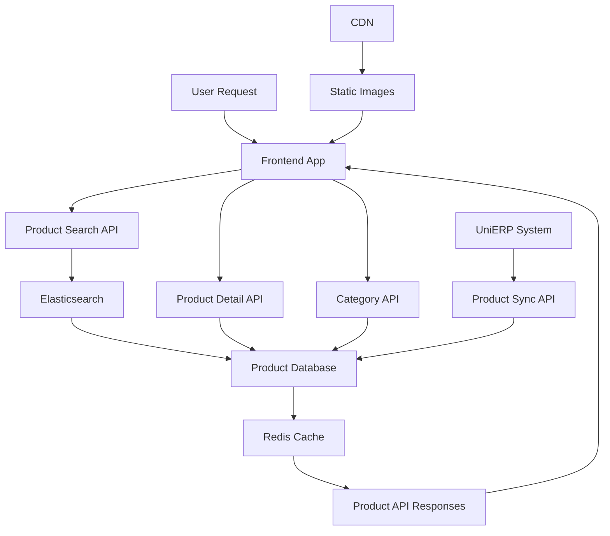

# Phase 4 Development Roadmap
## Product Catalog Foundation

**Date:** November 29, 2024  
**Document Version:** 1.0  
**Status:** Ready for Implementation  
**Duration:** 15 Working Days (3 weeks)  
**Priority:** P0 - Critical

---

## Executive Summary

Phase 4 establishes the comprehensive product catalog foundation for Smart Technologies B2C e-commerce platform. This phase builds upon the database and authentication systems from previous phases to create a scalable, searchable product management system that supports 100+ brands, 50,000+ products, and complex product relationships.

### Key Objectives
- Implement comprehensive product catalog management system
- Create scalable product search and filtering capabilities
- Build product categorization and brand management
- Establish product image and specification management
- Implement product variant and inventory management
- Create Bangladesh-specific product features (bilingual support, local pricing)

### Success Metrics
- Support for 50,000+ products across 100+ brands
- Advanced search with <300ms response time
- Complete product categorization hierarchy
- Real-time inventory synchronization with ERP
- Mobile-responsive product display

---

## Project Context

### Strategic Alignment
This Phase 4 roadmap supports Smart Technologies B2C Website Redevelopment by:
- Creating the core product discovery and browsing experience
- Supporting the largest product portfolio in Bangladesh e-commerce
- Enabling advanced product search and comparison features
- Establishing foundation for personalized recommendations
- Integrating with UniERP for real-time inventory management

### Technology Stack Focus
- **Database:** PostgreSQL with optimized queries and indexing
- **Search:** Elasticsearch for advanced product search and filtering
- **Backend:** NestJS with modular product management
- **Frontend:** Next.js with server-side rendering for SEO
- **Images:** Optimized image management with CDN integration

---

## Detailed Implementation Plan

### Milestone 1: Product Data Model Enhancement
**Duration:** Day 1-4  
**Primary Objective:** Extend database schema for comprehensive product management

#### Constituent Tasks
1. **Product Entity Enhancement**
   - Add product specifications and attributes
   - Implement product variant system
   - Add product image management with multiple images
   - Create product status and visibility controls
   - Add SEO fields (meta title, description, keywords)

2. **Category System Enhancement**
   - Implement multi-level category hierarchy
   - Add category-specific SEO fields
   - Create category image and icon support
   - Add category sorting and positioning

3. **Brand Management System**
   - Create comprehensive brand entity
   - Add brand logo and description support
   - Implement brand status and featured controls
   - Add brand-specific SEO optimization

4. **Product Relationships**
   - Define product-category relationships
   - Create product-brand associations
   - Implement product variant relationships
   - Add cross-selling and upselling relationships

#### Key Deliverables
- Enhanced product data models
- Complete category hierarchy system
- Brand management data structure
- Product relationship definitions
- Database migration scripts

#### Dependencies
- **Internal:** Phase 2 (Core Architecture & Database Design)
- **External:** None

#### Acceptance Criteria
- [ ] All product entities enhanced with required fields
- [ ] Category hierarchy supports unlimited levels
- [ ] Brand management system complete
- [ ] Product relationships properly defined
- [ ] Database migration executes without errors
- [ ] SEO fields implemented for all products

---

### Milestone 2: Product Management APIs
**Duration:** Day 5-8  
**Primary Objective:** Create comprehensive product management backend APIs

#### Constituent Tasks
1. **Product CRUD Operations**
   - Implement product creation, reading, updating, deletion
   - Add product bulk operations support
   - Implement product status management
   - Create product search and filtering APIs
   - Add product variant management APIs

2. **Category Management APIs**
   - Implement category CRUD operations
   - Add category hierarchy management
   - Create category reordering functionality
   - Implement category product listing APIs

3. **Brand Management APIs**
   - Implement brand CRUD operations
   - Add brand status management
   - Create featured brand management
   - Implement brand product listing APIs

4. **Product Search APIs**
   - Implement advanced product search with Elasticsearch
   - Add faceted search capabilities
   - Create search autocomplete functionality
   - Implement search result sorting and pagination

#### Key Deliverables
- Complete product management API endpoints
- Category management API system
- Brand management APIs
- Advanced search functionality
- API documentation with Swagger

#### Dependencies
- **Internal:** Milestone 1 (Product Data Model Enhancement)
- **External:** Elasticsearch cluster setup

#### Acceptance Criteria
- [ ] All CRUD operations working correctly
- [ ] Bulk operations supported
- [ ] Search integration with Elasticsearch functional
- [ ] Faceted search working with all filters
- [ ] API responses under 300ms (p95)
- [ ] Swagger documentation complete and accurate
- [ ] Pagination and sorting working correctly

---

### Milestone 3: Product Frontend Implementation
**Duration:** Day 9-12  
**Primary Objective:** Create comprehensive product browsing and management interface

#### Constituent Tasks
1. **Product Listing Pages**
   - Implement product grid and list views
   - Create responsive design for mobile and desktop
   - Add product filtering and sorting UI
   - Implement infinite scroll and pagination
   - Add product comparison functionality

2. **Product Detail Pages**
   - Create comprehensive product detail pages
   - Implement image galleries with zoom functionality
   - Add product specifications display
   - Create product variant selection interface
   - Implement stock availability indicators

3. **Category Navigation**
   - Create multi-level category navigation
   - Implement responsive category menu
   - Add category page layouts
   - Create breadcrumb navigation
   - Implement category-based product filtering

4. **Search Interface**
   - Implement advanced search interface
   - Add search suggestions and autocomplete
   - Create search results page with filters
   - Implement search history and saved searches
   - Add no results handling

#### Key Deliverables
- Responsive product listing pages
- Comprehensive product detail pages
- Multi-level category navigation
- Advanced search interface
- Product comparison functionality
- Mobile-optimized product browsing

#### Dependencies
- **Internal:** Milestone 2 (Product Management APIs)
- **External:** None

#### Acceptance Criteria
- [ ] Product pages load in <2 seconds
- [ ] Mobile-responsive design works on all devices
- [ ] Search interface functional with autocomplete
- [ ] Category navigation works with hierarchy
- [ ] Product comparison feature working
- [ ] Filtering and sorting functional
- [ ] Image galleries with zoom working

---

### Milestone 4: Product Image Management
**Duration:** Day 13-15  
**Primary Objective:** Implement comprehensive product image management system

#### Constituent Tasks
1. **Image Upload and Processing**
   - Implement multiple image upload per product
   - Add image optimization and compression
   - Create image resizing and thumbnail generation
   - Implement image format validation
   - Add image alt text management

2. **Image Storage and CDN**
   - Set up local image storage
   - Implement CDN integration for static images
   - Create image caching strategy
   - Add image backup and recovery
   - Implement image deletion and replacement

3. **Image Gallery Interface**
   - Create responsive image galleries
   - Implement image zoom and lightbox functionality
   - Add image carousel/slider for products
   - Create image management interface
   - Implement image reordering functionality

#### Key Deliverables
- Image upload and processing system
- CDN integration for static images
- Image gallery components
- Image management interface
- Image optimization pipeline

#### Dependencies
- **Internal:** Milestone 3 (Product Frontend Implementation)
- **External:** CDN service (CloudFlare)

#### Acceptance Criteria
- [ ] Multiple images upload correctly per product
- [ ] Images optimized for web (WebP, compression)
- [ ] CDN integration working for static images
- [ ] Image galleries responsive and functional
- [ ] Image zoom and lightbox working
- [ ] Image management interface complete

---

## Product Catalog Architecture

### Data Flow Diagram



### Search Architecture

```typescript
// Advanced Product Search
interface SearchFilters {
  query?: string;
  categoryId?: string;
  brandId?: string;
  minPrice?: number;
  maxPrice?: number;
  inStock?: boolean;
  specifications?: Record<string, string>;
  sortBy?: 'relevance' | 'price_asc' | 'price_desc' | 'name_asc' | 'name_desc' | 'rating' | 'newest';
  page?: number;
  perPage?: number;
}

interface SearchResult {
  products: Product[];
  total: number;
  facets: {
    categories: Category[];
    brands: Brand[];
    priceRanges: PriceRange[];
    specifications: Record<string, string[]>;
  };
  suggestions: string[];
}
```

---

## Timeline and Resource Allocation

### Overall Timeline (15 Working Days)

```mermaid
gantt
    title Phase 4 Development Timeline
    dateFormat X
    axisFormat %d
    
    section Milestone 1
    Product Data Model Enhancement :active, m1, 1, 4
    
    section Milestone 2
    Product Management APIs :active, m2, 5, 8
    
    section Milestone 3
    Product Frontend Implementation :active, m3, 9, 12
    
    section Milestone 4
    Product Image Management :active, m4, 13, 15
```



### Resource Allocation Matrix

| Role | Allocation | Key Responsibilities | Primary Milestones |
|------|------------|---------------------|-------------------|
| Backend Developer | 40% | Product APIs, database design, search integration | M1, M2 |
| Frontend Developer | 35% | Product UI, search interface, image galleries | M3, M4 |
| UI/UX Designer | 15% | Product page design, navigation design, search UX | M3 |
| Database Specialist | 10% | Database optimization, indexing, migration scripts | M1, M2 |

---

## Risk Assessment and Mitigation Strategies

### High-Risk Items

| Risk | Impact | Probability | Mitigation Strategy |
|------|--------|-------------|-------------------|
| Performance Issues with Large Catalog | High | Medium | Database indexing, caching strategies, CDN implementation |
| Search Performance Degradation | High | Medium | Elasticsearch optimization, query optimization, proper indexing |
| Image Storage and CDN Issues | High | Medium | Multiple storage locations, CDN fallback, image optimization |

### Medium-Risk Items

| Risk | Impact | Probability | Mitigation Strategy |
|------|--------|-------------|-------------------|
| Complex Product Variants | Medium | Medium | Clear variant management UI, bulk operations, validation rules |
| Category Hierarchy Complexity | Medium | Medium | Limited depth levels, clear navigation, testing procedures |
| Mobile Responsiveness Issues | Medium | Low | Mobile-first design, extensive testing, performance monitoring |

---

## Success Metrics and Validation Checkpoints

### Technical Validation Metrics

1. **Catalog Performance**
   - Metric: Product pages load in <2 seconds
   - Validation: Page speed tests
   - Checkpoint: End of Milestone 3

2. **Search Performance**
   - Metric: Search response time <300ms (p95)
   - Validation: Load testing and monitoring
   - Checkpoint: End of Milestone 2

3. **Data Integrity**
   - Metric: 100% product data accuracy
   - Validation: Data synchronization checks
   - Checkpoint: End of Milestone 1

4. **Mobile Experience**
   - Metric: 100% mobile responsiveness
   - Validation: Device testing and analytics
   - Checkpoint: End of Milestone 3

---

## Phase Transition Planning

### Phase 4 Completion Criteria

- [ ] All 4 milestones completed
- [ ] Product catalog system fully functional
- [ ] Search and filtering working correctly
- [ ] Image management system operational
- [ ] Mobile-responsive design implemented
- [ ] Bangladesh-specific requirements addressed
- [ ] All acceptance criteria met

### Phase 5 Readiness Assessment

1. **Technical Readiness**
   - Product catalog supports Phase 5 requirements
   - Search system ready for advanced features
   - Image management supports CDN and optimization
   - Database optimized for large-scale operations

2. **Feature Readiness**
   - Product comparison features ready
   - Wishlist integration points identified
   - Advanced filtering capabilities implemented
   - Product recommendation foundation established

---

## Conclusion

This Phase 4 Development Roadmap establishes the comprehensive product catalog foundation for Smart Technologies B2C e-commerce platform. The systematic approach ensures scalable, searchable, and user-friendly product browsing experience that will support the company's goal of becoming Bangladesh's premier technology e-commerce destination.

### Key Success Factors

1. **Scalability:** Architecture designed for 50,000+ products
2. **Search Excellence:** Advanced Elasticsearch integration with faceted search
3. **Mobile-First:** Responsive design optimized for Bangladesh mobile users
4. **Performance:** Sub-2-second load times with CDN optimization
5. **Bangladesh Focus:** Bilingual support, local optimization, mobile bandwidth considerations

### Expected Outcomes

- Comprehensive product catalog supporting 100+ brands
- Advanced search with <300ms response times
- Mobile-optimized product browsing experience
- Scalable image management with CDN
- Foundation for personalized recommendations and comparison
- Real-time inventory synchronization with UniERP

---

**Document Status:** Ready for Implementation  
**Next Steps:**
1. Review and approve product catalog architecture
2. Set up Elasticsearch cluster for development
3. Begin Milestone 1 execution
4. Establish image processing pipeline
5. Prepare Phase 5 initiation based on Phase 4 outcomes

**Prepared By:** Enterprise Solutions Team  
**For:** Smart Technologies (Bangladesh) Ltd.  
**Contact:** project-team@smarttechnologies.bd