# Phase 5 Development Roadmap
## Search & Discovery Engine

**Date:** November 29, 2024  
**Document Version:** 1.0  
**Status:** Ready for Implementation  
**Duration:** 15 Working Days (3 weeks)  
**Priority:** P0 - Critical

---

## Executive Summary

Phase 5 implements advanced search and discovery engine for Smart Technologies B2C e-commerce platform. This phase builds upon the product catalog foundation from Phase 4 to create a powerful, intelligent search system that enables customers to easily discover products through multiple search methods, with advanced filtering, faceted navigation, and personalized recommendations.

### Key Objectives
- Implement Elasticsearch-powered advanced search functionality
- Create intelligent search autocomplete and suggestions
- Build comprehensive faceted search and filtering system
- Implement product comparison features
- Create search analytics and optimization system
- Build Bangladesh-specific search optimizations
- Ensure mobile-optimized search experience

### Success Metrics
- Search response time under 300ms (p95)
- Search accuracy rate >95%
- Support for 10,000+ concurrent search queries
- Advanced filtering with <100ms response time
- Complete product comparison functionality
- Mobile-optimized search interface

---

## Project Context

### Strategic Alignment
This Phase 5 roadmap supports Smart Technologies B2C Website Redevelopment by:
- Enabling powerful product discovery for 100+ brands and 50,000+ products
- Creating intelligent search that understands user intent
- Implementing advanced filtering for complex product catalogs
- Building foundation for personalized recommendations
- Optimizing for Bangladesh mobile bandwidth constraints

### Technology Stack Focus
- **Search Engine:** Elasticsearch 8+ with advanced mappings
- **Backend:** NestJS with search optimization and caching
- **Frontend:** Next.js with server-side rendering for SEO
- **Caching:** Redis for search results and popular queries
- **Analytics:** Search term tracking and user behavior analysis

---

## Detailed Implementation Plan

### Milestone 1: Elasticsearch Infrastructure
**Duration:** Day 1-3  
**Primary Objective:** Set up production-ready Elasticsearch infrastructure

#### Constituent Tasks
1. **Elasticsearch Cluster Setup**
   - Deploy Elasticsearch 8+ cluster
   - Configure multi-node setup for scalability
   - Set up proper indexing and sharding
   - Configure cluster health monitoring
   - Implement backup and recovery procedures

2. **Index Mapping and Configuration**
   - Design comprehensive product index mapping
   - Configure analyzers for Bangladesh content (English, Bengali)
   - Set up custom analyzers for technical terms
   - Implement synonym mappings for better search
   - Configure index lifecycle management

3. **Search Performance Optimization**
   - Configure appropriate hardware allocation
   - Set up query optimization and caching
   - Implement search result caching strategies
   - Configure index warming and optimization

#### Key Deliverables
- Production Elasticsearch cluster
- Optimized index mappings for products
- Search performance monitoring system
- Backup and recovery procedures

#### Dependencies
- **Internal:** Phase 4 (Product Catalog Foundation)
- **External:** Elasticsearch infrastructure resources

#### Acceptance Criteria
- [ ] Elasticsearch cluster operational with multiple nodes
- [ ] Product index mapping complete and optimized
- [ ] Search queries execute under 300ms
- [ ] Cluster health monitoring functional
- [ ] Backup and recovery procedures tested
- [ ] Bangladesh language support configured

---

### Milestone 2: Advanced Search Backend
**Duration:** Day 4-8  
**Primary Objective:** Implement comprehensive search backend services

#### Constituent Tasks
1. **Search Service Implementation**
   - Create advanced product search service
   - Implement faceted search with multiple filters
   - Add search result sorting and pagination
   - Implement search autocomplete and suggestions
   - Create search analytics tracking

2. **Query Optimization**
   - Implement intelligent query parsing
   - Add typo tolerance and fuzzy matching
   - Create relevance scoring algorithms
   - Implement search result ranking optimization

3. **Search Caching**
   - Implement Redis caching for search results
   - Add popular search query caching
   - Create search result pagination caching
   - Implement cache invalidation strategies

#### Key Deliverables
- Advanced search backend services
- Query optimization algorithms
- Search caching infrastructure
- Search analytics tracking system
- API endpoints for all search operations

#### Dependencies
- **Internal:** Milestone 1 (Elasticsearch Infrastructure)
- **External:** None

#### Acceptance Criteria
- [ ] Advanced search queries working correctly
- [ ] Faceted search functional with all filters
- [ ] Search autocomplete working with suggestions
- [ ] Search results properly ranked and sorted
- [ ] Search caching improving performance
- [ ] Search analytics tracking user behavior
- [ ] API response times under 300ms

---

### Milestone 3: Search Frontend Implementation
**Duration:** Day 9-11  
**Primary Objective:** Create intuitive and responsive search user interface

#### Constituent Tasks
1. **Search Interface Design**
   - Create responsive search interface design
   - Implement advanced search form with filters
   - Design search results page layout
   - Create search autocomplete dropdown interface
   - Design mobile-optimized search experience

2. **Search Functionality Implementation**
   - Implement real-time search as user types
   - Create advanced filter sidebar with categories
   - Add sorting options (relevance, price, rating, newest)
   - Implement search result pagination and infinite scroll

3. **Search Experience Optimization**
   - Add search suggestions and popular searches
   - Implement search history functionality
   - Create saved search and alert features
   - Optimize for mobile bandwidth and performance

#### Key Deliverables
- Responsive search interface design
- Advanced search functionality implementation
- Mobile-optimized search experience
- Search suggestions and history features

#### Dependencies
- **Internal:** Milestone 2 (Advanced Search Backend)
- **External:** None

#### Acceptance Criteria
- [ ] Search interface responsive on all devices
- [ ] Real-time search working without lag
- [ ] Advanced filters functional and intuitive
- [ ] Search suggestions appear as user types
- [ ] Mobile search experience optimized
- [ ] Search history and saved searches working
- [ ] Search results load quickly and are relevant

---

### Milestone 4: Product Comparison System
**Duration:** Day 12-13  
**Primary Objective:** Implement comprehensive product comparison functionality

#### Constituent Tasks
1. **Comparison Engine**
   - Create product comparison data structure
   - Implement comparison algorithm for specifications
   - Add comparison table generation
   - Create comparison sharing functionality
   - Implement comparison history management

2. **Comparison Interface**
   - Design responsive comparison interface
   - Create side-by-side product comparison
   - Add specification comparison table
   - Implement add to comparison functionality
   - Create comparison sharing and export features

3. **Comparison Features**
   - Implement image comparison in comparison
   - Add price comparison with highlights
   - Create specification difference highlighting
   - Implement comparison removal and management
   - Add comparison to wishlist integration

#### Key Deliverables
- Product comparison engine
- Responsive comparison interface
- Comparison sharing and export features
- Integration with product catalog and wishlist

#### Dependencies
- **Internal:** Milestone 3 (Search Frontend Implementation)
- **External:** None

#### Acceptance Criteria
- [ ] Product comparison engine functional
- [ ] Comparison interface responsive and intuitive
- [ ] Side-by-side comparison working correctly
- [ ] Specification comparison accurate and clear
- [ ] Comparison sharing functional
- [ ] Integration with wishlist working
- [ ] Comparison history management functional

---

### Milestone 5: Search Analytics and Optimization
**Duration:** Day 14-15  
**Primary Objective:** Implement search analytics and performance optimization

#### Constituent Tasks
1. **Search Analytics Implementation**
   - Track search terms and user behavior
   - Implement search performance monitoring
   - Create search conversion tracking
   - Add popular product analytics
   - Implement search result click tracking

2. **Search Optimization**
   - Analyze search query patterns
   - Optimize Elasticsearch queries
   - Implement A/B testing for search results
   - Create search result optimization algorithms
   - Add machine learning for relevance scoring

3. **Personalization Features**
   - Implement personalized search results
   - Create recommendation engine foundation
   - Add user behavior-based search suggestions
   - Implement search result personalization
   - Create trending searches and products features

#### Key Deliverables
- Search analytics dashboard
- Search performance monitoring system
- Search optimization algorithms
- Personalization features foundation
- A/B testing framework for search

#### Dependencies
- **Internal:** Milestone 4 (Product Comparison System)
- **External:** Analytics tools integration

#### Acceptance Criteria
- [ ] Search analytics tracking implemented
- [ ] Search performance monitoring functional
- [ ] Search optimization algorithms working
- [ ] Personalization features operational
- [ ] A/B testing framework ready
- [ ] Search conversion tracking accurate
- [ ] User behavior insights generated

---

## Search Architecture

### Elasticsearch Index Structure

```json
{
  "mappings": {
    "properties": {
      "id": { "type": "keyword" },
      "sku": { "type": "keyword" },
      "name": {
        "type": "text",
        "fields": {
          "keyword": { "type": "keyword" },
          "autocomplete": {
            "type": "text",
            "analyzer": "autocomplete",
            "search_analyzer": "standard"
          },
          "english": {
            "type": "text",
            "analyzer": "english"
          },
          "bengali": {
            "type": "text",
            "analyzer": "bengali"
          }
        }
      },
      "description": {
        "type": "text",
        "fields": {
          "english": { "type": "text", "analyzer": "english" },
          "bengali": { "type": "text", "analyzer": "bengali" }
        }
      },
      "shortDescription": { "type": "text" },
      "price": { "type": "float" },
      "stock": { "type": "integer" },
      "status": { "type": "keyword" },
      "featured": { "type": "boolean" },
      "category": {
        "properties": {
          "id": { "type": "keyword" },
          "name": {
            "fields": {
              "keyword": { "type": "keyword" },
              "english": { "type": "text", "analyzer": "english" },
              "bengali": { "type": "text", "analyzer": "bengali" }
            }
          }
        }
      },
      "brand": {
        "properties": {
          "id": { "type": "keyword" },
          "name": {
            "fields": {
              "keyword": { "type": "keyword" },
              "english": { "type": "text", "analyzer": "english" },
              "bengali": { "type": "text", "analyzer": "bengali" }
            }
          }
        }
      },
      "specifications": {
        "type": "object",
        "enabled": false
      },
      "createdAt": { "type": "date" },
      "updatedAt": { "type": "date" }
    },
    "settings": {
      "analysis": {
        "analyzer": {
          "autocomplete": {
            "type": "custom",
            "tokenizer": "standard",
            "filter": [
              "lowercase",
              "autocomplete_filter"
            ]
          },
          "english": {
            "type": "standard",
            "stopwords": "_english_"
          },
          "bengali": {
            "type": "standard",
            "stopwords": "_bengali_"
          }
        }
      }
    }
  }
}
```

### Search Query Examples

```typescript
// Advanced Search Query
interface AdvancedSearchQuery {
  query: string;
  filters: {
    categories?: string[];
    brands?: string[];
    priceRange?: { min: number; max: number };
    specifications?: Record<string, string[]>;
    inStock?: boolean;
    featured?: boolean;
  };
  sort?: {
    field: string;
    order: 'asc' | 'desc';
  };
  page?: number;
  perPage?: number;
  facets?: string[];
}

// Search Service Implementation
@Injectable()
export class SearchService {
  constructor(
    private readonly elasticsearchService: ElasticsearchService,
    private readonly redisService: RedisService,
  ) {}

  async advancedSearch(query: AdvancedSearchQuery) {
    // Build Elasticsearch query
    const esQuery = {
      query: {
        bool: {
          must: [
            {
              multi_match: {
                query,
                fields: [
                  'name.english^3',
                  'name.bengali^2',
                  'description.english',
                  'description.bengali',
                  'shortDescription'
                ],
                fuzziness: 'AUTO'
              }
            },
            ...this.buildFilters(query.filters)
          ]
        }
      },
      aggs: this.buildAggregations(query.facets),
      from: (query.page - 1) * query.perPage,
      size: query.perPage,
      sort: this.buildSorting(query.sort)
    };

    // Execute search with caching
    const cacheKey = `search:${JSON.stringify(query)}`;
    let results = await this.redisService.get(cacheKey);
    
    if (!results) {
      results = await this.elasticsearchService.search(esQuery);
      await this.redisService.setex(cacheKey, 300, JSON.stringify(results)); // 5 min cache
    }
    
    return results;
  }
}
```

---

## Timeline and Resource Allocation

### Overall Timeline (15 Working Days)

```mermaid
gantt
    title Phase 5 Development Timeline
    dateFormat X
    axisFormat %d
    
    section Milestone 1
    Elasticsearch Infrastructure :active, m1, 1, 3
    
    section Milestone 2
    Advanced Search Backend :active, m2, 4, 8
    
    section Milestone 3
    Search Frontend Implementation :active, m3, 9, 11
    
    section Milestone 4
    Product Comparison System :active, m4, 12, 13
    
    section Milestone 5
    Search Analytics and Optimization :active, m5, 14, 15
```



### Resource Allocation Matrix

| Role | Allocation | Key Responsibilities | Primary Milestones |
|------|------------|---------------------|-------------------|
| Backend Developer | 40% | Elasticsearch setup, search APIs, performance optimization | M1, M2, M5 |
| Frontend Developer | 30% | Search UI, mobile optimization, user experience | M3, M4 |
| Search Specialist | 20% | Elasticsearch configuration, query optimization | M1, M2, M5 |
| UI/UX Designer | 10% | Search interface design, user experience | M3, M4 |

---

## Risk Assessment and Mitigation Strategies

### High-Risk Items

| Risk | Impact | Probability | Mitigation Strategy |
|------|--------|-------------|-------------------|
| Elasticsearch Performance Issues | High | Medium | Proper hardware allocation, query optimization, caching strategies |
| Search Relevance Quality | High | Medium | Machine learning algorithms, user feedback loops, A/B testing |
| Mobile Search Performance | High | Medium | Mobile-first design, bandwidth optimization, progressive loading |
| Index Synchronization Problems | High | Medium | Real-time sync mechanisms, conflict resolution, monitoring |

### Medium-Risk Items

| Risk | Impact | Probability | Mitigation Strategy |
|------|--------|-------------|-------------------|
| Complex Filter Logic | Medium | Medium | Clear UI design, extensive testing, user feedback |
| Search Analytics Privacy | Medium | Medium | Anonymization, data retention policies, user consent |
| Comparison System Complexity | Medium | Low | Modular design, clear specifications, testing procedures |

---

## Success Metrics and Validation Checkpoints

### Technical Validation Metrics

1. **Search Performance**
   - Metric: Search response time <300ms (p95)
   - Validation: Load testing and monitoring
   - Checkpoint: End of Milestone 2

2. **Search Accuracy**
   - Metric: Search relevance score >85%
   - Validation: User testing and feedback analysis
   - Checkpoint: End of Milestone 3

3. **Mobile Experience**
   - Metric: Mobile search load time <3 seconds
   - Validation: Device testing and performance monitoring
   - Checkpoint: End of Milestone 3

4. **Comparison Functionality**
   - Metric: Comparison accuracy >95%
   - Validation: User testing and comparison validation
   - Checkpoint: End of Milestone 4

---

## Phase Transition Planning

### Phase 5 Completion Criteria

- [ ] All 5 milestones completed
- [ ] Elasticsearch infrastructure operational
- [ ] Advanced search backend implemented
- [ ] Search frontend functional and responsive
- [ ] Product comparison system working
- [ ] Search analytics and optimization implemented
- [ ] Bangladesh-specific search optimizations in place

### Phase 6 Readiness Assessment

1. **Technical Readiness**
   - Search system supports Phase 6 requirements
   - Elasticsearch cluster ready for production load
   - Search APIs optimized for shopping cart integration
   - Mobile search experience optimized for Bangladesh users

2. **Feature Readiness**
   - Advanced filtering capabilities ready for complex catalogs
   - Product comparison features ready for user decision support
   - Search analytics foundation ready for personalization
   - Performance optimization supporting 10,000+ concurrent users

---

## Conclusion

This Phase 5 Development Roadmap establishes a powerful, intelligent search and discovery engine for Smart Technologies B2C e-commerce platform. The systematic approach ensures customers can easily discover products through multiple search methods, with advanced filtering, comparison capabilities, and personalized recommendations optimized for Bangladesh market conditions.

### Key Success Factors

1. **Search Excellence:** Advanced Elasticsearch integration with intelligent algorithms
2. **Mobile-First:** Optimized search experience for Bangladesh mobile users
3. **Performance Focus:** Sub-300ms response times with comprehensive caching
4. **User Experience:** Intuitive search interface with real-time feedback
5. **Scalability:** Architecture designed for 10,000+ concurrent searches

### Expected Outcomes

- Advanced search system supporting complex product catalogs
- Intelligent search with autocomplete and suggestions
- Comprehensive product comparison functionality
- Mobile-optimized search experience
- Search analytics foundation for personalization
- Bangladesh-specific optimizations for local market conditions

---

**Document Status:** Ready for Implementation  
**Next Steps:**
1. Review and approve search architecture design
2. Set up Elasticsearch production cluster
3. Begin Milestone 1 execution
4. Establish search performance monitoring
5. Prepare Phase 6 initiation based on Phase 5 outcomes

**Prepared By:** Enterprise Solutions Team  
**For:** Smart Technologies (Bangladesh) Ltd.  
**Contact:** project-team@smarttechnologies.bd