# Phase 6 Development Roadmap
## Shopping Cart & Wishlist

**Date:** November 29, 2024  
**Document Version:** 1.0  
**Status:** Ready for Implementation  
**Duration:** 15 Working Days (3 weeks)  
**Priority:** P0 - Critical

---

## Executive Summary

Phase 6 implements comprehensive shopping cart and wishlist system for Smart Technologies B2C e-commerce platform. This phase builds upon the authentication and product catalog systems from previous phases to create a seamless, persistent shopping experience with cart management, wishlist functionality, and integration with checkout and payment systems.

### Key Objectives
- Implement persistent shopping cart with real-time updates
- Create comprehensive wishlist management system
- Build cart-wishlist integration and synchronization
- Implement guest cart functionality with merge on login
- Create cart analytics and abandonment recovery features
- Build Bangladesh-specific cart features (COD preparation, EMI display)
- Ensure mobile-optimized cart experience

### Success Metrics
- Cart abandonment rate <15%
- Cart conversion rate >25%
- Support for 10,000+ concurrent cart operations
- Real-time cart synchronization across devices
- Complete wishlist functionality with alerts
- Mobile-optimized cart interface

---

## Project Context

### Strategic Alignment
This Phase 6 roadmap supports Smart Technologies B2C Website Redevelopment by:
- Creating core e-commerce transaction foundation
- Enabling seamless shopping experience for Bangladesh customers
- Building cart persistence for improved conversion rates
- Implementing wishlist for customer retention and marketing
- Supporting Bangladesh-specific payment and delivery requirements

### Technology Stack Focus
- **State Management:** Zustand for client-side cart state
- **Backend:** NestJS with cart and wishlist APIs
- **Database:** Optimized cart and wishlist data models
- **Caching:** Redis for cart persistence and performance
- **Frontend:** Next.js with server-side rendering for SEO

---

## Detailed Implementation Plan

### Milestone 1: Shopping Cart Foundation
**Duration:** Day 1-4  
**Primary Objective:** Implement core shopping cart functionality

#### Constituent Tasks
1. **Cart Data Model**
   - Design cart and cart item data structures
   - Implement cart persistence for logged-in users
   - Create guest cart functionality with session storage
   - Add cart merging on user login
   - Implement cart expiration and cleanup

2. **Cart Backend APIs**
   - Create cart CRUD operations (add, update, remove, clear)
   - Implement cart item quantity management
   - Add cart validation and stock checking
   - Create cart calculation and summary APIs
   - Implement cart sharing functionality

3. **Cart Frontend Components**
   - Create responsive cart interface design
   - Implement add to cart functionality
   - Build cart item management interface
   - Create cart summary and checkout flow
   - Add cart persistence indicators

#### Key Deliverables
- Complete cart data models
- Cart management backend APIs
- Responsive cart interface components
- Cart persistence and synchronization system

#### Dependencies
- **Internal:** Phase 3 (Authentication & User Management), Phase 4 (Product Catalog Foundation)
- **External:** None

#### Acceptance Criteria
- [ ] Cart operations work correctly for logged-in users
- [ ] Guest cart functionality operational
- [ ] Cart merging on login works seamlessly
- [ ] Stock validation prevents overselling
- [ ] Cart calculations accurate (subtotal, tax, shipping)
- [ ] Cart persistence across sessions working
- [ ] Mobile cart interface responsive and functional

---

### Milestone 2: Wishlist Management
**Duration:** Day 5-7  
**Primary Objective:** Implement comprehensive wishlist functionality

#### Constituent Tasks
1. **Wishlist Data Model**
   - Design wishlist and wishlist item data structures
   - Implement wishlist persistence for users
   - Create multiple wishlist support
   - Add wishlist sharing functionality
   - Implement wishlist privacy settings

2. **Wishlist Backend APIs**
   - Create wishlist CRUD operations
   - Implement add to wishlist from product/cart
   - Create wishlist item management
   - Add wishlist sharing and export features
   - Implement wishlist analytics and tracking

3. **Wishlist Frontend Components**
   - Create responsive wishlist interface
   - Implement add to wishlist functionality
   - Build wishlist management interface
   - Create wishlist sharing features
   - Add wishlist to cart integration

#### Key Deliverables
- Complete wishlist data models
- Wishlist management backend APIs
- Responsive wishlist interface components
- Wishlist sharing and export functionality

#### Dependencies
- **Internal:** Milestone 1 (Shopping Cart Foundation)
- **External:** None

#### Acceptance Criteria
- [ ] Wishlist operations work correctly
- [ ] Add to wishlist functional from product pages
- [ ] Wishlist management interface responsive
- [ ] Wishlist sharing features working
- [ ] Multiple wishlist support operational
- [ ] Wishlist privacy settings functional
- [ ] Wishlist to cart integration working

---

### Milestone 3: Cart-Wishlist Integration
**Duration:** Day 8-10  
**Primary Objective:** Create seamless integration between cart and wishlist systems

#### Constituent Tasks
1. **Integration Features**
   - Implement move items between cart and wishlist
   - Create bulk operations for cart and wishlist
   - Add wishlist to cart functionality
   - Implement cart to wishlist functionality
   - Create unified cart-wishlist interface

2. **Synchronization System**
   - Implement real-time cart-wishlist sync
   - Add conflict resolution for item moves
   - Create synchronization across devices
   - Implement offline support for cart operations
   - Add synchronization error handling

3. **Analytics Integration**
   - Track cart and wishlist user behavior
   - Implement cart abandonment analytics
   - Create wishlist conversion tracking
   - Add cart performance monitoring
   - Generate cart-wishlist reports

#### Key Deliverables
- Seamless cart-wishlist integration
- Real-time synchronization system
- Analytics and monitoring integration
- Cross-device synchronization support

#### Dependencies
- **Internal:** Milestone 1 (Shopping Cart Foundation), Milestone 2 (Wishlist Management)
- **External:** Analytics service integration

#### Acceptance Criteria
- [ ] Cart-wishlist integration working seamlessly
- [ ] Real-time synchronization functional
- [ ] Cross-device synchronization working
- [ ] Analytics tracking implemented
- [ ] Bulk operations supported
- [ ] Conflict resolution working correctly
- [ ] Offline mode functional

---

### Milestone 4: Cart Analytics & Optimization
**Duration:** Day 11-13  
**Primary Objective:** Implement cart analytics and performance optimization

#### Constituent Tasks
1. **Cart Analytics Implementation**
   - Track cart addition and removal patterns
   - Implement cart abandonment analysis
   - Create conversion funnel tracking
   - Add cart performance metrics
   - Implement user behavior analytics
   - Generate cart optimization recommendations

2. **Performance Optimization**
   - Optimize cart loading times
   - Implement cart caching strategies
   - Add database query optimization
   - Create cart response compression
   - Implement cart operation queuing

3. **Cart Recovery Features**
   - Implement abandoned cart recovery emails
   - Create cart recovery reminder system
   - Add cart recovery analytics tracking
   - Implement cart recovery conversion tracking
   - Create personalized recovery recommendations

#### Key Deliverables
- Cart analytics dashboard
- Performance optimization system
- Cart recovery features
- Abandoned cart prevention strategies
- Conversion optimization recommendations

#### Dependencies
- **Internal:** Milestone 3 (Cart-Wishlist Integration)
- **External:** Email service integration

#### Acceptance Criteria
- [ ] Cart analytics tracking implemented
- [ ] Cart performance optimized (<2s load time)
- [ ] Abandoned cart recovery functional
- [ ] Cart abandonment rate reduced by 20%
- [ ] Conversion funnel tracking working
- [ ] Recovery email system operational
- [ ] Performance metrics dashboard functional

---

### Milestone 5: Bangladesh-Specific Cart Features
**Duration:** Day 14-15  
**Primary Objective:** Implement Bangladesh-specific cart features and optimizations

#### Constituent Tasks
1. **EMI Display Integration**
   - Implement EMI calculation for cart items
   - Create EMI plan display interface
   - Add EMI eligibility validation
   - Implement EMI provider integration
   - Create EMI comparison features

2. **COD Preparation Features**
   - Implement COD fee calculation
   - Add COD verification system
   - Create COD-specific checkout flow
   - Implement COD order confirmation
   - Add COD analytics tracking

3. **Local Payment Integration**
   - Implement local payment method display
   - Add local payment validation
   - Create local payment processing flow
   - Implement local payment confirmation
   - Add local payment analytics

4. **Mobile Optimization**
   - Optimize cart for mobile bandwidth
   - Implement progressive cart loading
   - Create mobile-specific cart interface
   - Add SMS notifications for cart updates
   - Implement offline cart functionality

#### Key Deliverables
- EMI calculation and display system
- COD preparation and verification features
- Local payment integration
- Mobile-optimized cart experience
- Bangladesh-specific payment workflows

#### Dependencies
- **Internal:** Milestone 4 (Cart Analytics & Optimization)
- **External:** Payment gateway APIs, SMS gateway

#### Acceptance Criteria
- [ ] EMI calculations accurate and displayed
- [ ] COD verification system functional
- [ ] Local payment integration working
- [ ] Mobile cart optimized for Bangladesh conditions
- [ ] SMS notifications working for cart updates
- [ ] Offline cart functionality operational
- [ ] Bangladesh-specific payment flows implemented

---

## Cart Architecture

### Data Models

```typescript
// Cart Management
interface Cart {
  id: string;
  userId?: string; // null for guest carts
  items: CartItem[];
  subtotal: number;
  tax: number;
  shippingCost: number;
  discount: number;
  total: number;
  expiresAt?: Date;
  createdAt: Date;
  updatedAt: Date;
}

interface CartItem {
  id: string;
  cartId: string;
  productId: string;
  quantity: number;
  price: number;
  subtotal: number;
  addedAt: Date;
}

// Wishlist Management
interface Wishlist {
  id: string;
  userId: string;
  name?: string; // Multiple wishlists support
  isDefault: boolean;
  isPublic: boolean;
  shareToken?: string;
  createdAt: Date;
  updatedAt: Date;
}

interface WishlistItem {
  id: string;
  wishlistId: string;
  productId: string;
  addedAt: Date;
}

// Cart-Wishlist Integration
interface CartAnalytics {
  cartId: string;
  userId?: string;
  sessionId?: string;
  events: CartEvent[];
  conversionFunnel: ConversionStep[];
  abandonmentReasons?: string[];
}

interface CartEvent {
  type: 'add' | 'remove' | 'update' | 'view' | 'checkout';
  productId?: string;
  quantity?: number;
  price?: number;
  timestamp: Date;
}
```

### Cart State Management

```typescript
// Zustand Cart Store
import { create } from 'zustand';

interface CartState {
  items: CartItem[];
  itemCount: number;
  subtotal: number;
  tax: number;
  shippingCost: number;
  discount: number;
  total: number;
  isLoading: boolean;
  error: string | null;
  
  // Actions
  addItem: (product: Product, quantity?: number) => void;
  removeItem: (itemId: string) => void;
  updateQuantity: (itemId: string, quantity: number) => void;
  clearCart: () => void;
  applyDiscount: (discountCode: string) => void;
  setShippingMethod: (method: string, cost: number) => void;
  loadCart: () => Promise<void>;
  mergeGuestCart: (userCart: Cart) => void;
}

export const useCartStore = create<CartState>((set, get) => ({
  items: [],
  itemCount: 0,
  subtotal: 0,
  tax: 0,
  shippingCost: 0,
  discount: 0,
  total: 0,
  isLoading: false,
  error: null,
  
  addItem: (product, quantity = 1) => {
    set((state) => {
      const existingItem = state.items.find(item => item.productId === product.id);
      
      if (existingItem) {
        // Update existing item
        state.items = state.items.map(item =>
          item.productId === product.id
            ? { ...item, quantity: item.quantity + quantity }
            : item
        );
      } else {
        // Add new item
        const newItem: CartItem = {
          id: generateId(),
          productId: product.id,
          quantity,
          price: product.salePrice || product.regularPrice,
          subtotal: (product.salePrice || product.regularPrice) * quantity,
          addedAt: new Date(),
        };
        state.items = [...state.items, newItem];
      }
      
      // Recalculate totals
      const newSubtotal = state.items.reduce((sum, item) => sum + item.subtotal, 0);
      const newTotal = newSubtotal + state.tax + state.shippingCost - state.discount;
      
      return {
        ...state,
        items: state.items,
        itemCount: state.items.reduce((count, item) => count + item.quantity, 0),
        subtotal: newSubtotal,
        total: newTotal,
      };
    });
  },
  
  // ... other actions
}));
```

---

## Timeline and Resource Allocation

### Overall Timeline (15 Working Days)

```mermaid
gantt
    title Phase 6 Development Timeline
    dateFormat X
    axisFormat %d
    
    section Milestone 1
    Shopping Cart Foundation :active, m1, 1, 4
    
    section Milestone 2
    Wishlist Management :active, m2, 5, 7
    
    section Milestone 3
    Cart-Wishlist Integration :active, m3, 8, 10
    
    section Milestone 4
    Cart Analytics and Optimization :active, m4, 11, 13
    
    section Milestone 5
    Bangladesh-Specific Cart Features :active, m5, 14, 15
```



### Resource Allocation Matrix

| Role | Allocation | Key Responsibilities | Primary Milestones |
|------|------------|---------------------|-------------------|
| Backend Developer | 40% | Cart APIs, data models, integration | M1, M2, M3 |
| Frontend Developer | 35% | Cart UI, state management, mobile optimization | M1, M3, M4 |
| UI/UX Designer | 15% | Cart interface design, user experience flow | M1, M4, M5 |
| Payment Specialist | 10% | Payment integration, EMI, COD features | M5 |

---

## Risk Assessment and Mitigation Strategies

### High-Risk Items

| Risk | Impact | Probability | Mitigation Strategy |
|------|--------|-------------|-------------------|
| Cart Synchronization Issues | High | Medium | Redis-based locking, conflict resolution, real-time sync testing |
| Cart Performance Degradation | High | Medium | Database optimization, caching strategies, load testing |
| Mobile Cart Experience Issues | High | Medium | Mobile-first design, progressive loading, bandwidth optimization |
| Payment Integration Complexity | High | Medium | Modular payment gateway architecture, extensive testing, fallback options |

### Medium-Risk Items

| Risk | Impact | Probability | Mitigation Strategy |
|------|--------|-------------|-------------------|
| Cart Abandonment Rate | Medium | Medium | Cart recovery features, user behavior analysis, checkout optimization |
| Wishlist Privacy Concerns | Medium | Low | Privacy settings, user consent, data anonymization |
| EMI Calculation Accuracy | Medium | Low | Clear business rules, validation testing, audit trails |

---

## Success Metrics and Validation Checkpoints

### Technical Validation Metrics

1. **Cart Performance**
   - Metric: Cart operations <500ms response time
   - Validation: Load testing and monitoring
   - Checkpoint: End of Milestone 1

2. **Cart Functionality**
   - Metric: 100% cart operations working correctly
   - Validation: User testing and QA
   - Checkpoint: End of Milestone 2

3. **Wishlist Functionality**
   - Metric: Wishlist operations success rate >95%
   - Validation: User testing and feedback
   - Checkpoint: End of Milestone 2

4. **Integration Quality**
   - Metric: Cart-wishlist synchronization success rate >98%
   - Validation: Cross-device testing
   - Checkpoint: End of Milestone 3

5. **Bangladesh Features**
   - Metric: Local payment methods working correctly
   - Validation: Bangladesh user testing
   - Checkpoint: End of Milestone 5

---

## Phase Transition Planning

### Phase 6 Completion Criteria

- [ ] All 5 milestones completed
- [ ] Shopping cart system fully functional
- [ ] Wishlist management system operational
- [ ] Cart-wishlist integration working seamlessly
- [ ] Cart analytics and optimization implemented
- [ ] Bangladesh-specific cart features functional
- [ ] Mobile-optimized cart experience
- [ ] All acceptance criteria met

### Phase 7 Readiness Assessment

1. **Technical Readiness**
   - Cart system supports Phase 7 requirements
   - Cart APIs ready for checkout integration
   - Wishlist system ready for marketing features
   - Analytics foundation ready for optimization
   - Mobile cart experience optimized for Bangladesh users

2. **Feature Readiness**
   - Cart persistence supporting complex checkout flows
   - Wishlist features ready for customer retention
   - Bangladesh payment method support ready
   - Cart abandonment recovery features operational
   - Analytics and monitoring systems functional

---

## Conclusion

This Phase 6 Development Roadmap establishes a comprehensive shopping cart and wishlist system for Smart Technologies B2C e-commerce platform. The systematic approach ensures a seamless, persistent shopping experience with Bangladesh-specific features, mobile optimization, and analytics foundation for conversion optimization.

### Key Success Factors

1. **User Experience:** Seamless cart and wishlist management
2. **Performance:** Sub-500ms response times with comprehensive caching
3. **Mobile-First:** Optimized experience for Bangladesh mobile users
4. **Bangladesh Focus:** Local payment methods, EMI display, COD preparation
5. **Integration Ready:** Seamless checkout and payment system integration

### Expected Outcomes

- Complete shopping cart system with persistence
- Comprehensive wishlist management with sharing
- Real-time cart-wishlist synchronization
- Cart analytics and abandonment recovery features
- Bangladesh-specific cart features and optimizations
- Mobile-optimized shopping experience
- Foundation for improved conversion rates and customer retention

---

**Document Status:** Ready for Implementation  
**Next Steps:**
1. Review and approve cart architecture design
2. Set up cart analytics and monitoring
3. Begin Milestone 1 execution
4. Establish cart performance benchmarks
5. Prepare Phase 7 initiation based on Phase 6 outcomes

**Prepared By:** Enterprise Solutions Team  
**For:** Smart Technologies (Bangladesh) Ltd.  
**Contact:** project-team@smarttechnologies.bd