# Phase 7 Development Roadmap
## Checkout & Payment Integration

**Date:** November 29, 2024  
**Document Version:** 1.0  
**Status:** Ready for Implementation  
**Duration:** 20 Working Days (4 weeks)  
**Priority:** P0 - Critical

---

## Executive Summary

Phase 7 implements comprehensive checkout and payment integration system for Smart Technologies B2C e-commerce platform. This phase builds upon the shopping cart system from Phase 6 to create a seamless, secure, and Bangladesh-compliant checkout experience with multiple payment methods, order processing, and payment confirmation systems.

### Key Objectives
- Implement multi-step checkout process with address validation
- Integrate Bangladesh-specific payment gateways (bKash, Nagad, SSLCommerz, COD)
- Create secure payment processing with PCI-DSS compliance
- Build order management and confirmation system
- Implement guest checkout with account creation
- Create payment analytics and fraud detection
- Ensure mobile-optimized checkout experience

### Success Metrics
- Checkout conversion rate >80%
- Payment success rate >95%
- Support for 5,000+ concurrent checkout operations
- Complete Bangladesh payment method integration
- Mobile-optimized checkout experience
- Zero payment security breaches

---

## Project Context

### Strategic Alignment
This Phase 7 roadmap supports Smart Technologies B2C Website Redevelopment by:
- Creating core e-commerce transaction foundation
- Implementing Bangladesh-specific payment methods
- Building secure payment processing system
- Enabling seamless checkout experience for mobile users
- Establishing order management and tracking system
- Ensuring PCI-DSS compliance and fraud prevention

### Technology Stack Focus
- **Payment Gateways:** bKash, Nagad, SSLCommerz integration
- **Security:** PCI-DSS compliance, fraud detection, encryption
- **Backend:** NestJS with payment processing and order management
- **Frontend:** Next.js with secure form handling
- **Database:** Transaction logging and order management
- **Notifications:** SMS and email confirmations

---

## Detailed Implementation Plan

### Milestone 1: Checkout Foundation
**Duration:** Day 1-5  
**Primary Objective:** Implement multi-step checkout process foundation

#### Constituent Tasks
1. **Checkout Flow Design**
   - Design 4-step checkout process (Address → Shipping → Payment → Review)
   - Create checkout progress indicators
   - Implement checkout abandonment recovery
   - Design mobile-responsive checkout interface
   - Add checkout security measures

2. **Address Management Integration**
   - Integrate with user address system
   - Implement Bangladesh address validation
   - Create address selection and editing
   - Add new address creation during checkout
   - Implement address type selection (Home, Work, Other)

3. **Guest Checkout Support**
   - Implement guest checkout flow
   - Create account creation during checkout
   - Add guest cart merging on login
   - Implement guest order tracking
   - Create guest checkout security measures

#### Key Deliverables
- Multi-step checkout process design
- Address management integration
- Guest checkout functionality
- Mobile-responsive checkout interface
- Checkout security measures

#### Dependencies
- **Internal:** Phase 3 (Authentication & User Management), Phase 6 (Shopping Cart & Wishlist)
- **External:** None

#### Acceptance Criteria
- [ ] 4-step checkout process implemented
- [ ] Address management integrated correctly
- [ ] Bangladesh address validation working
- [ ] Guest checkout flow functional
- [ ] Cart merging on login working
- [ ] Mobile checkout interface responsive
- [ ] Checkout security measures implemented

---

### Milestone 2: Payment Gateway Integration
**Duration:** Day 6-10  
**Primary Objective:** Integrate Bangladesh-specific payment gateways

#### Constituent Tasks
1. **SSLCommerz Integration**
   - Set up SSLCommerz merchant account
   - Implement card payment processing (Visa, MasterCard, Amex)
   - Create payment callback handling
   - Add payment status tracking
   - Implement refund and cancellation handling

2. **bKash Integration**
   - Set up bKash merchant account
   - Implement mobile payment processing
   - Create bKash wallet integration
   - Add payment verification flow
   - Implement transaction status tracking

3. **Nagad Integration**
   - Set up Nagad merchant account
   - Implement mobile payment processing
   - Create Nagad wallet integration
   - Add payment verification flow
   - Implement transaction status tracking

4. **Payment Security**
   - Implement PCI-DSS compliant payment processing
   - Add payment encryption and tokenization
   - Create fraud detection algorithms
   - Implement payment logging and monitoring
   - Add payment error handling

#### Key Deliverables
- Complete SSLCommerz integration
- bKash payment system functional
- Nagad payment system operational
- PCI-DSS compliant payment processing
- Payment security and fraud detection

#### Dependencies
- **Internal:** Milestone 1 (Checkout Foundation)
- **External:** Payment gateway merchant accounts

#### Acceptance Criteria
- [ ] SSLCommerz payment processing working
- [ ] bKash integration functional end-to-end
- [ ] Nagad payment system operational
- [ ] All payment methods working correctly
- [ ] PCI-DSS compliance measures implemented
- [ ] Payment security features functional
- [ ] Transaction tracking and logging working

---

### Milestone 3: Order Management System
**Duration:** Day 11-14  
**Primary Objective:** Create comprehensive order management and confirmation system

#### Constituent Tasks
1. **Order Processing**
   - Implement order creation from checkout
   - Create order status management system
   - Add order modification and cancellation
   - Implement order fulfillment tracking
   - Create order history and reporting

2. **Order Confirmation**
   - Implement order confirmation pages
   - Create email and SMS confirmations
   - Add PDF invoice generation
   - Implement order tracking integration
   - Create order sharing functionality

3. **Order Tracking**
   - Implement real-time order status updates
   - Create courier integration for tracking
   - Add order status notifications
   - Implement tracking page with timeline
   - Create delivery confirmation system

#### Key Deliverables
- Order management backend system
- Order confirmation and notification system
- Order tracking with courier integration
- PDF invoice generation
- Order history and reporting

#### Dependencies
- **Internal:** Milestone 2 (Payment Gateway Integration)
- **External:** Courier service APIs

#### Acceptance Criteria
- [ ] Order processing working correctly
- [ ] Order status management functional
- [ ] Order confirmations sent via email and SMS
- [ ] PDF invoice generation working
- [ ] Courier integration functional for tracking
- [ ] Order tracking page operational
- [ ] Order history and reporting complete

---

### Milestone 4: Payment Analytics & Security
**Duration:** Day 15-20  
**Primary Objective:** Implement payment analytics and advanced security features

#### Constituent Tasks
1. **Payment Analytics**
   - Track payment conversion rates
   - Implement payment method analytics
   - Create payment failure analysis
   - Add revenue tracking and reporting
   - Implement payment performance monitoring

2. **Advanced Security Features**
   - Implement machine learning fraud detection
   - Add behavioral analysis for suspicious transactions
   - Create payment risk scoring system
   - Implement automatic payment blocking
   - Add security audit logging

3. **Payment Optimization**
   - Optimize payment processing times
   - Implement payment retry mechanisms
   - Add payment queue management
   - Create payment caching strategies
   - Implement load balancing for payment servers

#### Key Deliverables
- Payment analytics dashboard
- Advanced fraud detection system
- Payment optimization algorithms
- Security audit and monitoring system
- Load balancing and queue management

#### Dependencies
- **Internal:** Milestone 3 (Order Management System)
- **External:** Analytics services, security tools

#### Acceptance Criteria
- [ ] Payment analytics tracking implemented
- [ ] Fraud detection system operational
- [ ] Payment processing optimized (<2s)
- [ ] Security audit logging functional
- [ ] Payment failure analysis working
- [ ] Load balancing implemented
- [ ] Payment monitoring dashboard complete

---

## Payment Architecture

### Bangladesh Payment Gateway Integration

```typescript
// Payment Gateway Interface
interface PaymentGateway {
  name: string;
  type: 'CARD' | 'MOBILE_WALLET' | 'COD' | 'BANK_TRANSFER';
  processPayment(order: Order): Promise<PaymentResult>;
  verifyPayment(transactionId: string): Promise<PaymentStatus>;
  refundPayment(transactionId: string, amount: number): Promise<RefundResult>;
}

// SSLCommerz Implementation
@Injectable()
export class SSLCommerzService {
  async initiatePayment(order: Order): Promise<PaymentResult> {
    const data = {
      total_amount: order.total,
      currency: 'BDT',
      tran_id: order.orderNumber,
      success_url: `${process.env.APP_URL}/api/payments/sslcommerz/success`,
      fail_url: `${process.env.APP_URL}/api/payments/sslcommerz/fail`,
      cancel_url: `${process.env.APP_URL}/api/payments/sslcommerz/cancel`,
      ipn_url: `${process.env.APP_URL}/api/payments/sslcommerz/ipn`,
      product_name: 'Order Products',
      product_category: 'E-Commerce',
      cus_name: order.user.firstName + ' ' + order.user.lastName,
      cus_email: order.user.email,
      cus_phone: order.user.phone,
      cus_add1: order.shippingAddress.addressLine1,
      cus_city: order.shippingAddress.city,
      cus_country: 'Bangladesh',
      shipping_method: 'Courier',
      num_of_item: order.items.length,
    };
    
    return this.sslcommerz.init(data);
  }
}

// bKash Implementation
@Injectable()
export class BkashService {
  async createPayment(order: Order): Promise<PaymentResult> {
    const token = await this.getAccessToken();
    
    const paymentData = {
      mode: '0011',
      payerReference: order.user.phone,
      callbackURL: `${process.env.APP_URL}/api/payments/bkash/callback`,
      amount: order.total,
      currency: 'BDT',
      intent: 'sale',
      merchantInvoiceNumber: order.orderNumber,
    };
    
    return this.bkash.createPayment(paymentData);
  }
}
```

### Checkout Flow Architecture

```mermaid
flowchart TD
    A[User Cart] --> B{Checkout Process}
    B --> C{Address Selection}
    C --> D{Shipping Method}
    D --> E{Payment Method}
    E --> F{Payment Processing}
    F --> G{Order Creation}
    G --> H{Order Confirmation}
    H --> I{Order Tracking}
    
    I[J{Payment Gateways}] --> F
    K[Courier Services] --> G
    L[Email/SMS Services] --> H
```

---

## Timeline and Resource Allocation

### Overall Timeline (20 Working Days)

```mermaid
gantt
    title Phase 7 Development Timeline
    dateFormat X
    axisFormat %d
    
    section Milestone 1
    Checkout Foundation :active, m1, 1, 5
    
    section Milestone 2
    Payment Gateway Integration :active, m2, 6, 10
    
    section Milestone 3
    Order Management System :active, m3, 11, 14
    
    section Milestone 4
    Payment Analytics and Security :active, m4, 15, 20
```



### Resource Allocation Matrix

| Role | Allocation | Key Responsibilities | Primary Milestones |
|------|------------|---------------------|-------------------|
| Backend Developer | 40% | Payment APIs, order management, security | M1, M2, M3 |
| Payment Specialist | 30% | Payment gateway integration, security, analytics | M2, M4 |
| Frontend Developer | 25% | Checkout UI, payment forms, mobile optimization | M1, M3, M4 |
| Security Specialist | 15% | PCI-DSS compliance, fraud detection | M2, M4 |
| DevOps Engineer | 10% | Payment infrastructure, monitoring | M4 |

---

## Risk Assessment and Mitigation Strategies

### High-Risk Items

| Risk | Impact | Probability | Mitigation Strategy |
|------|--------|-------------|-------------------|
| Payment Security Breaches | High | High | PCI-DSS compliance, encryption, tokenization, security audits |
| Payment Gateway Failures | High | Medium | Multiple payment gateways, fallback options, retry mechanisms |
| Fraud and Chargebacks | High | Medium | ML-based fraud detection, behavioral analysis, manual review |
| Integration Complexity | High | Medium | Modular architecture, extensive testing, clear documentation |

### Medium-Risk Items

| Risk | Impact | Probability | Mitigation Strategy |
|------|--------|-------------|-------------------|
| Mobile Payment UX Issues | Medium | Medium | Mobile-first design, progressive loading, bandwidth optimization |
| Bangladesh Payment Regulations | Medium | Medium | Legal compliance, local regulations understanding, documentation |
| Payment Performance Issues | Medium | Medium | Load testing, optimization, monitoring |

---

## Success Metrics and Validation Checkpoints

### Technical Validation Metrics

1. **Payment Security**
   - Metric: Zero security vulnerabilities in penetration testing
   - Validation: Security audit results
   - Checkpoint: End of Milestone 2

2. **Payment Processing**
   - Metric: Payment success rate >95%
   - Validation: Transaction testing
   - Checkpoint: End of Milestone 2

3. **Order Management**
   - Metric: Order processing success rate >98%
   - Validation: Order testing and QA
   - Checkpoint: End of Milestone 3

4. **Checkout Experience**
   - Metric: Checkout conversion rate >80%
   - Validation: User testing and analytics
   - Checkpoint: End of Milestone 1

5. **Bangladesh Compliance**
   - Metric: 100% Bangladesh payment methods working
   - Validation: Local testing and compliance review
   - Checkpoint: End of Milestone 2

---

## Phase Transition Planning

### Phase 7 Completion Criteria

- [ ] All 4 milestones completed
- [ ] Multi-step checkout process implemented
- [ ] Bangladesh payment gateways integrated
- [ ] Order management system functional
- [ ] Payment security and analytics implemented
- [ ] Mobile-optimized checkout experience
- [ ] All acceptance criteria met

### Phase 8 Readiness Assessment

1. **Technical Readiness**
   - Checkout system supports Phase 8 requirements
   - Payment processing ready for order management
   - Order tracking system ready for customer support
   - Payment analytics foundation for optimization
   - Mobile checkout optimized for Bangladesh users

2. **Compliance Readiness**
   - PCI-DSS compliance measures implemented
   - Bangladesh payment regulations followed
   - Fraud detection and prevention systems operational
   - Payment security audit procedures established
   - Customer data protection measures in place

---

## Conclusion

This Phase 7 Development Roadmap establishes a comprehensive, secure, and Bangladesh-compliant checkout and payment integration system for Smart Technologies B2C e-commerce platform. The systematic approach ensures seamless payment processing, order management, and customer experience while maintaining the highest security standards.

### Key Success Factors

1. **Security First:** PCI-DSS compliance and comprehensive fraud prevention
2. **Bangladesh Focus:** Complete local payment method integration
3. **User Experience:** Seamless multi-step checkout with mobile optimization
4. **Scalability:** Architecture supporting 5,000+ concurrent transactions
5. **Analytics Foundation:** Comprehensive payment tracking and optimization

### Expected Outcomes

- Complete multi-step checkout system
- Full Bangladesh payment gateway integration
- Secure payment processing with PCI-DSS compliance
- Comprehensive order management and tracking
- Mobile-optimized checkout experience
- Payment analytics and fraud prevention system
- Foundation for successful e-commerce transactions

---

**Document Status:** Ready for Implementation  
**Next Steps:**
1. Review and approve payment architecture design
2. Set up payment gateway merchant accounts
3. Begin Milestone 1 execution
4. Establish security testing procedures
5. Prepare Phase 8 initiation based on Phase 7 outcomes

**Prepared By:** Enterprise Solutions Team  
**For:** Smart Technologies (Bangladesh) Ltd.  
**Contact:** project-team@smarttechnologies.bd