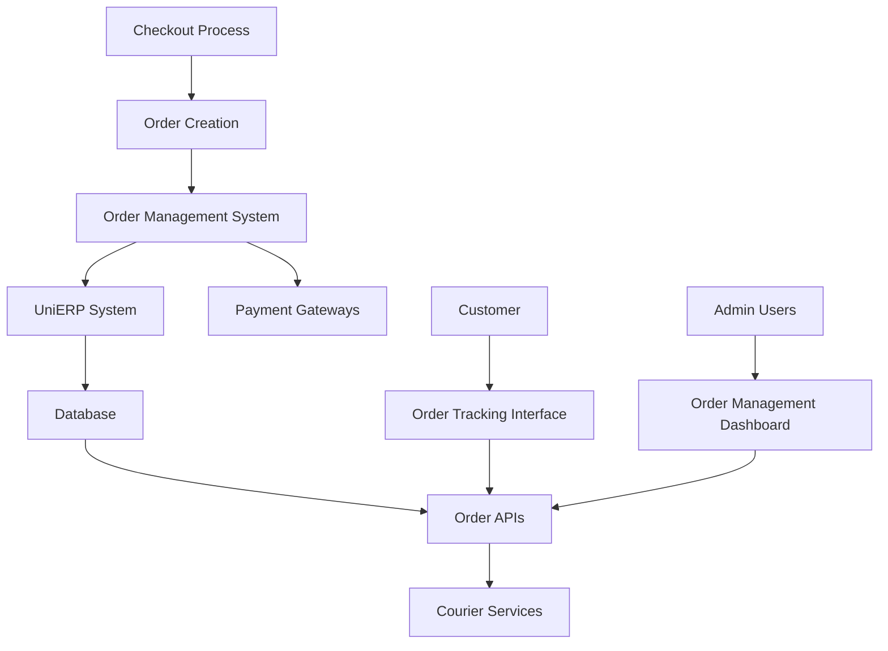

# Phase 8 Development Roadmap
## Order Management System

**Date:** November 29, 2024  
**Document Version:** 1.0  
**Status:** Ready for Implementation  
**Duration:** 20 Working Days (4 weeks)  
**Priority:** P0 - Critical

---

## Executive Summary

Phase 8 implements comprehensive order management system for Smart Technologies B2C e-commerce platform. This phase builds upon the checkout and payment systems from Phase 7 to create a complete order lifecycle management system with real-time tracking, customer notifications, and integration with UniERP and courier services.

### Key Objectives
- Implement comprehensive order management system
- Create real-time order tracking with courier integration
- Build order history and reporting features
- Implement returns and refunds management
- Create customer order notifications system
- Integrate with UniERP for order synchronization
- Build order analytics and reporting dashboard

### Success Metrics
- Order processing success rate >98%
- Real-time order tracking for all orders
- Customer satisfaction with order management >4.5 stars
- Return processing time <48 hours
- Order analytics dashboard with comprehensive insights
- UniERP synchronization success rate >95%

---

## Project Context

### Strategic Alignment
This Phase 8 roadmap supports Smart Technologies B2C Website Redevelopment by:
- Creating complete order lifecycle management system
- Enabling real-time order tracking for customer satisfaction
- Building foundation for customer retention and analytics
- Implementing Bangladesh-specific delivery and returns processes
- Integrating with UniERP for seamless order fulfillment
- Supporting customer service with notifications and self-service

### Technology Stack Focus
- **Database:** Optimized order queries with proper indexing
- **Backend:** NestJS with order management modules
- **Integration:** UniERP API, courier service APIs
- **Notifications:** SMS and email services
- **Frontend:** Next.js with real-time order updates
- **Analytics:** Order behavior analysis and reporting

---

## Detailed Implementation Plan

### Milestone 1: Order Data Model Enhancement
**Duration:** Day 1-4  
**Primary Objective:** Extend database schema for comprehensive order management

#### Constituent Tasks
1. **Order Entity Enhancement**
   - Add order status management (PENDING, CONFIRMED, PROCESSING, SHIPPED, DELIVERED, CANCELLED, REFUNDED)
   - Implement order modification and cancellation tracking
   - Add order notes and internal comments system
   - Create order priority and escalation system

2. **Order Item Enhancement**
   - Implement comprehensive order item tracking
   - Add product variant and specification tracking
   - Create order item status management (READY, BACKORDERED)
   - Add return and exchange tracking

3. **Transaction Management**
   - Implement payment transaction logging
   - Create refund and chargeback tracking
   - Add payment method analytics
   - Create transaction status management

4. **Order History Enhancement**
   - Implement comprehensive order history system
   - Add order search and filtering
   - Create order reordering functionality
   - Implement order analytics and reporting

#### Key Deliverables
- Enhanced order data models
- Transaction management system
- Order history and analytics
- Order status and tracking system

#### Dependencies
- **Internal:** Phase 7 (Checkout & Payment Integration)
- **External:** None

#### Acceptance Criteria
- [ ] All order entities enhanced with required fields
- [ ] Order status management working correctly
- [ ] Transaction logging functional
- [ ] Order history system operational
- [ ] Order search and filtering working
- [ ] Order analytics and reporting complete

---

### Milestone 2: Order Management APIs
**Duration:** Day 5-9  
**Primary Objective:** Create comprehensive order management backend APIs

#### Constituent Tasks
1. **Order CRUD Operations**
   - Implement order creation, reading, updating, deletion
   - Add order status management APIs
   - Create order modification and cancellation APIs
   - Implement order search and filtering APIs

2. **Order Processing APIs**
   - Implement order confirmation and status updates
   - Create order fulfillment processing
   - Add order completion and delivery APIs
   - Implement order tracking integration

3. **Transaction Management APIs**
   - Implement payment transaction logging
   - Create refund and return processing APIs
   - Add transaction status tracking APIs
   - Implement payment analytics APIs

4. **Order Analytics APIs**
   - Implement order statistics and reporting APIs
   - Create order conversion funnel analytics
   - Add customer behavior tracking
   - Implement order performance monitoring

#### Key Deliverables
- Complete order management API system
- Transaction processing and tracking APIs
- Order analytics and reporting system
- Order status management APIs

#### Dependencies
- **Internal:** Milestone 1 (Order Data Model Enhancement)
- **External:** None

#### Acceptance Criteria
- [ ] All order CRUD operations working correctly
- [ ] Order status management functional
- [ ] Transaction logging and tracking operational
- [ ] Order analytics and reporting complete
- [ ] API response times under 300ms
- [ ] Order search and filtering functional

---

### Milestone 3: Order Frontend Implementation
**Duration:** Day 10-13  
**Primary Objective:** Create comprehensive order management user interface

#### Constituent Tasks
1. **Order Listing and Management**
   - Implement order history page with filtering
   - Create order detail pages with status tracking
   - Add order modification and cancellation interface
   - Implement order search and sorting functionality

2. **Order Tracking Interface**
   - Create real-time order tracking page
   - Implement courier integration for tracking
   - Add order status notifications
   - Create tracking timeline visualization

3. **Order Analytics Dashboard**
   - Implement customer order analytics dashboard
   - Create order statistics and reporting interface
   - Add order performance monitoring
   - Create order conversion and retention analytics

4. **Mobile Order Management**
   - Implement mobile-responsive order interface
   - Create mobile order tracking features
   - Add push notifications for order updates
   - Implement offline order management support

#### Key Deliverables
- Responsive order management interface
- Real-time order tracking system
- Order analytics dashboard
- Mobile-optimized order experience
- Order notifications and alerts system

#### Dependencies
- **Internal:** Milestone 2 (Order Management APIs)
- **External:** Courier service APIs

#### Acceptance Criteria
- [ ] Order listing and management interface responsive
- [ ] Real-time order tracking functional
- [ ] Order analytics dashboard complete
- [ ] Mobile order experience optimized
- [ ] Order notifications working correctly
- [ ] Courier integration for tracking functional

---

### Milestone 4: Returns and Refunds Management
**Duration:** Day 14-16  
**Primary Objective:** Implement comprehensive returns and refunds system

#### Constituent Tasks
1. **Return Request Processing**
   - Implement return request creation
   - Add return approval workflow
   - Create return shipping management
   - Implement return reason tracking
   - Add return status management

2. **Refund Processing**
   - Implement refund request processing
   - Create refund approval workflow
   - Add refund status tracking
   - Implement refund method management
   - Create refund analytics and reporting

3. **Return and Refund Analytics**
   - Implement return rate tracking
   - Create refund reason analysis
   - Add customer satisfaction tracking
   - Implement return cost and recovery analytics

4. **Customer Support Integration**
   - Implement return customer service interface
   - Add return FAQ and help system
   - Create return communication tracking
   - Implement return resolution management

#### Key Deliverables
- Complete returns and refunds system
- Return and refund analytics dashboard
- Customer support interface for returns
- Return processing workflows

#### Dependencies
- **Internal:** Milestone 3 (Order Frontend Implementation)
- **External:** None

#### Acceptance Criteria
- [ ] Return request processing working correctly
- [ ] Refund processing functional
- [ ] Return analytics and reporting complete
- [ ] Customer support interface operational
- [ ] Return workflows documented and tested

---

### Milestone 5: UniERP Integration
**Duration:** Day 17-20  
**Primary Objective:** Integrate order management system with UniERP

#### Constituent Tasks
1. **Order Synchronization**
   - Implement real-time order sync to UniERP
   - Create order status synchronization
   - Add inventory update integration
   - Implement customer data synchronization
   - Create conflict resolution system

2. **Product and Inventory Sync**
   - Implement product information sync from UniERP
   - Create inventory level synchronization
   - Add stock update notifications
   - Implement price synchronization
   - Create product status management

3. **Customer Data Synchronization**
   - Implement customer data sync to UniERP
   - Create customer information updates
   - Add order history synchronization
   - Implement customer status synchronization

4. **Integration Monitoring**
   - Implement sync status monitoring
   - Create error handling and recovery
   - Add integration analytics and reporting
   - Implement manual sync capabilities

#### Key Deliverables
- Real-time UniERP order synchronization
- Product and inventory sync system
- Customer data synchronization
- Integration monitoring and analytics
- Error handling and recovery system

#### Dependencies
- **Internal:** Milestone 4 (Returns and Refunds Management)
- **External:** UniERP API access

#### Acceptance Criteria
- [ ] Order synchronization with UniERP working
- [ ] Product and inventory sync functional
- [ ] Customer data synchronization operational
- [ ] Integration monitoring system functional
- [ ] Error handling and recovery working
- [ ] Manual sync capabilities implemented

---

## Order Management Architecture

### Data Flow Diagram



### Order Status Flow

```typescript
// Order Status Management
enum OrderStatus {
  PENDING = 'PENDING',
  CONFIRMED = 'CONFIRMED',
  PROCESSING = 'PROCESSING',
  SHIPPED = 'SHIPPED',
  DELIVERED = 'DELIVERED',
  CANCELLED = 'CANCELLED',
  REFUNDED = 'REFUNDED',
  RETURN_REQUESTED = 'RETURN_REQUESTED',
  RETURN_APPROVED = 'RETURN_APPROVED',
  RETURNED = 'RETURNED',
  BACKORDERED = 'BACKORDERED'
}

interface OrderStatusTransition {
  from: OrderStatus;
  to: OrderStatus;
  timestamp: Date;
  userId?: string;
  notes?: string;
  automated: boolean;
}

// Order Status Management
@Injectable()
export class OrderStatusService {
  async updateOrderStatus(orderId: string, status: OrderStatus, userId?: string, notes?: string): Promise<void> {
    const transition: OrderStatusTransition = {
      from: order.currentStatus,
      to: status,
      timestamp: new Date(),
      userId,
      notes,
      automated: false,
    };
    
    // Update order
    await this.orderRepository.update(orderId, { status });
    
    // Log transition
    await this.orderStatusLogService.createLog(transition);
    
    // Trigger notifications
    if (this.shouldNotifyStatusChange(status)) {
      await this.notificationService.sendOrderStatusUpdate(orderId, status);
    }
    
    // Update UniERP
    if (this.shouldSyncToERP(status)) {
      await this.uniERPService.updateOrderStatus(orderId, status);
    }
  }
}
```

---

## Timeline and Resource Allocation

### Overall Timeline (20 Working Days)

```mermaid
gantt
    title Phase 8 Development Timeline
    dateFormat X
    axisFormat %d
    
    section Milestone 1
    Order Data Model Enhancement :active, m1, 1, 4
    
    section Milestone 2
    Order Management APIs :active, m2, 5, 9
    
    section Milestone 3
    Order Frontend Implementation :active, m3, 10, 13
    
    section Milestone 4
    Returns and Refunds Management :active, m4, 14, 16
    
    section Milestone 5
    UniERP Integration :active, m5, 17, 20
```



### Resource Allocation Matrix

| Role | Allocation | Key Responsibilities | Primary Milestones |
|------|------------|---------------------|-------------------|
| Backend Developer | 40% | Order APIs, database optimization, UniERP integration | M1, M2, M5 |
| Frontend Developer | 30% | Order UI, tracking interface, mobile optimization | M3, M4 |
| Integration Specialist | 20% | UniERP integration, courier APIs, payment sync | M5 |
| Customer Service | 10% | Returns management, customer support | M4 |
| Database Administrator | 10% | Order data optimization, indexing, performance | M1, M2 |

---

## Risk Assessment and Mitigation Strategies

### High-Risk Items

| Risk | Impact | Probability | Mitigation Strategy |
|------|--------|-------------|-------------------|
| Order Processing Failures | High | Medium | Comprehensive error handling, retry mechanisms, fallback procedures |
| UniERP Integration Issues | High | Medium | Real-time sync monitoring, conflict resolution, manual override capabilities |
| Payment Transaction Errors | High | Medium | Robust error handling, transaction logging, audit trails |
| Customer Data Privacy | High | Medium | Data anonymization, consent management, GDPR-like compliance |

### Medium-Risk Items

| Risk | Impact | Probability | Mitigation Strategy |
|------|--------|-------------|-------------------|
| Returns Management Complexity | Medium | Medium | Clear workflows, comprehensive testing, customer communication |
| Order Performance Issues | Medium | Medium | Database optimization, caching strategies, load testing |
| Integration Complexity | Medium | Low | Modular architecture, clear documentation, testing procedures |

---

## Success Metrics and Validation Checkpoints

### Technical Validation Metrics

1. **Order Processing Performance**
   - Metric: Order processing success rate >98%
   - Validation: Load testing and monitoring
   - Checkpoint: End of Milestone 2

2. **Integration Success**
   - Metric: UniERP synchronization success rate >95%
   - Validation: Integration testing and monitoring
   - Checkpoint: End of Milestone 5

3. **Customer Satisfaction**
   - Metric: Customer satisfaction with order management >4.5 stars
   - Validation: Customer feedback analysis
   - Checkpoint: End of Milestone 3

4. **Returns Processing**
   - Metric: Return processing time <48 hours
   - Validation: Returns testing and QA
   - Checkpoint: End of Milestone 4

---

## Phase Transition Planning

### Phase 8 Completion Criteria

- [ ] All 5 milestones completed
- [ ] Order management system fully functional
- [ ] Real-time order tracking operational
- [ ] Returns and refunds system implemented
- [ ] UniERP integration working with >95% success rate
- [ ] Order analytics dashboard complete
- [ ] Mobile-optimized order management interface
- [ ] All acceptance criteria met

### Phase 9 Readiness Assessment

1. **Technical Readiness**
   - Order management system supports Phase 9 requirements
   - UniERP integration ready for advanced features
   - Order analytics foundation ready for customer insights
   - Mobile order management optimized for Bangladesh users

2. **Feature Readiness**
   - Order tracking ready for customer self-service
   - Returns management system ready for customer retention
   - Order analytics ready for business intelligence
   - Integration foundation ready for advanced features

---

## Conclusion

This Phase 8 Development Roadmap establishes a comprehensive order management system for Smart Technologies B2C e-commerce platform. The systematic approach ensures complete order lifecycle management, real-time tracking, customer satisfaction, and seamless integration with UniERP for operational efficiency.

### Key Success Factors

1. **Complete Order Lifecycle:** From creation to delivery and returns
2. **Real-Time Tracking:** Integration with courier services for live updates
3. **Customer Satisfaction:** Self-service order management with notifications
4. **Operational Efficiency:** UniERP integration for automated processes
5. **Analytics Foundation:** Comprehensive order insights for business decisions
6. **Mobile-First:** Optimized order management for Bangladesh users

### Expected Outcomes

- Complete order management system with >98% processing success
- Real-time order tracking with courier integration
- Comprehensive returns and refunds management
- UniERP synchronization with >95% success rate
- Order analytics dashboard with business insights
- Mobile-optimized order management experience
- Customer satisfaction >4.5 stars

---

**Document Status:** Ready for Implementation  
**Next Steps:**
1. Review and approve order management architecture
2. Set up UniERP development environment
3. Begin Milestone 1 execution
4. Establish courier service integrations
5. Prepare Phase 9 initiation based on Phase 8 outcomes

**Prepared By:** Enterprise Solutions Team  
**For:** Smart Technologies (Bangladesh) Ltd.  
**Contact:** project-team@smarttechnologies.bd