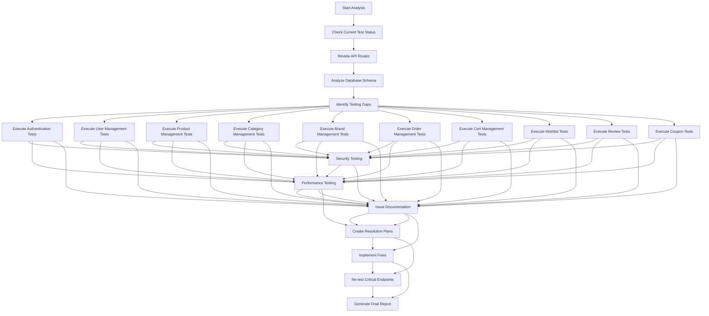

# Comprehensive API Endpoint Testing Plan

## Executive Summary

This plan outlines a systematic approach to test all API endpoints for the Smart Technologies Bangladesh B2C Website, identify issues, and provide solutions. The testing will cover all major endpoint categories with both functional and security validation.

## Current State Analysis

Based on the project analysis:

- **Infrastructure Status**: Docker containers running, database connected, backend operational
- **Current Testing**: Basic service layer tests running, but comprehensive API endpoint testing needed
- **API Routes Available**: 9 main route modules (auth, users, products, categories, brands, orders, cart, wishlist, reviews, coupons)
- **Test Framework**: Jest configured with existing test files, but comprehensive real-database testing required

## Testing Strategy

### Phase 1: Infrastructure Analysis
- Analyze current test execution status
- Identify gaps in existing test coverage
- Validate database connectivity and schema integrity
- Review authentication and security configurations

### Phase 2: Comprehensive Endpoint Testing
- Test all CRUD operations for each entity
- Validate Bangladesh-specific features (phone numbers, addresses, payment methods)
- Perform security and vulnerability testing
- Test error handling and edge cases

### Phase 3: Issue Identification & Resolution
- Document all identified issues with severity levels
- Categorize issues by type (security, functionality, performance)
- Create resolution strategies for each issue category

### Phase 4: Reporting & Validation
- Generate comprehensive test report
- Validate all fixes implemented
- Re-test critical endpoints to ensure resolution

## Detailed Testing Workflow

## Endpoint Testing Matrix

| Module | Endpoints | Test Types | Priority | Bangladesh Features |
|--------|-----------|-----------|---------|------------------|
| **Authentication** | register, login, logout, refresh, verify-email, forgot-password, reset-password, change-password, password-policy, validate-phone, send-otp, verify-otp, resend-otp, operators | HIGH | Phone validation, OTP, Bengali messages |
| **Users** | GET all, GET by ID, PUT update, DELETE (admin), GET addresses | HIGH | Address structure, Bangladesh divisions |
| **Products** | GET all, GET by ID, GET by slug, POST create, PUT update, DELETE (admin), GET featured | HIGH | Bengali names, warranty, search, filtering |
| **Categories** | GET all, GET by ID, GET tree, POST create, PUT update, DELETE (admin) | MEDIUM | Bengali names, hierarchy |
| **Brands** | GET all, GET by ID, POST create, PUT update, DELETE (admin) | MEDIUM | Bangladesh domains, validation |
| **Orders** | GET all, GET by ID, POST create, PUT status, payment processing | HIGH | bKash, Nagad, Rocket, BDT currency |
| **Cart** | GET cart, POST add item, PUT item, DELETE item, DELETE clear | HIGH | Guest cart, quantity validation |
| **Wishlist** | GET all, GET by ID, POST create, DELETE, PUT update, sharing | MEDIUM | Social sharing, notifications |
| **Reviews** | GET all, GET by ID, POST create, PUT update, DELETE (admin), moderation | MEDIUM | Bangladesh content, moderation |
| **Coupons** | GET all, GET by ID, POST create, PUT update, DELETE (admin), validation | LOW | Discount codes, Bangladesh offers |

## Testing Categories

### 1. Functional Testing
- **Happy Path Testing**: Valid requests with correct data
- **Negative Testing**: Invalid data, missing required fields
- **Edge Case Testing**: Boundary values, special characters
- **Integration Testing**: Cross-entity workflows

### 2. Security Testing
- **Authentication**: JWT tokens, session management, role-based access
- **Input Validation**: SQL injection, XSS, CSRF protection
- **Authorization**: Admin-only endpoints, resource ownership
- **Rate Limiting**: Request throttling, brute force protection

### 3. Performance Testing
- **Response Times**: Measure API latency under load
- **Concurrent Requests**: Multiple simultaneous connections
- **Database Performance**: Query optimization, connection pooling
- **Load Testing**: Stress testing with high request volumes

### 4. Bangladesh-Specific Testing
- **Phone Number Validation**: +880 format, operator detection
- **Address Structure**: All 8 divisions, districts, upazilas
- **Payment Methods**: bKash, Nagad, Rocket integration
- **Language Support**: Bengali content, Unicode handling
- **Currency**: BDT formatting and calculations

## Issue Classification System

### Critical Issues
- Security vulnerabilities
- Database connection failures
- Authentication bypasses
- Data corruption

### High Priority
- Functional failures in core endpoints
- Performance degradation
- Missing Bangladesh features

### Medium Priority
- UI/UX issues
- Minor functionality gaps
- Documentation inconsistencies

### Low Priority
- Code optimization opportunities
- Enhanced error messages
- Logging improvements

## Success Criteria

### Testing Completion
- [ ] All endpoints tested with both positive and negative cases
- [ ] Security vulnerabilities identified and documented
- [ ] Performance metrics collected and analyzed
- [ ] Bangladesh features validated
- [ ] Error handling verified for all scenarios

### Issue Resolution
- [ ] All critical issues resolved
- [ ] High-priority items addressed
- [ ] Medium-priority items planned
- [ ] Low-priority items documented

### Reporting
- [ ] Comprehensive test report generated
- [ ] Findings categorized by severity
- [ ] Resolution strategies documented
- [ ] Re-testing validation completed

## Implementation Strategy

### Tools & Technologies
- **Jest**: Primary testing framework
- **Supertest**: HTTP request testing
- **Prisma**: Database operations and validation
- **Custom Test Utilities**: Bangladesh-specific data generation
- **Docker**: Containerized testing environment
- **Real Database**: Production-like testing with PostgreSQL

### Test Data Management
- **Seed Data**: Realistic test datasets
- **Bangladesh Content**: Local names, addresses, phone numbers
- **Cleanup Procedures**: Automated data restoration
- **Isolation**: Each test runs in clean state

## Deliverables

1. **Test Execution Report**: Detailed results with pass/fail rates
2. **Issue Inventory**: Categorized list of all identified problems
3. **Resolution Documentation**: Step-by-step fix instructions
4. **Validation Report**: Re-testing results confirming fixes
5. **Comprehensive Summary**: Overall system health assessment

## Risk Mitigation

### Testing Risks
- **Data Corruption**: Mitigate with database backups
- **Service Disruption**: Test in isolated environment
- **Performance Impact**: Monitor system resources during testing
- **Security Exposure**: Use test-only credentials and environments

### Mitigation Strategies
- **Incremental Testing**: Phase-based approach to minimize impact
- **Rollback Plans**: Quick restoration procedures
- **Monitoring**: Real-time observation during test execution
- **Documentation**: Live recording of all test activities

---

**Next Steps**: Review this plan and provide feedback for any adjustments needed before implementation begins.