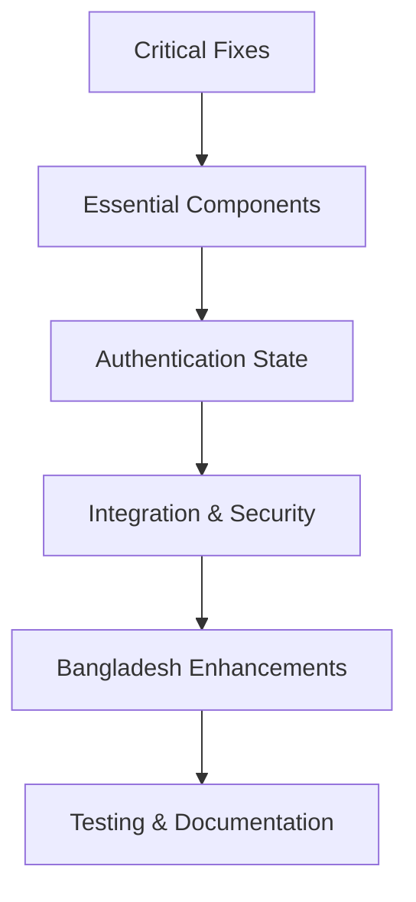

# Milestone 1: Authentication System Gap Analysis & Implementation Plan

## Executive Summary

This comprehensive analysis identifies critical gaps in the authentication system that prevent basic functionality. The system has a 92.3% test failure rate, indicating severe foundational issues that must be addressed immediately.

## Critical Issues Identified

### 1. API Routing Problems (CRITICAL)
- **Double API Path Prefix**: Routes mounted at `/api/api/v1/auth/` instead of `/api/v1/auth/`
- **Frontend-Backend Path Mismatch**: Frontend calls `/api/auth/register` but backend expects `/api/v1/auth/register`
- **JSON Request Body Parsing**: POST requests return HTML "Bad Request" instead of proper JSON responses

### 2. Missing Frontend Components (HIGH)
- **Login Page**: No `frontend/src/app/login/page.tsx` exists
- **Email Verification Page**: Missing UI for email verification workflow
- **Phone Verification Page**: Missing UI for OTP verification workflow
- **Password Reset Pages**: Missing UI for password reset workflows
- **Authentication Context**: No global authentication state management
- **API Client**: No centralized API client for authentication

### 3. Backend Integration Gaps (HIGH)
- **Session Management Integration**: Frontend lacks integration with backend session service
- **Token Refresh Integration**: Backend token refresh endpoint exists but no frontend implementation
- **Verification Workflow Integration**: Email/phone verification backend logic exists but missing frontend UI

### 4. Security & Validation Gaps (MEDIUM)
- **CSRF Protection**: Missing CSRF token implementation in frontend forms
- **Input Sanitization**: Frontend lacks comprehensive input sanitization
- **Rate Limiting Feedback**: No frontend feedback for rate limiting responses

### 5. Bangladesh-Specific Gaps (MEDIUM)
- **Phone Validation Integration**: Backend phone validation exists but frontend integration is incomplete
- **Localization**: Error messages primarily in English, incomplete Bengali support

## Prioritized Implementation Plan

### Phase 1: Critical Fixes (Immediate Actions)

#### 1.1 Fix API Routing Issues
**Files to Modify**:
- `backend/index.js` (line 90): Remove duplicate `/api` prefix
- `backend/routes/index.js` (line 22): Fix auth routes mounting
- `frontend/src/app/register/page.tsx` (line 13): Update API calls to use correct paths

**Dependencies**: None
**Impact**: Enables all authentication endpoints to be accessible

#### 1.2 Fix Request Body Parsing
**Files to Modify**:
- `backend/index.js` (line 79): Ensure JSON middleware is properly configured

**Dependencies**: None
**Impact**: Enables frontend to successfully submit registration data

#### 1.3 Create Frontend API Client
**Files to Create**:
- `frontend/src/lib/api/auth.ts`: Centralized API client for authentication endpoints
- `frontend/src/contexts/AuthContext.tsx`: Global authentication state management

**Dependencies**: 1.1, 1.2
**Impact**: Provides consistent API communication layer

### Phase 2: Essential Frontend Components (High Priority)

#### 2.1 Create Login Page and Form
**Files to Create**:
- `frontend/src/app/login/page.tsx`: Complete login page with language support
- `frontend/src/components/auth/LoginForm.tsx`: Reusable login form component

**Dependencies**: 1.3
**Impact**: Enables users to authenticate with the system

#### 2.2 Create Email Verification UI
**Files to Create**:
- `frontend/src/app/verify-email/page.tsx`: Email verification page
- `frontend/src/components/auth/EmailVerificationForm.tsx`: Email verification form component

**Dependencies**: 1.3
**Impact**: Completes email verification workflow

#### 2.3 Create Phone Verification UI
**Files to Create**:
- `frontend/src/app/verify-phone/page.tsx`: Phone verification page
- `frontend/src/components/auth/PhoneVerificationForm.tsx`: Phone verification form component

**Dependencies**: 1.3
**Impact**: Completes phone verification workflow

#### 2.4 Create Password Reset UI
**Files to Create**:
- `frontend/src/app/forgot-password/page.tsx`: Password reset request page
- `frontend/src/app/reset-password/page.tsx`: Password reset confirmation page
- `frontend/src/components/auth/PasswordResetForm.tsx`: Password reset form components

**Dependencies**: 1.3
**Impact**: Enables password reset functionality

### Phase 3: Authentication State Management (High Priority)

#### 3.1 Implement Authentication Context
**Files to Create**:
- `frontend/src/contexts/AuthContext.tsx`: Complete authentication context with state management
- `frontend/src/hooks/useAuth.ts`: Custom hook for authentication state

**Dependencies**: 2.1, 2.2, 2.3, 2.4
**Impact**: Provides global authentication state across the application

### Phase 4: Integration & Security Enhancements (Medium Priority)

#### 4.1 Frontend-Backend Integration
**Files to Modify**:
- All authentication forms: Connect to backend API endpoints
- `frontend/src/lib/api/auth.ts`: Implement API calls to backend

**Dependencies**: 1.3, 3.1
**Impact**: Enables end-to-end authentication functionality

#### 4.2 Session Management Integration
**Files to Modify**:
- `frontend/src/contexts/AuthContext.tsx`: Integrate with backend session management
- `frontend/src/lib/api/auth.ts`: Handle session cookies and tokens

**Dependencies**: 3.1, 3.5
**Impact**: Maintains user authentication state across sessions

#### 4.3 Security Enhancements
**Files to Create**:
- `frontend/src/middleware/csrfProtection.tsx`: CSRF protection middleware
- `frontend/src/components/auth/SecureForm.tsx`: Base form component with CSRF protection

**Dependencies**: 4.1, 4.2
**Impact**: Enhances security of authentication forms

### Phase 5: Bangladesh-Specific Enhancements (Medium Priority)

#### 5.1 Phone Validation Enhancement
**Files to Modify**:
- `frontend/src/components/ui/PhoneInput.tsx`: Enhanced Bangladesh phone validation
- `frontend/src/lib/api/auth.ts`: Integrate with backend phone validation service

**Dependencies**: 2.1, 4.1, 5.1
**Impact**: Improves user experience for Bangladesh phone numbers

#### 5.2 Localization Enhancement
**Files to Modify**:
- All authentication components: Add comprehensive Bengali language support
- `frontend/src/contexts/AuthContext.tsx`: Language preference management

**Dependencies**: 5.1, 5.2
**Impact**: Provides culturally appropriate experience for Bangladesh market

### Phase 6: Testing & Documentation (Low Priority)

#### 6.1 Authentication Flow Testing
**Files to Create**:
- `backend/tests/auth/`: Comprehensive authentication test suite
- `frontend/tests/auth/`: Frontend authentication component tests

**Dependencies**: All previous phases
**Impact**: Ensures reliability and correctness of authentication system

#### 6.2 Documentation Updates
**Files to Create**:
- `docs/authentication/`: Complete authentication system documentation
- `README.md`: Updated setup and usage instructions

**Dependencies**: All previous phases
**Impact**: Improves developer experience and system maintainability

## Implementation Sequence

## Success Metrics

### Completion Criteria
- All authentication endpoints accessible at correct URLs
- Frontend can complete registration, login, and verification flows
- Session management works seamlessly between frontend and backend
- Security measures implemented and functional
- Bangladesh-specific features fully integrated
- Test coverage exceeds 90% for authentication flows

### Risk Mitigation
- **API Breaking Changes**: Implement versioning to prevent client disruption
- **Security Vulnerabilities**: Comprehensive security review before production deployment
- **Performance Impact**: Monitor performance after each implementation phase

## Conclusion

The authentication system requires immediate attention to critical routing and parsing issues, followed by systematic implementation of missing frontend components and integration layers. This plan prioritizes fixes that enable basic functionality first, then enhances the system with security, Bangladesh-specific features, and comprehensive testing.

**Total Implementation Phases**: 6
**Estimated Critical Issues Resolved**: Phase 1 (3 issues)
**Estimated Components Created**: 15+ frontend components
**Estimated Integration Points**: 8+ frontend-backend connections